# In Situ Quantitative Measurement of Rare Earth Elements in Uranium Oxides by Laser Ablation-Inductively Coupled Plasma-Mass Spectrometry

Philippe Lach (1), Julien Mercadier (1, 2)\*, Jean Dubessy (1), Marie- Christine Boiron (1) and Michel Cuney (1)  

(1) G2R, Nancy-Université, CNRS, CREGU, Boulevard des Aiguillettes, BP.239, F-54506, Vandoeuvre-lès-Nancy, France  
(2) ETH Zürich, Laboratory of Inorganic Chemistry, Wolfgang-Pauli-Strasse 10, CH-8093, Zürich, Switzerland  
\* Corresponding author. e-mail: julien.mercadier@yahoo.fr  

Advances in the quantification of rare earth elements (REE) at the micrometric scale in uranium oxides by laser ablation- inductively coupled plasma- mass spectrometry are described. The determination of the best analytical conditions was tested using a uranium oxide (Mistamisk) the concentrations of REE in which were previously estimated by other techniques. Comparison between the use of U or Pb as an internal standard clearly showed a diameter- dependent fractionation effect related to Pb at small crater diameters (16 and \(24 \mu \mathrm{m}\) ), which was not found for U. The quantification of REE contents in uranium oxide samples using both matrix- matched (uranium oxide) and non- matrix- matched (NIST SRM 610 certified glass) external calibrators displayed no significant difference, demonstrating a limited matrix effect for REE determination by LA- ICP- MS. Moreover, no major interferences on REEs were detected. The proposed methodology (NIST SRM 610 as external calibrator and U as internal standard) was applied to samples from uranium deposits from around the world. The results showed that LA- ICP- MS is a suitable analytical technique to determine REE down to the \(\mu \mathrm{g} \mathrm{g}^{- 1}\) level in uranium oxides at the micrometre scale and that this technique can provide significant insights into uranium metallogeny.  

Keywords: LA- ICP- MS, uranium oxide, rare earth elements, metallogeny, uranium deposits, in situ measurement.  

Une avancée pour la quantification des éléments de terres rares (ETR) à l'échelle micrométrique dans les oxydes d'uranium par ablation laser couplée à un spectromètre de masse à source plasma est décrite dans le présent papier. La détermination des meilleures conditions analytiques est premièrement testée sur un oxyde d'uranium (Mistamisk) pour lequel les concentrations en ETR ont été antérieurement estimées par d'autres techniques. La comparaison entre l'utilisation de U ou Pb comme standard interne montre clairement un effet de fractionnement dépendant du diamètre pour Pb à petit diamètre (16 et \(24 \mu \mathrm{m}\) ), ce qui n'a pas été observé pour U. La quantification des concentrations en ETR dans un oxyde d'uranium de composition connue en utilisant des matériaux de références externes de même matrice ou de matrice différente (verre silicate certifié NIST SRM 610) ne montre pas de différence significative, démontrant des effets de matrice limités pour l'analyse des ETR par LA- ICP- MS. De plus, aucune interférence majeure n'a pu être détectée pour les ETR par LA- ICP- MS. La méthodologie proposée (NIST SRM 610 comme standard externe et U comme standard interne) est appliquée à des échantillons en provenance de différents types de gisements mondiaux d'uranium. Les résultats montrent que la technique LA- ICP- MS est actuellement une méthode d'analyse localisée efficace pour déterminer des concentrations en ETR, jusqu'à des teneurs de l'ordre du \(\mu \mathrm{g} \mathrm{g}^{- 1}\) , dans les oxydes d'uranium à l'échelle micrométrique, et que cette technique peut apporter des contributions significatives pour la métallogenie de l'uranium.  

Mots- clés : LA- ICP- MS, oxyde d'uranium, éléments de terres rares, métallogenie, gisements d'uranium, mesures in situ.

<!-- Page 278 -->

In the geological sciences, trace element and especially rare earth element (REE) behaviour plays a major role in the understanding of ore system formation (Lottermoser 1992, Merten et al. 2005, Mercadier et al. 2011b among others). Much work on REE substitution in minerals and REE fractionation between minerals and fluids during crystallisation has been reported (e.g., Lee and Bastron 1967, Lewis et al. 1998, Van Middelsworth and Wood 1998, Uysal and Golding 2003). Currently, the improvement of knowledge on these topics is mostly linked to the development of experimental and thermodynamic studies, and to new analytical techniques. These allow precise and accurate determination of the elemental composition of complex samples on a micrometre scale, permitting the preserved information to be obtained. This is particularly critical for minerals with micrometre to millimetre scale overgrowths and/or zoning related to multiple processes of crystallisation under various conditions and during successive geological intervals. In this case, in situ analysis at an appropriate spatial scale is the only way to unambiguously determine the evolution of the mineral composition through time and thereby decipher the multiple processes related to geochemical evolution during single crystal growth.  

In uranium oxides (UO2, uraninite or pitchblende), the REE have ionic radii (116- 97.7 pm) close to that of U4+ (100 pm) in eightfold co- ordination (Shannon 1976), which allows them to be easily substituted for U from hundreds of \(\mu g g^{- 1}\) to % m/m levels. Pioneering work on the REE content of uranium oxides, the most ubiquitous form of uranium mineral in U deposits, was realised by bulk methods (Fryer and Taylor 1987, Pagel et al. 1987, Maas and McCulloch 1990, Hidaka et al. 1992). Although technical limitations prevented the quantification of all the REE abundance and the discrimination of overgrowth/ alteration processes, this early work showed clearly that the REE contents of uranium oxides are highly variable and depend on the type of uranium deposits (as classified by the International Atomic Energy Agency, IAEA 2009). Indeed, uranium oxides have a wide range of crystallisation conditions (Cuney and Kyser 2008, Cuney 2009, 2010, Fayek et al. 2011), and their REE contents and chondrite- normalised REE patterns are strongly dependent on factors such as temperature, fluid chemistry or REE source (Mercadier et al. 2011b). This highlights the importance of studying the REE to understand uranium deposit formation. However, uranium oxides are chemically active minerals subject to elemental exchange and recrystallisation during post- initial- crystallisation events (Alexandre and Kyser 2005). Consequently, REE determination in uranium oxide requires in situ techniques to differentiate the best preserved areas from the altered ones. To improve our understanding of the link between REE abundance and formation conditions, recent advances in REE determination in  

uranium oxides at a micrometre scale have resulted from analysis by secondary ion mass spectrometry (SIMS; Bonhoure et al. 2007, Mercadier et al. 2011a). However, REE determination by this technique has several drawbacks: (i) the existence of mass interferences that do not allow the measurement of all REE (Gd and Yb in particular); (ii) strong matrix effects requiring an external calibrator with a crystalline structure identical to the analysed mineral phase; and (iii) a long acquisition time and data treatment \((\approx 3\) hr for a single analysis). A more favourable SIMS protocol limiting mass interferences was later proposed by Piani et al. (2008); this awaits further validation using well- characterised natural uranium oxides.  

To overcome these limitations, a new in situ methodology for REE quantitative measurements in \(\mathrm{UO_2}\) based on LA- ICP- MS, is described in the present article. This technique was applied to previously microscopically characterised samples, on zones known to be chemically homogeneous at the scale of tens of micrometres. The methodology and different calibration strategies (U or Pb as internal standard, ablation crater diameter effect and matrix- matched versus non- matrix- matched external calibrator) were tested and compared with solution nebulisation ICP- MS and SIMS to study the capability of LA- ICP- MS to measure REE contents in \(\mathrm{UO_2}\) . Thereafter, application to uranium oxides from different uranium deposits from various global locations is shown to demonstrate the potential of the REE in constraining uranium deposit genesis  

## Experimental

### LA-ICP-MS instrumentation and operating conditions

LA- ICP- MS analyses were carried out at the G2R laboratory (Nancy, France). Laser sampling was performed with a 193 nm Geolas Pro ArF Excimer laser (Microlas®, Göttingen, Germany) equipped with beam homogenisation optics. Ablation was performed by focussing the beam at the sample surface with a constant fluence of \(10 \mathrm{J cm}^{- 2}\) and constant repetition rate of \(5 \mathrm{Hz}\) . Helium was used as a carrier gas to transport the laser- generated aerosols from the ablation cell to the ICP- MS. Argon as a make- up gas was mixed with the carrier gas via a T- connector before entering the ICP torch. Typical flow rates of \(0.5 \mathrm{l min}^{- 1}\) for He and \(0.96 \mathrm{l min}^{- 1}\) for Ar were used. These values were optimised during ablation experiments performed on the NIST SRM 610 silica glass. Ablated material was introduced to an Agilent 7500c Quadrupole ICP- MS (Agilent®, Santa Clara, CA, USA) equipped with an octopole reaction system with enhanced sensitivity optional lenses (Cs type; Agilent). Detailed operating

<!-- Page 279 -->

Table 1. Operating parameters for the LA-ICP-MS analysis of the uranium oxides   

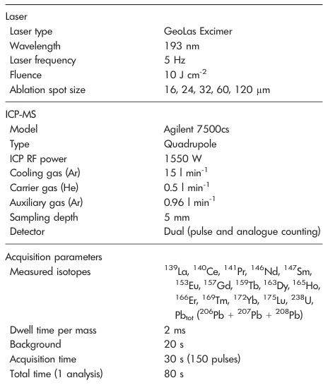

<table><tr><td>Laser</td><td></td></tr><tr><td>Laser type</td><td>GeoLax Excimer</td></tr><tr><td>Wavelength</td><td>193 nm</td></tr><tr><td>Laser frequency</td><td>5 Hz</td></tr><tr><td>Fluence</td><td>10 J cm-2</td></tr><tr><td>Ablation spot size</td><td>16, 24, 32, 60, 120 μm</td></tr><tr><td>ICP-MS</td><td></td></tr><tr><td>Model</td><td>Agilent 7500cs</td></tr><tr><td>Type</td><td>Quadrupole</td></tr><tr><td>ICP RF power</td><td>1550 W</td></tr><tr><td>Cooling gas (Ar)</td><td>15 l min-1</td></tr><tr><td>Carrier gas (He)</td><td>0.5 l min-1</td></tr><tr><td>Auxiliary gas (Ar)</td><td>0.96 l min-1</td></tr><tr><td>Sampling depth</td><td>5 mm</td></tr><tr><td>Detector</td><td>Dual (pulse and analogue counting)</td></tr><tr><td>Acquisition parameters</td><td></td></tr><tr><td>Measured isotopes</td><td>139Lo, 140Ce, 141Pr, 146Nd, 147Sm, 153Eu, 157Gd, 159Tb, 163Dy, 165Ho, 166Er, 169Tm, 172Yb, 175Lu, 238U, PbIOT (206Pb + 207Pb + 208Pb)</td></tr><tr><td>Dwell time per mass</td><td>2 ms</td></tr><tr><td>Background</td><td>20 s</td></tr><tr><td>Acquisition time</td><td>30 s (150 pulses)</td></tr><tr><td>Total time (1 analysis)</td><td>80 s</td></tr></table>  

conditions and acquisition parameters for the laser and the ICP- MS are listed in Table 1. The MS detector was in analogue mode for the detection of \(^{238}\mathrm{U}\) and switched to pulse mode for the other elements.  

### Signal acquisition

For each experiment, fourteen rare earth elements, \(^{238}\mathrm{U}\) and \(\mathrm{Pb}_{\mathrm{IOT}}\) were determined. \(\mathrm{Pb}_{\mathrm{IOT}}\) is the sum of \(^{206}\mathrm{Pb}\) , \(^{207}\mathrm{Pb}\) and \(^{208}\mathrm{Pb}\) , \(^{204}\mathrm{Pb}\) is considered as negligible as it was not detected during the first analytical tests and thus was not measured during later analyses. All data were acquired as raw counts (cps) using the time resolved mode. For each individual analysis (external calibrator and unknown sample), the background was measured before ablation for 20 s (used for data reduction) and its return to its initial value was checked before ablating a new zone. Signal intensity integration of \(^{238}\mathrm{U}\) and fourteen REE masses was carried out during the plateau regime (Figure 1). Signal acquisition of the sample was stopped after 150 pulses (30 s at 5 Hz). For each individual analysis, the signal acquisition was recorded for 80 s (including 20 s of background acquisition and 30 s of ablation).  

### Data processing

The output data for counts for the 80 s of acquisition were recorded in an Excel spreadsheet from which the data  

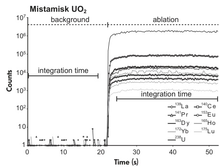

Figure 1. LA-ICP-MS signal for \(^{238}\mathrm{U}\) and nine rare earth elements obtained during ablation of the Mistamisk uraniumite. 
  

reduction was carried out manually by the authors. All the intensities used in the calculations were corrected by background subtraction. Subsequently, absolute concentrations and limit of detection were obtained from the equations developed by Longerich et al. (1996). Calculations of precision, uncertainty, reproducibility and accuracy from the acquired data on uranium oxides are proposed in the present article following the ISO guidelines (ISO Guide 98: 1995).  

### Reference materials

The certified glass reference materials NIST SRM 610, 612 and 614 (concentrations from Pearce et al. 1997) were used as calibrators for the LA- ICP- MS (Figure 2). The calibration curves defined are linear over two orders of magnitude for all the REE. The Mistamisk uraniumite is currently considered the best characterised natural uranium oxide with respect to its REE contents (Bonhoure et al. 2007) and was used in this study to initially develop the LA- ICP- MS analytical protocol. This uraniumite comes from the Mistamisk uraniumite- albite veins located in the Labrador Palaeoproterozoic trough (Northern Québec, Canada; detailed geology in Kish and Cuney (1981)). The Mistamisk uraniumite has been previously studied and used as a reference sample for trace element composition in uranium oxides, due to its homogeneity at the spatial scale of tens of micrometres and lack of significant post- crystallisation alteration (Bonhoure et al. 2007). Bulk REE compositions have been determined on crushed Mistamisk uraniumite samples by solution nebulisation ICP- MS at the SARM (CRPG, Nancy, France) and at the IGEM- RAS laboratory (Moscow, Russia) and published in Bonhoure et al. (2007). Additionally, REE contents of the Mistamisk uraniumite have been measured in situ by SIMS

<!-- Page 280 -->

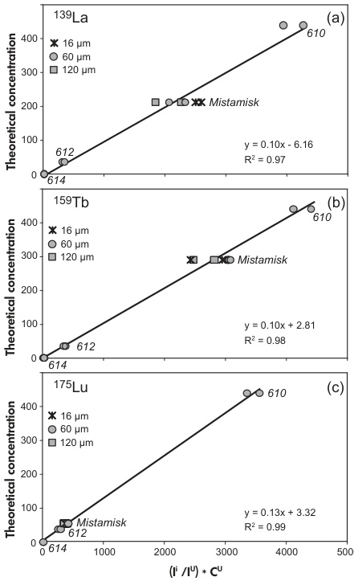

Figure 2. Calibration curves of (a) \(^{139}\mathrm{La}\) (b) \(^{159}\mathrm{Tb}\) and (c) \(^{175}\mathrm{Lu}\) using the NIST SRM glass series (610, 612 and 614) and the Mistamisk uraninite. Vertical axis represents the reference concentration, and horizontal axis represents the normalisation intensity of element (i')/ intensity of internal standard (i')\\* concentration of internal standard (c'). \(238\mathrm{U}\) was used as internal standard, and all intensities were corrected from the background value. 
  

(Cameca IMS- 3f instrument at the CRPG, Bonhoure et al. 2007).  

### Studied samples

Natural uranium oxides from various uranium deposits were selected for LA- ICP- MS determination of their REE contents (Figure 3). The samples come from four different deposits: Millennium (Canada), Kiggavik (Canada), Tortkuduk (Kazakhstan) and Dulann Ul (Mongolia).  

<|ref|>text<|/ref|><|det|>[[116, 870, 480, 914], [515, 115, 880, 592]]<|/det|>
The Millennium deposit is an unconformity- related type uranium deposit (see IAEA (2009) for the classification of uranium deposits) located in the Athabasca basin (Saskatchewan, Canada). The classification as 'unconformity- related type' is directly linked to the spatial relationship between the uranium deposits and an unconformity between sedimentary basin deposits and an underlying crystalline basement. The detailed geology of the Millennium deposit is described in Mercadier (2008) and in Cloutier et al. (2009). The REE contents of different uranium oxides from this deposit were previously determined using SIMS (Mercadier 2008) following the procedure of Bonhoure et al. (2007). The three other selected deposits correspond to three major uranium deposits, which are currently under exploration or in exploitation. Consequently, very little geological work has been performed on these deposits. However, they have been proposed to belong to well- known deposit types, which could ultimately be tested by REE determination (Mercadier et al. 2011b). The Kiggavik uranium deposit is located near the current margin of the Thelon sedimentary basin, 400 km north of the Athabasca basin. This deposit is proposed to be an equivalent to the unconformity- related U deposits from the Athabasca basin (Davidson and Gandhi 1989, Fuchs and Hilger 1989), such as the Millennium deposit; however, clear proof is still lacking. The samples from Tortkuduk and Dulann Ul are characterised by a close association of the uranium oxides with organic matter, sulfides and/or carbonates within sandstone layers in sedimentary basins (Aubakirov 1998, Dahlkamp 2009). They are proposed to belong to 'roll- front' uranium type deposits (IAEA 2009) due to possible geological similarities with the uranium deposits from the central part of the USA (Wyoming in particular) where this deposit type was defined (Cuney and Kyser 2008).   

One sample from the Millennium deposit, three samples from the Kiggavik deposit (06, 38 and 39), two samples from the Tortkuduk deposit (31 and 36) and two samples from the Dulann Ul deposit (117- 1 and 117- 2) were studied. Samples of each deposit were selected from drill cores from different locations within each deposit and were considered as representative of the different currently known habits and mineral associations present in the different deposits (Figure 3). The samples were analysed by optical and secondary electron microscopes (Hitachi FEG S- 4800; SCMEM laboratory, Nancy, France) to select homogeneous zones (10- 50 μm range) lacking evidence of post- crystallisation alteration. After this preliminary selection, uranium oxides were analysed using a CAMECA SX100 electron probe microanalyser (SCMEM laboratory) to determine their major elements before LA- ICP- MS analysis. Based on these preliminary studies, the diameters of the target ablation craters were determined and ranged between 16 and 120 μm, depending in particular on the geometry and chemical zoning within the samples (Figure 3).

<!-- Page 281 -->

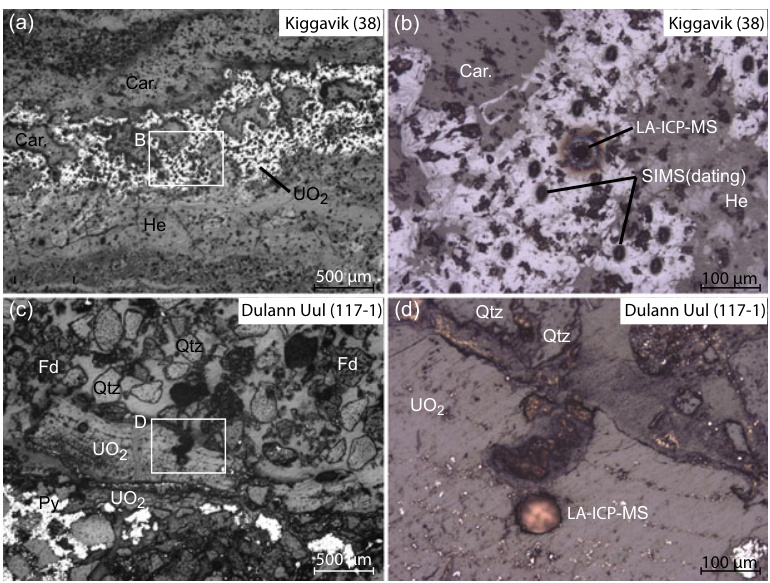

Figure 3. Photomicrographs of two studied uranium oxide-bearing natural samples. (a, b) Sample 38 from the Kiggavik U deposit (Canada). (c, d) Sample 117-1 from the Dulaan Uul U deposit (Mongolia). The analyses were carried out on a thin section for 117-1 and on a polished section for 38. SIMS dating was carried out on sample 38 in the same zone as LA-ICP-MS. Qtz: quartz, Py: pyrite, Fd: feldspar, Car: carbonate, He: haematite. 
  

### Calibration of the LA-ICP-MS for uranium oxide analyses

### Calibration protocol

The calibration of the LA- ICP- MS system was firstly based on the Mistamisk uraninite and the NIST SRM 610, 612 and 614 silica glasses (Figure 2). NIST SRM 610 was selected as the primary reference material (as against NIST SRM 612 or 614) as it is closest in REE concentrations to the Mistamisk uraninite. The diameter of the ablation crater was \(60 \mu m\) for all analyses of NIST SRM 610. Throughout all the analytical sessions, forty ablations of the Mistamisk uraninite reference material were carried out, with ten ablations for the four crater diameters tested (16, 24, 60 and \(120 \mu m\) ).  

The calibration protocol was determined as follows: (i) U and Pb were tested as internal standard elements for routine analysis at all selected diameters (from 16 to \(120 \mu m\) ). This included the calculation of the mean and standard deviation (s) for all REE for the ten analyses realised for each diameter. (ii) The influence of ablation diameter (16 and \(120 \mu m\) ) on the limits of detection (LOD) was calculated for  

the ten analyses realised for both diameters. (iii) The uncertainty (denoted \(s^*\) ) for each individual analysis, made at crater sizes of 16 and \(120 \mu m\) , was examined to determine the variability of the results towards the two extreme diameters. (iv) The reproducibility (denoted \(s^{**}\) ) for the forty results obtained under optimal analytical conditions (i.e., using the optimal internal standard) was calculated and the result compared with the previous published values for the Mistamisk uraninite (by solution nebulisation ICP- MS and SIMS) to determine the accuracy of LA- ICP- MS for REE determination in uranium oxide.  

### Influence of internal standard (Pb or U) and ablation crater diameter

For quantitative analyses by LA- ICP- MS, one method is to use a major element of the ablated samples as an 'internal standard' (Longerich et al. 1996). In uranium oxide, U and Pb are part of the major elements, the Pb content being related to the radioactive decay of U. The concentrations of REE in the Mistamisk reference material uraninite were calculated using either U or Pb as internal standards and for different ablation crater diameters (from 16 to \(120 \mu m\) ). Uranium and Pb concentrations of Mistamisk \(\mathrm{UO}_2\) [ \(\mathrm{UO}_2\) :

<!-- Page 282 -->

77.0 ± 1.4% m/m (1s) and PbO: 13.5 ± 1.5% m/m (1s), acquired by EPMA, are from Bonhoure et al. (2007). The REE concentrations obtained with both U and Pb as the internal standard are reported in Table 2.  

When using U as the internal standard, the absolute differences of REE concentrations between the mean value based on ten analyses performed with a crater diameter of \(16\mu \mathrm{m}\) and the mean value based on ten analyses performed at \(120\mu \mathrm{m}\) were less than \(12\%\) (1s) for all the REEs (Figure 4a). When using Pb as internal standard, the variation of REE concentration between the mean value based on ten analyses performed at \(16\mu \mathrm{m}\) and the mean value based on ten analyses at \(120\mu \mathrm{m}\) was between 19 and \(36\%\) (1s) for all the elements (Figure 4b). For a large diameter ( \(120\mu \mathrm{m}\) ), the differences between the mean REE contents using U or Pb as the internal standard were within uncertainty \((< 9\%\) for all fourteen REE; Figure 4c). However, differences increased up to \(34\%\) (1s) with a \(16\mu \mathrm{m}\) diameter spot (Figure 4d). The differences for the REE contents using Pb or U were significant for diameters below \(60\mu \mathrm{m}\) , with a systematic underestimation of Pb relative to U. This result indicates a selective diameter- dependent fractionation of Pb content measured by LA- ICP- MS with the instrumentation used in this work. Consequently, only U was used as the internal standard for all following analyses of uranium oxides.  

### Uncertainty and limit of detection

The LA- ICP- MS technique provided elemental concentrations at the micrometre scale and the standard deviation related to each element for each individual ablation. The latter parameter is defined as the uncertainty in the Guide to Expression of Uncertainty in Measurement (GUM), which follows ISO guidelines (ISO Guide 98: 1995). A similar interpretation of this model was previously used by Luo et al. (2007). Uncertainty (denoted \(s^*\) ) on each analysis is a function of the amount of ablated material (directly dependent on the diameter of the ablation crater) and thus must be calculated independently for each analysis and for all the elements using the standard deviation of the background- corrected recorded intensity (Table 3). This definition is different from the precision (denoted \(s\) ) obtained for a group of analyses in the same area and at the same diameter (Table 2). Here, the analytical uncertainty was calculated for each single analysis and for all the determined elements. Uncertainty is clearly influenced by the crater diameter: \(\approx 8 - 14\%\) RSD at \(120\mu \mathrm{m}\) to \(14 - 30\%\) RSD at \(16\mu \mathrm{m}\) . The LOD of quantified REE were calculated using the 3s criterion as described in Longerich et al. (1996). A clear difference was shown between the LOD at \(120\mu \mathrm{m}\) (close to the \(\mathrm{ng} \mathrm{g}^{- 1}\) level for all elements) and at \(16\mu \mathrm{m}\) (close to the \(\mathrm{mg} \mathrm{g}^{- 1}\) level for all elements, Table 3). The limit of detection at \(16\mu \mathrm{m}\) for all REE was around \(1\mu \mathrm{g} \mathrm{g}^{- 1}\) and thus was largely lower than the concentrations obtained for the Mistamisk uranium, which were close to or \(>40\mu \mathrm{g} \mathrm{g}^{- 1}\) .  

level for all elements, Table 3). The limit of detection at \(16\mu \mathrm{m}\) for all REE was around \(1\mu \mathrm{g} \cdot \mathrm{g}^{- 1}\) and thus was largely lower than the concentrations obtained for the Mistamisk uranium, which were close to or \(>40\mu \mathrm{gg}^{- 1}\) .  

### Reproducibility and accuracy

The reproducibility (denoted \(s^{**}\) ) was obtained using the standard deviation between the concentrations of all the forty ablations realised on the Mistamisk uranium reference material (Table 4). For LA- ICP- MS, the reproducibility was between 13 and \(25\%\) . Accuracy was calculated from the comparison of the mean measured concentration with the published value obtained by solution nebulisation ICP- MS (SARM and IGEM- RAS) and SIMS (CRPG) (Table 4). LA- ICP- MS values agreed with the IGEM- RAS value within \(11\%\) relative, except for La and Ce (23 and \(15\%\) , respectively, Figure 5a). Compared with the solution nebulisation ICP- MS analysis of the SARM, nine REE were within \(20\%\) relative difference, but the lowest atomic number REEs showed differences of up to \(33\%\) (Figure 5b). The difference between LA- ICP- MS and SIMS values was higher, especially for the lightest (La and Ce; 10 and \(25\%\) ) and intermediate to heavy REE (Tb to Lu; 21- \(62\%\) ; Figure 5c).  

A reliable and accurate comparison of the present data with previously published data firstly necessitates the study of differences between the previous data. The difference between SIMS and solution nebulisation ICP- MS (SARM) values is around \(18\%\) for all the REE and up to \(40\%\) (Lu) comparing SIMS and solution nebulisation ICP- MS IGEM- RAS values (Bonhoure et al. 2007). Moreover, solution nebulisation ICP- MS IGEM- RAS and SARM results show significant differences of up to \(30\%\) for ICP- MS solution analyses (Figure 5d). Independent analyses of NIST SRM 610 did not show any interferences for the lowest atomic number REEs (La and Ce, for example).  

### Matrix-matched versus non-matrix-matched analyses

To determine whether the difference in matrix between the external reference material NIST SRM 610 and \(\mathrm{UO_2}\) had an effect on the estimation of the REE concentration in uranium oxide, eighteen determinations of \(^{238}\mathrm{U}\) , \(\mathrm{Pb_{tot}}\) and REEs in an uranium oxide sample of known composition from the Millennium deposit were performed using both NIST SRM 610 and the Mistamisk RM uranium oxide as external calibrators. The reference REE contents for Mistamisk are those from the IGEM- RAS solution nebulisation ICP- MS. The REE contents measured for both external calibrators using crater diameters of 16, 24 and \(60\mu \mathrm{m}\) are reported in

<!-- Page 283 -->

e e e e e e e e e e e e e e e e e e e e e e e e e e e e e e e e e e e e   

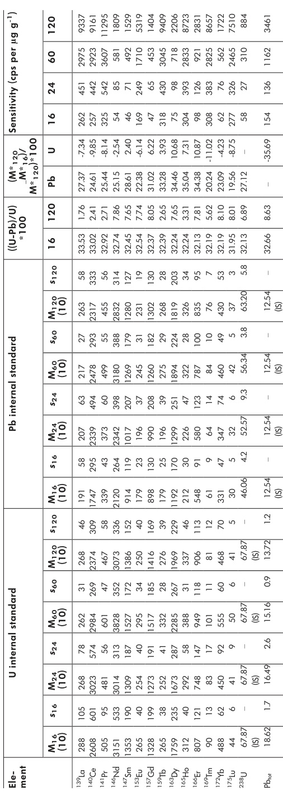

<table><tr><td rowspan="2">Ett-</td><td rowspan="2">M1</td><td rowspan="2">M2</td><td rowspan="2">M3</td><td rowspan="2">M4</td><td rowspan="2">M5</td><td rowspan="2">M6</td><td rowspan="2">M7</td><td rowspan="2">M8</td><td rowspan="2">M9</td><td rowspan="2">M10</td><td rowspan="2">M11</td><td rowspan="2">M12</td><td rowspan="2">M13</td><td rowspan="2">M14</td><td rowspan="2">M15</td><td rowspan="2">M16</td><td rowspan="2">M17</td><td rowspan="2">M18</td><td rowspan="2">M19</td><td rowspan="2">M20</td><td rowspan="2">M21</td><td rowspan="2">M22</td><td rowspan="2">M23</td><td rowspan="2">M24</td><td rowspan="2">M25</td><td rowspan="2">M26</td><td rowspan="2">M27</td><td rowspan="2">M28</td><td rowspan="2">M29</td><td rowspan="2">M30</td><td rowspan="2">M31</td><td rowspan="2">M32</td><td rowspan="2">M33</td><td rowspan="2">M34</td><td rowspan="2">M35</td><td rowspan="2">M36</td><td rowspan="2">M37</td><td rowspan="2">M38</td><td rowspan="2">M39</td><td rowspan="2">M40</td><td rowspan="2">M41</td><td rowspan="2">M42</td><td rowspan="2">M43</td><td rowspan="2">M44</td><td rowspan="2">M45</td><td rowspan="2">M46</td><td rowspan="2">M47</td><td rowspan="2">M48</td><td rowspan="2">M49</td><td rowspan="2">M50</td><td rowspan="2">M51</td><td rowspan="2">M52</td><td rowspan="2">M53</td><td rowspan="2">M54</td><td rowspan="2">M55</td><td rowspan="2">M56</td><td rowspan="2">M57</td><td rowspan="2">M58</td><td rowspan="2">M59</td><td rowspan="2">M60</td><td rowspan="2">M61</td><td rowspan="2">M62</td><td rowspan="2">M63</td><td rowspan="2">M64</td><td rowspan="2">M65</td><td rowspan="2">M66</td><td rowspan="2">M67</td><td rowspan="2">M68</td><td rowspan="2">M69</td><td rowspan="2">M70</td><td rowspan="2">M71</td><td rowspan="2">M72</td><td rowspan="2">M73</td><td rowspan="2">M74</td><td rowspan="2">M75</td><td rowspan="2">M76</td><td rowspan="2">M77</td><td rowspan="2">M78</td><td rowspan="2">M79</td><td rowspan="2">M80</td><td rowspan="2">M81</td><td rowspan="2">M82</td><td rowspan="2">M83</td><td rowspan="2">M84</td><td rowspan="2">M85</td><td rowspan="2">M86</td><td rowspan="2">M87</td><td rowspan="2">M88</td><td rowspan="2">M89</td><td rowspan="2">M90</td><td rowspan="2">M91</td><td rowspan="2">M92</td><td rowspan="2">M93</td><td rowspan="2">M94</td><td rowspan="2">M95</td><td rowspan="2">M96</td><td rowspan="2">M97</td><td rowspan="2">M98</td><td rowspan="2">M99</td><td rowspan="2">M100</td><td rowspan="2">M101</td><td rowspan="2">M102</td><td rowspan="2">M103</td><td rowspan="2">M104</td><td rowspan="2">M105</td><td rowspan="2">M106</td><td rowspan="2">M107</td><td rowspan="2">M108</td><td rowspan="2">M109</td><td rowspan="2">M110</td><td rowspan="2">M111</td><td rowspan="2">M112</td><td rowspan="2">M113</td><td rowspan="2">M114</td><td rowspan="2">M115</td><td rowspan="2">M116</td><td rowspan="2">M117</td><td rowspan="2">M118</td><td rowspan="2">M119</td><td rowspan="2">M120</td><td rowspan="2">M121</td><td rowspan="2">M122</td><td rowspan="2">M123</td><td rowspan="2">M124</td><td rowspan="2">M125</td><td rowspan="2">M126</td><td rowspan="2">M127</td><td rowspan="2">M128</td><td rowspan="2">M129</td><td rowspan="2">M130</td><td rowspan="2">M131</td><td rowspan="2">M132</td><td rowspan="2">M133</td><td rowspan="2">M134</td><td rowspan="2">M135</td><td rowspan="2">M136</td><td rowspan="2">M137</td><td rowspan="2">M138</td><td rowspan="2">M139</td><td rowspan="2">M140</td><td rowspan="2">M141</td><td rowspan="2">M142</td><td rowspan="2">M143</td><td rowspan="2">M144</td><td rowspan="2">M145</td><td rowspan="2">M146</td><td rowspan="2">M147</td><td rowspan="2">M148</td><td rowspan="2">M149</td><td rowspan="2">M150</td><td rowspan="2">M151</td><td rowspan="2">M152</td><td rowspan="2">M153</td><td rowspan="2">M154</td><td rowspan="2">M155</td><td rowspan="2">M156</td><td rowspan="2">M157</td><td rowspan="2">M158</td><td rowspan="2">M159</td><td rowspan="2">M160</td><td rowspan="2">M161</td><td rowspan="2">M162</td><td rowspan="2">M163</td><td rowspan="2">M164</td><td rowspan="2">M165</td><td rowspan="2">M166</td><td rowspan="2">M167</td><td rowspan="2">M168</td><td rowspan="2">M169</td><td rowspan="2">M170</td><td rowspan="2">M171</td><td rowspan="2">M172</td><td rowspan="2">M173</td><td rowspan="2">M174</td><td rowspan="2">M175</td><td rowspan="2">M176</td><td rowspan="2">M177</td><td rowspan="2">M178</td><td rowspan="2">M179</td><td rowspan="2">M180</td><td rowspan="2">M181</td><td rowspan="2">M182</td><td rowspan="2">M183</td><td rowspan="2">M184</td><td rowspan="2">M185</td><td rowspan="2">M186</td><td rowspan="2">M187</td><td rowspan="2">M188</td><td rowspan="2">M189</td><td rowspan="2">M190</td><td rowspan="2">M191</td><td rowspan="2">M192</td><td rowspan="2">M193</td><td rowspan="2">M194</td><td rowspan="2">M195</td><td rowspan="2">M196</td><td rowspan="2">M197</td><td rowspan="2">M198</td><td rowspan="2">M199</td><td rowspan="2">M200</td><td rowspan="2">M201</td><td rowspan="2">M202</td><td rowspan="2">M203</td><td rowspan="2">M204</td><td rowspan="2">M205</td><td rowspan="2">M206</td><td rowspan="2">M207</td><td rowspan="2">M208</td><td rowspan="2">M209</td><td rowspan="2">M210</td><td rowspan="2">M211</td><td rowspan="2">M212</td><td rowspan="2">M213</td><td rowspan="2">M214</td><td rowspan="2">M215</td><td rowspan="2">M216</td><td rowspan="2">M217</td><td rowspan="2">M218</td><td rowspan="2">M219</td><td rowspan="2">M220</td><td rowspan="2">M221</td><td rowspan="2">M222</td><td rowspan="2">M223</td><td rowspan="2">M224</td><td rowspan="2">M225</td><td rowspan="2">M226</td><td rowspan="2">M227</td><td rowspan="2">M228</td><td rowspan="2">M229</td><td rowspan="2">M230</td><td rowspan="2">M231</td><td rowspan="2">M232</td><td rowspan="2">M233</td><td rowspan="2">M234</td><td rowspan="2">M235</td><td rowspan="2">M236</td><td rowspan="2">M237</td><td rowspan="2">M238</td><td rowspan="2">M239</td><td rowspan="2">M240</td><td rowspan="2">M241</td><td rowspan="2">M242</td><td rowspan="2">M243</td><td rowspan="2">M244</td><td rowspan="2">M245</td><td rowspan="2">M246</td><td rowspan="2">M247</td><td rowspan="2">M248</td><td rowspan="2">M249</td><td rowspan="2">M250</td><td rowspan="2">M251</td><td rowspan="2">M252</td><td rowspan="2">M253</td><td rowspan="2">M254</td><td rowspan="2">M255</td><td rowspan="2">M256</td><td rowspan="2">M257</td><td rowspan="2">M258</td><td rowspan="2">M259</td><td rowspan="2">M260</td><td rowspan="2">M261</td><td rowspan="2">M262</td><td rowspan="2">M263</td><td rowspan="2">M264</td><td rowspan="2">M265</td><td rowspan="2">M266</td><td rowspan="2">M267</td><td rowspan="2">M268</td><td rowspan="2">M269</td><td rowspan="2">M270</td><td rowspan="2">M271</td><td rowspan="2">M272</td><td rowspan="2">M273</td><td rowspan="2">M274</td><td rowspan="2">M275</td><td rowspan="2">M276</td><td rowspan="2">M277</td><td rowspan="2">M278</td><td rowspan="2">M279</td><td rowspan="2">M280</td><td rowspan="2">M281</td><td rowspan="2">M282</td><td rowspan="2">M283</td><td rowspan="2">M284</td><td rowspan="2">M285</td><td rowspan="2">M286</td><td rowspan="2">M287</td><td rowspan="2">M288</td><td rowspan="2">M289</td><td rowspan="2">M290</td><td rowspan="2">M291</td><td rowspan="2">M292</td><td rowspan="2">M293</td><td rowspan="2">M294</td><td rowspan="2">M295</td><td rowspan="2">M296</td><td rowspan="2">M297</td><td rowspan="2">M298</td><td rowspan="2">M299</td><td rowspan="2">M300</td><td rowspan="2">M301</td><td rowspan="2">M302</td><td rowspan="2">M303</td><td rowspan="2">M304</td><td rowspan="2">M305</td><td rowspan="2">M306</td><td rowspan="2">M307</td><td rowspan="2">M308</td><td rowspan="2">M309</td><td rowspan="2">M310</td><td rowspan="2">M311</td><td rowspan="2">M312</td><td rowspan="2">M313</td><td rowspan="2">M314</td><td rowspan="2">M315</td><td rowspan="2">M316</td><td rowspan="2">M317</td><td rowspan="2">M318</td><td rowspan="2">M319</td><td rowspan="2">M320</td><td rowspan="2">M321</td><td rowspan="2">M322</td><td rowspan="2">M323</td><td rowspan="2">M324</td><td rowspan="2">M325</td><td rowspan="2">M326</td><td rowspan="2">M327</td><td rowspan="2">M328</td><td rowspan="2">M329</td><td rowspan="2">M330</td><td rowspan="2">M331</td><td rowspan="2">M332</td><td rowspan="2">M333</td><td rowspan="2">M334</td><td rowspan="2">M335</td><td rowspan="2">M336</td><td rowspan="2">M337</td><td rowspan="2">M338</td><td rowspan="2">M339</td><td rowspan="2">M340</td><td rowspan="2">M341</td><td rowspan="2">M342</td><td rowspan="2">M343</td><td rowspan="2">M344</td><td rowspan="2">M345</td><td rowspan="2">M346</td><td rowspan="2">M347</td><td rowspan="2">M348</td><td rowspan="2">M349</td><td rowspan="2">M350</td><td rowspan="2">M351</td><td rowspan="2">M352</td><td rowspan="2">M353</td><td rowspan="2">M354</td><td rowspan="2">M355</td><td rowspan="2">M356</td><td rowspan="2">M357</td><td rowspan="2">M358</td><td rowspan="2">M359</td><td rowspan="2">M360</td><td rowspan="2">M361</td><td rowspan="2">M362</td><td rowspan="2">M363</td><td rowspan="2">M364</td><td rowspan="2">M365</td><td rowspan="2">M366</td><td rowspan="2">M367</td><td rowspan="2">M368</td><td rowspan="2">M369</td><td rowspan="2">M370</td><td rowspan="2">M371</td><td rowspan="2">M372</td><td rowspan="2">M373</td><td rowspan="2">M374</td><td rowspan="2">M375</td><td rowspan="2">M376</td><td rowspan="2">M377</td><td rowspan="2">M378</td><td rowspan="2">M379</td><td rowspan="2">M380</td><td rowspan="2">M381</td><td rowspan="2">M382</td><td rowspan="2">M383</td><td rowspan="2">M384</td><td rowspan="2">M385</td><td rowspan="2">M386</td><td rowspan="2">M387</td><td rowspan="2">M388</td><td rowspan="2">M389</td><td rowspan="2">M390</td><td rowspan="2">M391</td><td rowspan="2">M392</td><td rowspan="2">M393</td><td rowspan="2">M394</td><td rowspan="2">M395</td><td rowspan="2">M396</td><td rowspan="2">M397</td><td rowspan="2">M398</td><td rowspan="2">M399</td><td rowspan="2">M400</td><td rowspan="2">M401</td><td rowspan="2">M402</td><td rowspan="2">M403</td><td rowspan="2">M404</td><td rowspan="2">M405</td><td rowspan="2">M406</td><td rowspan="2">M407</td><td rowspan="2">M408</td><td rowspan="2">M409</td><td rowspan="2">M410</td><td rowspan="2">M411</td><td rowspan="2">M412</td><td rowspan="2">M413</td><td rowspan="2">M414</td><td rowspan="2">M415</td><td rowspan="2">M416</td><td rowspan="2">M417</td><td rowspan="2">M418</td><td rowspan="2">M419</td><td rowspan="2">M420</td><td rowspan="2">M421</td><td rowspan="2">M422</td><td rowspan="2">M423</td><td rowspan="2">M424</td><td rowspan="2">M425</td><td rowspan="2">M426</td><td rowspan="2">M427</td><td rowspan="2">M428</td><td rowspan="2">M429</td><td rowspan="2">M430</td><td rowspan="2">M431</td><td rowspan="2">M432</td><td rowspan="2">M433</td><td rowspan="2">M434</td><td rowspan="2">M435</td><td rowspan="2">M436</td><td rowspan="2">M437</td><td rowspan="2">M438</td><td rowspan="2">M439</td><td rowspan="2">M440</td><td rowspan="2">M441</td><td rowspan="2">M442</td><td rowspan="2">M443</td><td rowspan="2">M444</td><td rowspan="2">M445</td><td rowspan="2">M446</td><td rowspan="2">M447</td><td rowspan="2">M448</td><td rowspan="2">M449</td><td rowspan="2">M450</td><td rowspan="2">M451</td><td rowspan="2">M452</td><td rowspan="2">M453</td><td rowspan="2">M454</td><td rowspan="2">M455</td><td rowspan="2">M456</td><td rowspan="2">M457</td><td rowspan="2">M458</td><td rowspan="2">M459</td><td rowspan="2">M460</td><td rowspan="2">M461</td><td rowspan="2">M462</td><td rowspan="2">M463</td><td rowspan="2">M464</td><td rowspan="2">M465</td><td rowspan="2">M466</td><td rowspan="2">M467</td><td rowspan="2">M468</td><td rowspan="2">M469</td><td rowspan="2">M470</td><td rowspan="2">M471</td><td rowspan="2">M472</td><td rowspan="2">M473</td><td rowspan="2">M474</td><td rowspan="2">M475</td><td rowspan="2">M476</td><td rowspan="2">M477</td><td rowspan="2">M478</td><td rowspan="2">M479</td><td rowspan="2">M480</td><td rowspan="2">M481</td><td rowspan="2">M482</td><td rowspan="2">M483</td><td rowspan="2">M484</td><td rowspan="2">M485</td><td rowspan="2">M486</td><td rowspan="2">M487</td><td rowspan="2">M488</td><td rowspan="2">M489</td><td rowspan="2">M490</td><td rowspan="2">M491</td><td rowspan="2">M492</td><td rowspan="2">M493</td><td rowspan="2">M494</td><td rowspan="2">M495</td><td rowspan="2">M496</td><td rowspan="2">M497</td><td rowspan="2">M498</td><td rowspan="2">M499</td><td rowspan="2">M500</td><td rowspan="2">M501</td><td rowspan="2">M502</td><td rowspan="2">M503</td><td rowspan="2">M504</td><td rowspan="2">M505</td><td rowspan="2">M506</td><td rowspan="2">M507</td><td rowspan="2">M508</td><td rowspan="2">M509</td><td rowspan="2">M510</td><td rowspan="2">M511</td><td rowspan="2">M512</td><td rowspan="2">M513</td><td rowspan="2">M514</td><td rowspan="2">M515</td><td rowspan="2">M516</td><td rowspan="2">M517</td><td rowspan="2">M518</td><td rowspan="2">M519</td><td rowspan="2">M520</td><td rowspan="2">M521</td><td rowspan="2">M522</td><td rowspan="2">M523</td><td rowspan="2">M524</td><td rowspan="2">M525</td><td rowspan="2">M526</td><td rowspan="2">M527</td><td rowspan="2">M528</td><td rowspan="2">M529</td><td rowspan="2">M530</td><td rowspan="2">M531</td><td rowspan="2">M532</td><td rowspan="2">M533</td><td rowspan="2">M534</td><td rowspan="2">M535</td><td rowspan="2">M536</td><td rowspan="2">M537</td><td rowspan="2">M538</td><td rowspan="2">M539</td><td rowspan="2">M540</td><td rowspan="2">M541</td><td rowspan="2">M542</td><td rowspan="2">M543</td><td rowspan="2">M544</td><td rowspan="2">M545</td><td rowspan="2">M546</td><td rowspan="2">M547</td><td rowspan="2">M548</td><td rowspan="2">M549</td><td rowspan="2">M550</td><td rowspan="2">M551</td><td rowspan="2">M552</td><td rowspan="2">M553</td><td rowspan="2">M554</td><td rowspan="2">M555</td><td rowspan="2">M556</td><td rowspan="2">M557</td><td rowspan="2">M558</td><td rowspan="2">M559</td><td rowspan="2">M560</td><td rowspan="2">M561</td><td rowspan="2">M562</td><td rowspan="2">M563</td><td rowspan="2">M564</td><td rowspan="2">M565</td><td rowspan="2">M566</td><td rowspan="2">M567</td><td rowspan="2">M568</td><td rowspan="2">M569</td><td rowspan="2">M570</td><td rowspan="2">M571</td><td rowspan="2">M572</td><td rowspan="2">M573</td><td rowspan="2">M574</td><td rowspan="2">M575</td><td rowspan="2">M576</td><td rowspan="2">M577</td><td rowspan="2">M578</td><td rowspan="2">M579</td><td rowspan="2">M580</td><td rowspan="2">M581</td><td rowspan="2">M582</td><td rowspan="2">M583</td><td rowspan="2">M584</td><td rowspan="2">M585</td><td rowspan="2">M586</td><td rowspan="2">M587</td><td rowspan="2">M588</td><td rowspan="2">M589</td><td rowspan="2">M590</td><td rowspan="2">M591</td><td rowspan="2">M592</td><td rowspan="2">M593</td><td rowspan="2">M594</td><td rowspan="2">M595</td><td rowspan="2">M596</td><td rowspan="2">M597</td><td rowspan="2">M598</td><td rowspan="2">M599</td><td rowspan="2">M600</td><td rowspan="2">M601</td><td rowspan="2">M602</td><td rowspan="2">M603</td><td rowspan="2">M604</td><td rowspan="2">M605</td><td rowspan="2">M606</td><td rowspan="2">M607</td><td rowspan="2">M608</td><td rowspan="2">M609</td><td rowspan="2">M610</td><td rowspan="2">M611</td><td rowspan="2">M612</td><td rowspan="2">M613</td><td rowspan="2">M614</td><td rowspan="2">M615</td><td rowspan="2">M616</td><td rowspan="2">M617</td><td rowspan="2">M618</td><td rowspan="2">M619</td><td rowspan="2">M620</td><td rowspan="2">M621</td><td rowspan="2">M622</td><td rowspan="2">M623</td><td rowspan="2">M624</td><td rowspan="2">M625</td><td rowspan="2">M626</td><td rowspan="2">M627</td><td rowspan="2">M628</td><td rowspan="2">M629</td><td rowspan="2">M630</td><td rowspan="2">M631</td><td rowspan="2">M632</td><td rowspan="2">M633</td><td rowspan="2">M634</td><td rowspan="2">M635</td><td rowspan="2">M636</td><td rowspan="2">M637</td><td rowspan="2">M638</td><td rowspan="2">M639</td><td rowspan="2">M640</td><td rowspan="2">M641</td><td rowspan="2">M642</td><td rowspan="2">M643</td><td rowspan="2">M644</td><td rowspan="2">M645</td><td rowspan="2">M646</td><td rowspan="2">M647</td><td rowspan="2">M648</td><td rowspan="2">M649</td><td rowspan="2">M650</td><td rowspan="2">M651</td><td rowspan="2">M652</td><td rowspan="2">M653</td><td rowspan="2">M654</td><td rowspan="2">M655</td><td rowspan="2">M656</td><td rowspan="2">M657</td><td rowspan="2">M658</td><td rowspan="2">M659</td><td rowspan="2">M660</td><td rowspan="2">M661</td><td rowspan="2">M662</td><td rowspan="2">M663</td><td rowspan="2">M664</td><td rowspan="2">M665</td><td rowspan="2">M666</td><td rowspan="2">M667</td><td rowspan="2">M668</td><td rowspan="2">M669</td><td rowspan="2">M670</td><td rowspan="2">M671</td><td rowspan="2">M672</td><td rowspan="2">M673</td><td rowspan="2">M674</td><td rowspan="2">M675</td><td rowspan="2">M676</td><td rowspan="2">M677</td><td rowspan="2">M678</td><td rowspan="2">M679</td><td rowspan="2">M680</td><td rowspan="2">M681</td><td rowspan="2">M682</td><td rowspan="2">M683</td><td rowspan="2">M684</td><td rowspan="2">M685</td><td rowspan="2">M686</td><td rowspan="2">M687</td><td rowspan="2">M688</td><td rowspan="2">M689</td><td rowspan="2">M690</td><td rowspan="2">M691</td><td rowspan="2">M692</td><td rowspan="2">M693</td><td rowspan="2">M694</td><td rowspan="2">M695</td><td rowspan="2">M696</td><td rowspan="2">M697</td><td rowspan="2">M698</td><td rowspan="2">M699</td><td rowspan="2">M700</td><td rowspan="2">M701</td><td rowspan="2">M702</td><td rowspan="2">M703</td><td rowspan="2">M704</td><td rowspan="2">M705</td><td rowspan="2">M706</td><td rowspan="2">M707</td><td rowspan="2">M708</td><td rowspan="2">M709</td><td rowspan="2">M710</td><td rowspan="2">M711</td><td rowspan="2">M712</td><td rowspan="2">M713</td><td rowspan="2">M714</td><td rowspan="2">M715</td><td rowspan="2">M716</td><td rowspan="2">M717</td><td rowspan="2">M718</td><td rowspan="2">M719</td><td rowspan="2">M720</td><td rowspan="2">M721</td><td rowspan="2">M722</td><td rowspan="2">M723</td><td rowspan="2">M724</td><td rowspan="2">M725</td><td rowspan="2">M726</td><td rowspan="2">M727</td><td rowspan="2">M728</td><td rowspan="2">M729</td><td rowspan="2">M730</td><td rowspan="2">M731</td><td rowspan="2">M732</td><td rowspan="2">M733</td><td rowspan="2">M734</td><td rowspan="2">M735</td><td rowspan="2">M736</td><td rowspan="2">M737</td><td rowspan="2">M738</td><td rowspan="2">M739</td><td rowspan="2">M740</td><td rowspan="2">M741</td><td rowspan="2">M742</td><td rowspan="2">M743</td><td rowspan="2">M744</td><td rowspan="2">M745</td><td rowspan="2">M746</td><td rowspan="2">M747</td><td rowspan="2">M748</td><td rowspan="2">M749</td><td rowspan="2">M750</td><td rowspan="2">M751</td><td rowspan="2">M752</td><td rowspan="2">M753</td><td rowspan="2">M754</td><td rowspan="2">M755</td><td rowspan="2">M756</td><td rowspan="2">M757</td><td rowspan="2">M758</td><td rowspan="2">M759</td><td rowspan="2">M760</td><td rowspan="2">M761</td><td rowspan="2">M762</td><td rowspan="2">M763</td><td rowspan="2">M764</td><td rowspan="2">M765</td><td rowspan="2">M766</td><td rowspan="2">M767</td><td rowspan="2">M768</td><td rowspan="2">M769</td><td rowspan="2">M770</td><td rowspan="2">M771</td><td rowspan="2">M772</td><td rowspan="2">M773</td><td rowspan="2">M774</td><td rowspan="2">M775</td><td rowspan="2">M776</td><td rowspan="2">M777</td><td rowspan="2">M778</td><td rowspan="2">M779</td><td rowspan="2">M780</td><td rowspan="2">M781</td><td rowspan="2">M782</td><td rowspan="2">M783</td><td rowspan="2">M784</td><td rowspan="2">M785</td><td rowspan="2">M786</td><td rowspan="2">M787</td><td rowspan="2">M788</td><td rowspan="2">M789</td><td rowspan="2">M790</td><td rowspan="2">M791</td><td rowspan="2">M792</td><td rowspan="2">M793</td><td rowspan="2">M794</td><td rowspan="2">M795</td><td rowspan="2">M796</td><td rowspan="2">M797</td><td rowspan="2">M798</td><td rowspan="2">M799</td><td rowspan="2">M800</td><td rowspan="2">M801</td><td rowspan="2">M802</td><td rowspan="2">M803</td><td rowspan="2">M804</td><td rowspan="2">M805</td><td rowspan="2">M806</td><td rowspan="2">M807</td><td rowspan="2">M808</td><td rowspan="2">M809</td><td rowspan="2">M810</td><td rowspan="2">M811</td><td rowspan="2">M812</td><td rowspan="2">M813</td><td rowspan="2">M814</td><td rowspan="2">M815</td><td rowspan="2">M816</td><td rowspan="2">M817</td><td rowspan="2">M818</td><td rowspan="2">M819</td><td rowspan="2">M820</td><td rowspan="2">M821</td><td rowspan="2">M822</td><td rowspan="2">M823</td><td rowspan="2">M824</td><td rowspan="2">M825</td><td rowspan="2">M826</td><td rowspan="2">M827</td><td rowspan="2">M828</td><td rowspan="2">M829</td><td rowspan="2">M830</td><td rowspan="2">M831</td><td rowspan="2">M832</td><td rowspan="2">M833</td><td rowspan="2">M834</td><td rowspan="2">M835</td><td rowspan="2">M836</td><td rowspan="2">M837</td><td rowspan="2">M838</td><td rowspan="2">M839</td><td rowspan="2">M840</td><td rowspan="2">M841</td><td rowspan="2">M842</td><td rowspan="2">M843</td><td rowspan="2">M844</td><td rowspan="2">M845</td><td rowspan="2">M846</td><td rowspan="2">M847</td><td rowspan="2">M848</td><td rowspan="2">M849</td><td rowspan="2">M850</td><td rowspan="2">M851</td><td rowspan="2">M852</td><td rowspan="2">M853</td><td rowspan="2">M854</td><td rowspan="2">M855</td><td rowspan="2">M856</td><td rowspan="2">M857</td><td rowspan="2">M858</td><td rowspan="2">M859</td><td rowspan="2">M860</td><td rowspan="2">M861</td><td rowspan="2">M862</td><td rowspan="2">M863</td><td rowspan="2">M864</td><td rowspan="2">M865</td><td rowspan="2">M866</td><td rowspan="2">M867</td><td rowspan="2">M868</td><td rowspan="2">M869</td><td rowspan="2">M870</td><td rowspan="2">M871</td><td rowspan="2">M872</td><td rowspan="2">M873</td><td rowspan="2">M874</td><td rowspan="2">M875</td><td rowspan="2">M876</td><td rowspan="2">M877</td><td rowspan="2">M878</td><td rowspan="2">M879</td><td rowspan="2">M880</td><td rowspan="2">M881</td><td rowspan="2">M882</td><td rowspan="2">M883</td><td rowspan="2">M884</td><td rowspan="2">M885</td><td rowspan="2">M886</td><td rowspan="2">M887</td><td rowspan="2">M888</td><td rowspan="2">M889</td><td rowspan="2">M890</td><td rowspan="2">M891</td><td rowspan="2">M892</td><td rowspan="2">M893</td><td rowspan="2">M894</td><td rowspan="2">M895</td><td rowspan="2">M896</td><td rowspan="2">M897</td><td rowspan="2">M898</td><td rowspan="2">M899</td><td rowspan="2">M900</td><td rowspan="

<!-- Page 284 -->

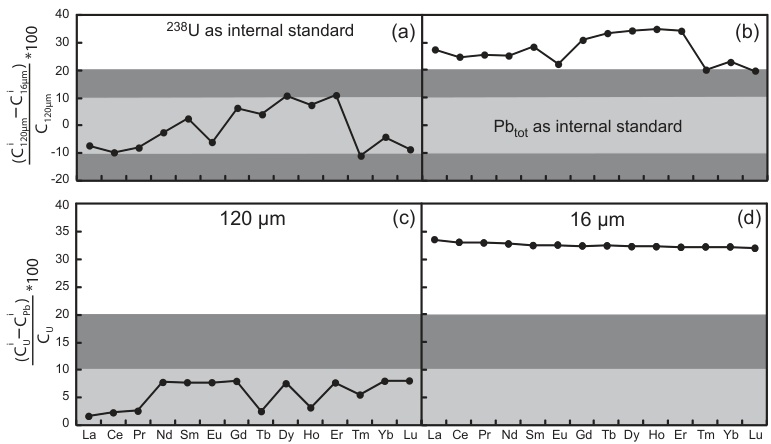

Figure 4. Comparison between the REE concentration obtained by LA-ICP-MS at ablation diameters of \(16\mu \mathrm{m}\) \(\left(\mathbf{C}_{16\mu \mathrm{m}}^{1}\right)\) and \(120\mu \mathrm{m}\) \(\left(\mathbf{C}_{120\mu \mathrm{m}}^{1}\right)\) for the Mistamisk uraninite (upper part) with \(^{238}\mathrm{U}\) or \(\mathrm{Pb_{tot}(^{206}Pb + ^{207}Pb + ^{208}Pb)}\) as internal standards. (a) \(^{238}\mathrm{U}\) used as internal standard and (b) \(\mathrm{Pb_{tot}}\) used as internal standard. Comparison between the REE concentrations obtained with \(\mathrm{U}\left(\mathrm{C}_{1}^{1}\right)\) and \(\mathrm{Pb}\) as internal standard \(\left(\mathrm{C}_{Pb}^{1}\right)\) (lower part). (c) \(120\mu \mathrm{m}\) ablation diameter and (d) \(16\mu \mathrm{m}\) ablation diameter. For all analyses, NIST SRM 610 was used as the external calibrator with an ablation diameter of \(60\mu \mathrm{m}\) . Light grey zone: \(0 - 10\%\) of variation, dark grey zone: \(10 - 20\%\) of variation. Values are from Table 2. 
  

Table 3. LA-ICP-MS limit of detection (LOD) and uncertainty \((s^{*}\) , in \(\mu \mathrm{g}\cdot \mathrm{g}^{-1}\) ) at spot diameters of 16 and \(120\mu \mathrm{m}\) for the REE measurements in the Mistamisk uraninite   

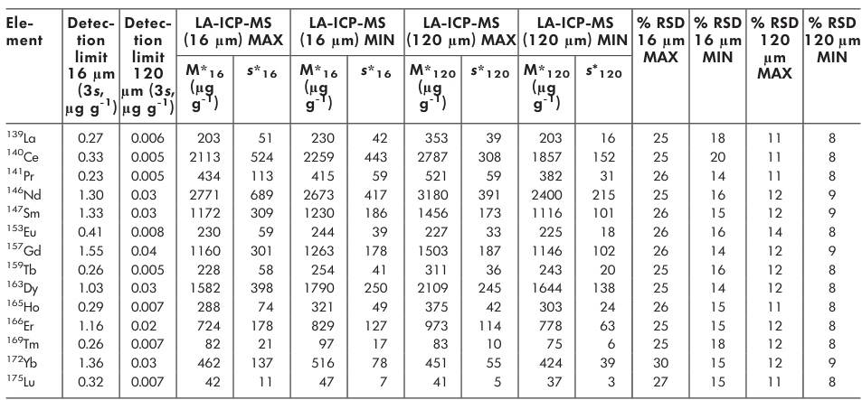

<table><tr><td>Ele- ment</td><td>Detec-tion limit 16 μm (3s, μg g-1)</td><td>Detec-tion limit 120 μm (3s, μg g-1)</td><td>LA-ICP-MS (16 μm) MAX</td><td>LA-ICP-MS (16 μm) MIN</td><td>LA-ICP-MS (120 μm) MAX</td><td>LA-ICP-MS (120 μm) MIN</td><td>% RSD 16 μm MAX</td><td>% RSD 16 μm MIN</td><td>% RSD 120 μm MAX</td><td>% RSD 120 μm MIN</td><td>% RSD 120 μm MAX</td></tr><tr><td>139La</td><td>0.27</td><td>0.006</td><td>203</td><td>51</td><td>230</td><td>42</td><td>353</td><td>39</td><td>203</td><td>16</td><td>25</td><td>18</td></tr><tr><td>140Ce</td><td>0.33</td><td>0.005</td><td>2113</td><td>524</td><td>2259</td><td>443</td><td>2787</td><td>308</td><td>1857</td><td>152</td><td>25</td><td>20</td></tr><tr><td>141Pr</td><td>0.23</td><td>0.005</td><td>434</td><td>113</td><td>415</td><td>59</td><td>521</td><td>59</td><td>382</td><td>31</td><td>26</td><td>14</td></tr><tr><td>146Nd</td><td>1.30</td><td>0.03</td><td>2771</td><td>689</td><td>2673</td><td>417</td><td>3180</td><td>391</td><td>2400</td><td>215</td><td>25</td><td>16</td></tr><tr><td>147Sm</td><td>1.33</td><td>0.03</td><td>1172</td><td>309</td><td>1230</td><td>186</td><td>1456</td><td>173</td><td>1116</td><td>101</td><td>26</td><td>15</td></tr><tr><td>153Eu</td><td>0.41</td><td>0.008</td><td>230</td><td>59</td><td>244</td><td>39</td><td>227</td><td>33</td><td>225</td><td>18</td><td>26</td><td>14</td></tr><tr><td>157Gd</td><td>1.55</td><td>0.04</td><td>1160</td><td>301</td><td>1263</td><td>178</td><td>1503</td><td>187</td><td>1146</td><td>102</td><td>26</td><td>14</td></tr><tr><td>159Tb</td><td>0.26</td><td>0.005</td><td>228</td><td>58</td><td>254</td><td>41</td><td>311</td><td>36</td><td>243</td><td>20</td><td>25</td><td>16</td></tr><tr><td>163Dy</td><td>1.03</td><td>0.03</td><td>1582</td><td>398</td><td>1790</td><td>250</td><td>2109</td><td>245</td><td>1644</td><td>138</td><td>25</td><td>14</td></tr><tr><td>165Ho</td><td>0.29</td><td>0.007</td><td>288</td><td>74</td><td>321</td><td>49</td><td>375</td><td>42</td><td>303</td><td>24</td><td>26</td><td>15</td></tr><tr><td>166Er</td><td>1.16</td><td>0.02</td><td>724</td><td>178</td><td>829</td><td>127</td><td>973</td><td>114</td><td>778</td><td>63</td><td>25</td><td>15</td></tr><tr><td>169Tm</td><td>0.26</td><td>0.007</td><td>82</td><td>21</td><td>97</td><td>17</td><td>83</td><td>10</td><td>75</td><td>6</td><td>25</td><td>18</td></tr><tr><td>172Yb</td><td>1.36</td><td>0.03</td><td>462</td><td>137</td><td>516</td><td>78</td><td>451</td><td>55</td><td>424</td><td>39</td><td>30</td><td>15</td></tr><tr><td>175Lu</td><td>0.32</td><td>0.007</td><td>42</td><td>11</td><td>47</td><td>7</td><td>41</td><td>5</td><td>37</td><td>3</td><td>27</td><td>15</td></tr></table>

LOD were obtained using \(3s\) (Longerich et al. 1996). Uncertainty and concentration were calculated for one individual analysis. They are expressed for two selected diameters (16 and \(120\mu \mathrm{m}\) ). MIN and MAX values for the two diameters correspond to the minimum and maximum uncertainties calculated for the ten analyses realised for each diameter. Uncertainties are reported as relative standard deviation \((\%)\) RSD). \(^{238}\mathrm{U}\) was used as the internal standard and NIST SRM 610 silicate glass as the external calibrator. Uncertainty is given as \(1s\)

<!-- Page 285 -->

Table 4. LA-ICP-MS mean concentration \((M^{**})\) in \(\mu \mathrm{g}\mathrm{g}^{-1}\) and reproducibility \((s^{**}\) in \(\mu \mathrm{g}\mathrm{g}^{-1})\) for all the REE measurements in the Mistamisk uraninite (forty analyses) and accuracy (expressed as relative standard deviation) compared with reference SIMS and solution nebulisation ICP-MS (SARM and IGEM-RAS) values   

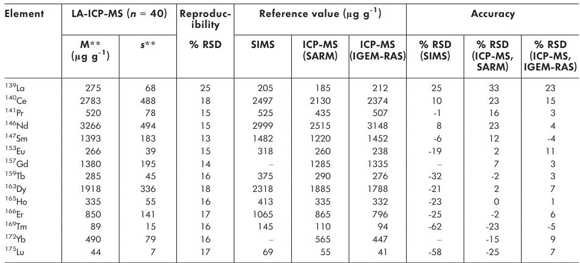

<table><tr><td rowspan="2">Element</td><td colspan="2">LA-ICP-MS (n = 40)</td><td rowspan="2">Reproduc- bility % RSD</td><td colspan="3">Reference value (μg g-1)</td><td colspan="3">Accuracy</td></tr><tr><td>M** (μg g-1)</td><td>s**</td><td>SIMS</td><td>ICP-MS (SARM)</td><td>ICP-MS (IGEM-RAS)</td><td>% RSD (SIMS)</td><td>% RSD (ICP-MS, SARM)</td><td>% RSD (ICP-MS, IGEM-RAS)</td></tr><tr><td>139La</td><td>275</td><td>68</td><td>25</td><td>205</td><td>185</td><td>212</td><td>25</td><td>33</td><td>23</td></tr><tr><td>140Ce</td><td>2783</td><td>488</td><td>18</td><td>2497</td><td>2130</td><td>2374</td><td>10</td><td>23</td><td>15</td></tr><tr><td>141Pr</td><td>520</td><td>78</td><td>15</td><td>525</td><td>435</td><td>507</td><td>-1</td><td>16</td><td>3</td></tr><tr><td>146Nd</td><td>3266</td><td>494</td><td>15</td><td>2999</td><td>2515</td><td>3148</td><td>8</td><td>23</td><td>4</td></tr><tr><td>147Sm</td><td>1393</td><td>183</td><td>13</td><td>1482</td><td>1220</td><td>1452</td><td>-6</td><td>12</td><td>-4</td></tr><tr><td>153Eu</td><td>266</td><td>39</td><td>15</td><td>318</td><td>260</td><td>238</td><td>-19</td><td>2</td><td>11</td></tr><tr><td>137Gd</td><td>1380</td><td>195</td><td>14</td><td>-</td><td>1285</td><td>1335</td><td>-</td><td>7</td><td>3</td></tr><tr><td>159Tb</td><td>285</td><td>45</td><td>16</td><td>375</td><td>290</td><td>276</td><td>-32</td><td>-2</td><td>3</td></tr><tr><td>163Dy</td><td>1918</td><td>336</td><td>18</td><td>2318</td><td>1885</td><td>1788</td><td>-21</td><td>2</td><td>7</td></tr><tr><td>165Ho</td><td>335</td><td>55</td><td>16</td><td>413</td><td>335</td><td>332</td><td>-23</td><td>0</td><td>1</td></tr><tr><td>166Er</td><td>850</td><td>141</td><td>17</td><td>1065</td><td>865</td><td>796</td><td>-25</td><td>-2</td><td>6</td></tr><tr><td>169Tm</td><td>89</td><td>15</td><td>16</td><td>145</td><td>110</td><td>94</td><td>-62</td><td>-23</td><td>-5</td></tr><tr><td>172Yb</td><td>490</td><td>79</td><td>16</td><td>-</td><td>565</td><td>447</td><td>-</td><td>-15</td><td>9</td></tr><tr><td>175Lu</td><td>44</td><td>7</td><td>17</td><td>69</td><td>55</td><td>41</td><td>-58</td><td>-25</td><td>7</td></tr></table>

Reproducibility was obtained using the standard deviation calculated from the mean \((M^{**})\) of forty ablations whatever the spot diameter. Accuracy was calculated using \((100*\) (measured value-reference value)/measured value). All concentrations are in \(\mu \mathrm{g}\mathrm{g}^{-1}\) . Reference values for solution nebulisation ICP-MS and SIMS are from Bonhoure et al. (2007), RSD for solution nebulisation reference values was not provided. \(238\mathrm{U}\) was used as the internal standard and NIST SRM 610 as the external calibrator. -: not measured. Reproducibility is given as 1 s.  

Table 5, and a comparison for a spot diameter of \(60\mu \mathrm{m}\) is presented in Figure 6a. A slight difference for the REE concentrations was observed between analyses carried out using both external calibrators (Figure 6a), with an overestimation of the REE concentrations between 3 and \(22\%\) using NIST SRM 610 compared with the Mistamisk uraninite. The comparison of the concentrations obtained by LA- ICP- MS with the values from the same sample using SIMS (Mercadier 2008) is presented in Figure 6b. Considering the chondrite- normalised REE patterns, no significant differences are visible. As both external calibrators provided similar results and because NIST SRM 610 is a certified reference material, the latter was used as the external calibrator during the routine analytical protocol for unknown samples. The REE concentrations obtained by LA- ICP- MS for all diameters (16, 24 and \(60\mu \mathrm{m}\) ) were very similar to those obtained by SIMS at a diameter of \(40\mu \mathrm{m}\) (Figure 6b) and gave identical chondrite- normalised REE patterns.  

### Application: REE measurements of UO2 from the Kiggavik, Torkuduk and Dulann Uul uranium deposits

Samples originating from the three selected deposits for which the genetic conditions are not clearly constrained were analysed using NIST SRM 610 as external calibrator,  

\(238\mathrm{U}\) as internal standard and beam diameters of 16, 24 or \(60\mu \mathrm{m}\) , depending on the dimensions of the \(\mathrm{UO_2}\) phase (Figure 3). The analytical values are given in Table 6, and the associated chondrite- normalised REE patterns are presented in Figure 7. For all samples, the REE contents were strongly enriched compared with the chondritic values, up to \(10^{5}\) the reference data for Kiggavik (Figure 7a). For the Kiggavik deposit, the chondrite- normalised REE patterns display a bell- shaped pattern with enrichment in intermediate REE (Sm to Dy) compared with light and heavy REE. All analyses from the three Kiggavik samples were consistent within uncertainty. The Torkuduk samples showed enrichment in low atomic number REE (La to Sm) compared with high atomic number REE (Ho to Yb) and presented a negative Eu anomaly. The highest atomic number REEs were below the limits of detection for two analyses (K31- 2 and K36- 2). The REE displayed the same general pattern among the samples but with variable abundance (less than one order of magnitude), especially for low atomic number REE (La to Nd). The two uranium oxides from Dulann Uul had nearly flat chondrite- normalised REE patterns with a well- defined negative Eu anomaly (Figure 7c). A small enrichment in low atomic number REE can be observed (La to Nd). The chondrite- normalised REE patterns present the same shape at the deposit scale, whatever the sample location, but exhibit clear differences between the three deposits.

<!-- Page 286 -->

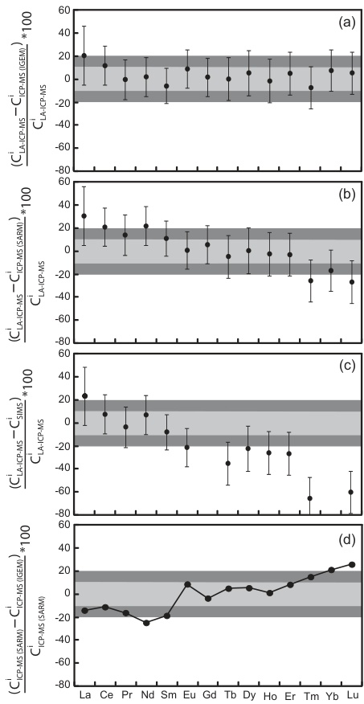

Figure 5. Comparison of the REE concentration obtained for the Mistamisk uranium by LA-ICP-MS ( \(\mathrm{C_{LA-ICP-MS}}\) ) and (a) solution nebulisation ICP-MS at IGEM-RAS (Moscow, Russia) \(\mathrm{(C_{ICP-MS(IGEM)})}\) , (b) solution nebulisation ICP-MS at the SARM (CRPG, Nancy, France) \(\mathrm{(C_{ICP-MS(SARM)})}\) and (c) SIMS IMS 3f at CRPG \(\mathrm{(C_{SIMS})}\) . Solution nebulisation ICP-MS and SIMS values are from Bonhoure et al. (2007). For LA-ICP-MS, \(^{238}\mathrm{U}\) was used as internal standard and NIST SRM 610 as external calibrator. The errors bars represent the reproducibility for the forty LA-ICP-MS analyses (Table 4). (d) Comparison between the concentrations obtained by both solution nebulisation data sets from IGEM-RAS and SARM. Light grey zone: \(0 - 10\%\) of variation, dark grey zone: \(10 - 20\%\) of variation. 
  

## Discussion

The present results provide reference operating conditions on our system to achieve reliable measurements of REEs in uranium oxides by LA- ICP- MS. The main point of the present work is that, for LA- ICP- MS analyses of \(\mathrm{UO_2}\) only U ought to be used as an internal standard for routine determination of REE and that the NIST SRM 610 glass CRM can be used as an external standard. This protocol, applied to the Mistamisk reference material uranium for determination of REE, gave results consistent with previous studies by solution nebulisation ICP- MS and SIMS techniques. This suggests that interferences in the REE determination by LA- ICP- MS are negligible, as initially proposed by Jackson et al. (1992), and that no correction is therefore needed for these elements.  

### Evidence for fractionation effects between U, REE and Pb

Firstly, the choice of the internal standard appears to be of primary importance. Uranium oxides are composed of a relatively limited number of major elements: U, O and Pb (Pb content depending of the crystallisation age of the mineral as it is related to the radioactive decay of U) and to a lesser extent Si, Ca or Th (Cuney and Kyser 2008), depending on the genetic conditions. The calculated values for the REE using LA- ICP- MS differed significantly depending on the internal standard used, that is, Pb or U, and on the diameter of the ablation crater. This is particularly the case for the small ablation diameters (16 and \(24\mu \mathrm{m}\) ). The REE concentrations were less dependent on the ablation diameter if U was chosen as the internal standard, whereas measurements with Pb were strongly diameter dependent.  

To explain these results, an elemental fractionation between Pb and U during the \(\mathrm{UO_2}\) ablation process at the crater site could be invoked, as observed for zircon (Kuhn et al. 2010). This elemental fractionation for \(\mathrm{UO_2}\) is proposed to be related to two main effects. A first fractionation effect could be directly related to the difference in location of the two elements within \(\mathrm{UO_2}\) . Uranium and the REE are simultaneously integrated within the uranium oxide structure at the time of its crystallisation following substitution phenomenon (Shannon 1976), whereas Pb content increases with time as a function of U and Th decay. The Pb ionic radius (119 pm) is larger than the ionic radius of U and the majority of the REE, and the oxidation state differs between Pb (2+) and U (4+) and REE (mainly 3+). Because of these two differences, Pb is not bound in the crystal structure but occupies domains in the uranium oxide lattice and is mainly observed in small (50-

<!-- Page 287 -->

aee eee eee eee eee eee eee eee eee eee eee eee eee eee eee eee eee eee eeee eee eee eee eee eee eee eee eee eee eee eee eee eee eee eee eee eee ee eee eee eee eee eee eee eee eee eee eee eee eee eee eee eee eee eee   

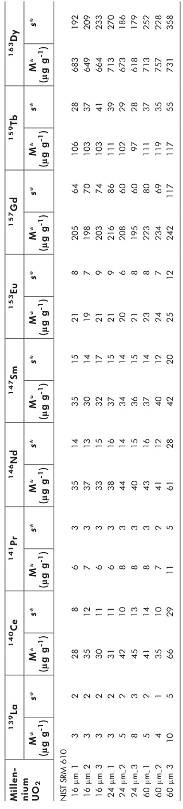

<table><tr><td></td><td>Milline</td><td>UQ</td><td>13-gp</td><td>14-QE</td><td>14-QE</td><td>14-QE</td><td>14-QE</td><td>14-QE</td><td>14-QE</td><td>14-QE</td><td>14-QF</td><td>14-QF</td><td>14-QF</td><td>14-QF</td><td>14-QF</td><td>14-QF</td><td>14-QF</td><td>14-QE</td><td>14-QE</td><td>14-QE</td><td>14-QE</td><td>14-QE</td><td>14-QE</td><td>14-QG</td><td>14-QG</td><td>14-QG</td><td>14-QG</td><td>14-QG</td><td>14-QG</td><td>14-QG</td><td>14-QH</td><td>14-QH</td><td>14-QH</td><td>14-QH</td><td>14-QH</td><td>14-QH</td><td>14-QH</td><td>14-QG</td><td>14-QG</td><td>14-QG</td><td>14-QG</td><td>14-QG</td><td>14-QG</td><td>14-QF</td><td>14-QF</td><td>14-QF</td><td>14-QF</td><td>14-QF</td><td>14-QF</td><td>14-QG</td><td>14-QG</td><td>14-QG</td><td>14-QG</td><td>14-QG</td><td>14-QG</td><td>14-QE</td><td>14-QE</td><td>14-QE</td><td>14-QE</td><td>14-QE</td><td>14-QE</td><td>14-QH</td><td>14-QH</td><td>14-QH</td><td>14-QH</td><td>14-QH</td><td>14-QH</td><td>14-QE</td><td>14-QE</td><td>14-QE</td><td>14-QE</td><td>14-QE</td><td>14-QE</td><td>14-QD</td><td>14-QD</td><td>14-QD</td><td>14-QD</td><td>14-QD</td><td>14-QD</td><td>14-QD</td><td>14-QE</td><td>14-QE</td><td>14-QE</td><td>14-QE</td><td>14-QE</td><td>14-QE</td><td>14-QC</td><td>14-QC</td><td>14-QC</td><td>14-QC</td><td>14-QC</td><td>14-QC</td><td>14-QC</td><td>14-QE</td><td>14-QE</td><td>14-QE</td><td>14-QE</td><td>14-QE</td><td>14-QE</td><td>14-QB</td><td>14-QB</td><td>14-QB</td><td>14-QB</td><td>14-QB</td><td>14-QB</td><td>14-QB</td><td>14-QE</td><td>14-QE</td><td>14-QE</td><td>14-QE</td><td>14-QE</td><td>14-QE</td><td>14-QA</td><td>14-QA</td><td>14-QA</td><td>14-QA</td><td>14-QA</td><td>14-QA</td><td>14-QA</td><td>14-QB</td><td>14-QB</td><td>14-QB</td><td>14-QB</td><td>14-QB</td><td>14-QB</td><td>14-QA</td><td>14-QA</td><td>14-QA</td><td>14-QA</td><td>14-QA</td><td>14-QA</td><td>14-QE</td><td>14-QE</td><td>14-QE</td><td>14-QE</td><td>14-QE</td><td>14-QE</td><td>14-QS</td><td>14-QS</td><td>14-QS</td><td>14-QS</td><td>14-QS</td><td>14-QS</td><td>14-QS</td><td>14-QE</td><td>14-QE</td><td>14-QE</td><td>14-QE</td><td>14-QE</td><td>14-QE</td><td>14-QQ</td><td>14-QQ</td><td>14-QQ</td><td>14-QQ</td><td>14-QQ</td><td>14-QQ</td><td>14-QQ</td><td>14-QE</td><td>14-QE</td><td>14-QE</td><td>14-QE</td><td>14-QE</td><td>14-QE</td><td>14-QL</td><td>14-QL</td><td>14-QL</td><td>14-QL</td><td>14-QL</td><td>14-QL</td><td>14-QL</td><td>14-QE</td><td>14-QE</td><td>14-QE</td><td>14-QE</td><td>14-QE</td><td>14-QE</td><td>14-QN</td><td>14-QN</td><td>14-QN</td><td>14-QN</td><td>14-QN</td><td>14-QN</td><td>14-QN</td><td>14-QE</td><td>14-QE</td><td>14-QE</td><td>14-QE</td><td>14-QE</td><td>14-QE</td><td>14-QT</td><td>14-QT</td><td>14-QT</td><td>14-QT</td><td>14-QT</td><td>14-QT</td><td>14-QT</td><td>14-QE</td><td>14-QE</td><td>14-QE</td><td>14-QE</td><td>14-QE</td><td>14-QE</td><td>14-QR</td><td>14-QR</td><td>14-QR</td><td>14-QR</td><td>14-QR</td><td>14-QR</td><td>14-QR</td><td>14-QE</td><td>14-QE</td><td>14-QE</td><td>14-QE</td><td>14-QE</td><td>14-QE</td><td>14-QI</td><td>14-QI</td><td>14-QI</td><td>14-QI</td><td>14-QI</td><td>14-QI</td><td>14-QI</td><td>14-QE</td><td>14-QE</td><td>14-QE</td><td>14-QE</td><td>14-QE</td><td>14-QE</td><td>14-QU</td><td>14-QU</td><td>14-QU</td><td>14-QU</td><td>14-QU</td><td>14-QU</td><td>14-QU</td><td>14-QE</td><td>14-QE</td><td>14-QE</td><td>14-QE</td><td>14-QE</td><td>14-QE</td><td>14-QW</td><td>14-QW</td><td>14-QW</td><td>14-QW</td><td>14-QW</td><td>14-QW</td><td>14-QE</td><td>14-QE</td><td>14-QE</td><td>14-QE</td><td>14-QE</td><td>14-QE</td><td>14-QX</td><td>14-QX</td><td>14-QX</td><td>14-QX</td><td>14-QX</td><td>14-QX</td><td>14-QX</td><td>14-QE</td><td>14-QE</td><td>14-QE</td><td>14-QE</td><td>14-QE</td><td>14-QE</td><td>14-QY</td><td>14-QY</td><td>14-QY</td><td>14-QY</td><td>14-QY</td><td>14-QY</td><td>14-QY</td><td>14-QE</td><td>14-QE</td><td>14-QE</td><td>14-QE</td><td>14-QE</td><td>14-QE</td><td>14-QZ</td><td>14-QZ</td><td>14-QZ</td><td>14-QZ</td><td>14-QZ</td><td>14-QZ</td><td>14-QZ</td><td>14-QE</td><td>14-QE</td><td>14-QE</td><td>14-QE</td><td>14-QE</td><td>14-QE</td><td>14-QK</td><td>14-QK</td><td>14-QK</td><td>14-QK</td><td>14-QK</td><td>14-QK</td><td>14-QE</td><td>14-QE</td><td>14-QE</td><td>14-QE</td><td>14-QE</td><td>14-QE</td><td>14-QM</td><td>14-QM</td><td>14-QM</td><td>14-QM</td><td>14-QM</td><td>14-QM</td><td>14-QM</td><td>14-QE</td><td>14-QE</td><td>14-QE</td><td>14-QE</td><td>14-QE</td><td>14-QE</td><td>14-QP</td><td>14-QP</td><td>14-QP</td><td>14-QP</td><td>14-QP</td><td>14-QP</td><td>14-QP</td><td>14-QE</td><td>14-QE</td><td>14-QE</td><td>14-QE</td><td>14-QE</td><td>14-QE</td><td>14-QV</td><td>14-QV</td><td>14-QV</td><td>14-QV</td><td>14-QV</td><td>14-QV</td><td>14-QV</td><td>14-QE</td><td>14-QE</td><td>14-QE</td><td>14-QE</td><td>14-QE</td><td>14-QE</td><td>14-QO</td><td>14-QO</td><td>14-QO</td><td>14-QO</td><td>14-QO</td><td>14-QO</td><td>14-QO</td><td>14-QE</td><td>14-QE</td><td>14-QE</td><td>14-QE</td><td>14-QE</td><td>14-QE</td><td>14-QJ</td><td>14-QJ</td><td>14-QJ</td><td>14-QJ</td><td>14-QJ</td><td>14-QJ</td><td>14-QJ</td><td>14-QE</td><td>14-QE</td><td>14-QE</td><td>14-QE</td><td>14-QE</td><td>14-QE</td><td>14-Qe</td><td>14-QE</td><td>14-QE</td><td>14-QE</td><td>14-QE</td><td>14-QE</td><td>14-QE</td><td>14-Qf</td><td>14-Qf</td><td>14-Qf</td><td>14-Qf</td><td>14-Qf</td><td>14-Qf</td><td>14-Qf</td><td>14-QE</td><td>14-QE</td><td>14-QE</td><td>14-QE</td><td>14-QE</td><td>14-QE</td><td>14-Qg</td><td>14-Qg</td><td>14-Qg</td><td>14-Qg</td><td>14-Qg</td><td>14-Qg</td><td>14-Qg</td><td>14-QE</td><td>14-QE</td><td>14-QE</td><td>14-QE</td><td>14-QE</td><td>14-QE</td><td>14-Qh</td><td>14-Qh</td><td>14-Qh</td><td>14-Qh</td><td>14-Qh</td><td>14-Qh</td><td>14-Qh</td><td>14-QE</td><td>14-QE</td><td>14-QE</td><td>14-QE</td><td>14-QE</td><td>14-QE</td><td>14-Qk</td><td>14-Qk</td><td>14-Qk</td><td>14-Qk</td><td>14-Qk</td><td>14-QE</td><td>14-QE</td><td>14-QE</td><td>14-QE</td><td>14-QE</td><td>14-QE</td><td>14-Ql</td><td>14-Ql</td><td>14-Ql</td><td>14-Ql</td><td>14-Ql</td><td>14-QE</td><td>14-QE</td><td>14-QE</td><td>14-QE</td><td>14-QE</td><td>14-QE</td><td>14-Qn</td><td>14-Qn</td><td>14-Qn</td><td>14-Qn</td><td>14-Qn</td><td>14-QE</td><td>14-QE</td><td>14-QE</td><td>14-QE</td><td>14-QE</td><td>14-QE</td><td>14-Qx</td><td>14-Qx</td><td>14-Qx</td><td>14-Qx</td><td>14-Qx</td><td>14-QE</td><td>14-QE</td><td>14-QE</td><td>14-QE</td><td>14-QE</td><td>14-QE</td><td>14-Qy</td><td>14-Qy</td><td>14-Qy</td><td>14-Qy</td><td>14-QE</td><td>14-QE</td><td>14-QE</td><td>14-QE</td><td>14-QE</td><td>14-QE</td><td>14-Qz</td><td>14-Qz</td><td>14-Qz</td><td>14-Qz</td><td>14-Qz</td><td>14-QE</td><td>14-QE</td><td>14-QE</td><td>14-QE</td><td>14-QE</td><td>14-QE</td><td>14-Qw</td><td>14-Qw</td><td>14-Qw</td><td>14-Qw</td><td>14-Qw</td><td>14-QE</td><td>14-QE</td><td>14-QE</td><td>14-QE</td><td>14-QE</td><td>14-QE</td><td>14-Qr</td><td>14-Qr</td><td>14-Qr</td><td>14-Qr</td><td>14-Qr</td><td>14-QE</td><td>14-QE</td><td>14-QE</td><td>14-QE</td><td>14-QE</td><td>14-QE</td><td>14-Qt</td><td>14-Qt</td><td>14-Qt</td><td>14-Qt</td><td>14-Qt</td><td>14-Qt</td><td>14-Qt</td><td>14-QE</td><td>14-QE</td><td>14-QE</td><td>14-QE</td><td>14-QE</td><td>14-QE</td><td>14-Qu</td><td>14-Qu</td><td>14-Qu</td><td>14-Qu</td><td>14-QE</td><td>14-QE</td><td>14-QE</td><td>14-QE</td><td>14-QE</td><td>14-QE</td><td>14-Qs</td><td>14-Qs</td><td>14-Qs</td><td>14-Qs</td><td>14-QE</td><td>14-QE</td><td>14-QE</td><td>14-QE</td><td>14-QE</td><td>14-QE</td><td>14-Qd</td><td>14-Qd</td><td>14-Qd</td><td>14-Qd</td><td>14-Qd</td><td>14-Qd</td><td>14-Qd</td><td>14-QE</td><td>14-QE</td><td>14-QE</td><td>14-QE</td><td>14-QE</td><td>14-QE</td><td>14-Qq</td><td>14-Qq</td><td>14-Qq</td><td>14-Qq</td><td>14-Qq</td><td>14-Qq</td><td>14-QE</td><td>14-QE</td><td>14-QE</td><td>14-QE</td><td>14-QE</td><td>14-QE</td><td>14-Qm</td><td>14-Qm</td><td>14-Qm</td><td>14-Qm</td><td>14-Qm</td><td>14-QE</td><td>14-QE</td><td>14-QE</td><td>14-QE</td><td>14-QE</td><td>14-QE</td><td>14-Qo</td><td>14-Qo</td><td>14-Qo</td><td>14-Qo</td><td>14-QE</td><td>14-QE</td><td>14-QE</td><td>14-QE</td><td>14-QE</td><td>14-QE</td><td>14-Qi</td><td>14-Qi</td><td>14-Qi</td><td>14-Qi</td><td>14-Qi</td><td>14-QE</td><td>14-QE</td><td>14-QE</td><td>14-QE</td><td>14-QE</td><td>14-QE</td><td>14-Qa</td><td>14-Qa</td><td>14-Qa</td><td>14-Qa</td><td>14-QE</td><td>14-QE</td><td>14-QE</td><td>14-QE</td><td>14-QE</td><td>14-QE</td><td>14-Qb</td><td>14-Qb</td><td>14-Qb</td><td>14-Qb</td><td>14-QE</td><td>14-QE</td><td>14-QE</td><td>14-QE</td><td>14-QE</td><td>14-QE</td><td>14-Qc</td><td>14-Qc</td><td>14-Qc</td><td>14-Qc</td><td>14-QE</td><td>14-QE</td><td>14-QE</td><td>14-QE</td><td>14-QE</td><td>14-QE</td><td>14-Qv</td><td>14-Qv</td><td>14-Qv</td><td>14-Qv</td><td>14-QE</td><td>14-QE</td><td>14-QE</td><td>14-QE</td><td>14-QE</td><td>14-QE</td><td>14-Qp</td><td>14-Qp</td><td>14-Qp</td><td>14-Qp</td><td>14-QE</td><td>14-QE</td><td>14-QE</td><td>14-QE</td><td>14-QE</td><td>14-QE</td><td>14-Qs</td><td>14-Qs</td><td>14-Qs</td><td>14-Qs</td><td>14-QE</td><td>14-QE</td><td>14-QE</td><td>14-QE</td><td>14-QE</td><td>14-QE</td><td>14-Qj</td><td>14-Qj</td><td>14-Qj</td><td>14-Qj</td><td>14-QE</td><td>14-QE</td><td>14-QE</td><td>14-QE</td><td>14-QE</td><td>14-QE</td><td>14-Q-1</td><td>14-Q-1</td><td>14-Q-1</td><td>14-Q-1</td><td>14-Q-1</td><td>14-Q-1</td><td>14-QE</td><td>14-QE</td><td>14-QE</td><td>14-QE</td><td>14-QE</td><td>14-QE</td><td>14-Q-E</td><td>14-QE</td><td>14-QE</td><td>14-QE</td><td>14-QE</td><td>14-QE</td><td>14-QE</td><td>14-Q-F</td><td>14-Q-F</td><td>14-Q-F</td><td>14-QF</td><td>14-QF</td><td>14-QF</td><td>14-QF</td><td>14-QF</td><td>14-QF</td><td>14-Q-1</td><td>14-Q-1</td><td>14-Q-1</td><td>14-Q-1</td><td>14-Q-1</td><td>14-QF</td><td>14-QF</td><td>14-QF</td><td>14-QF</td><td>14-QF</td><td>14-QF</td><td>14-Q-F</td><td>14-QF</td><td>14-QF</td><td>14-QF</td><td>14-QF</td><td>14-QF</td><td>14-Q-1</td><td>14-Qs</td><td>14-Qs</td><td>14-Qs</td><td>14-Q-1</td><td>14-Q-1</td><td>14-Q-1</td><td>14-Q-1</td><td>14-Q-1</td><td>14-Q-F</td><td>14-QF</td><td>14-QF</td><td>14-QF</td><td>14-QF</td><td>14-QF</td><td>14-QE</td><td>14-QF</td><td>14-QF</td><td>14-QF</td><td>14-QF</td><td>14-QF</td><td>14-Q-1</td><td>14-O-1</td><td>14-O-1</td><td>14-O-1</td><td>14-O-1</td><td>14-O-1</td><td>14-O-1</td><td>15-O-1</td><td>15-O-1</td><td>15-O-1</td><td>15-O-1</td><td>15-O-1</td><td>15-O-1</td></tr></table>

O 2012 The Authors. Geostandards and Geoanlytical Research © 2012 International Association of Geoanlytical Research

<!-- Page 288 -->

Table 5 (Continued) LA-ICP-MS determinations of RE concentrations in the Millenium canyon under deposit (Cacond)   

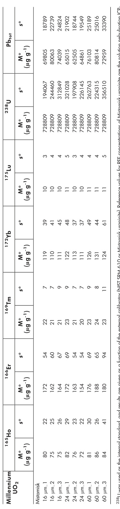

<table><tr><td>Millennium UO2</td><td>M* (μg g-1)</td><td>M* (μg g-1)</td><td>M* (μg g-1)</td><td>M* (μg g-1)</td><td>M*</td><td>M*</td><td>M*</td><td>M*</td><td>M*</td><td>M*</td><td>M*</td><td>M*</td><td>M*</td><td></td><td></td><td></td><td></td><td></td><td></td><td></td><td></td><td></td><td></td><td></td><td></td><td></td><td></td><td></td><td></td><td></td><td>M*</td><td></td><td></td><td></td><td></td><td></td><td></td><td></td><td></td><td></td><td></td><td></td><td></td><td></td><td></td><td>M*</td><td>M*</td><td></td><td></td><td></td><td></td><td></td><td></td><td></td><td></td><td></td><td></td><td></td><td></td><td>M*</td><td></td><td></td><td>M*</td><td></td><td></td><td></td><td></td><td></td><td></td><td></td><td></td><td></td><td></td><td></td><td></td><td>M*</td><td>M*</td><td>M*</td><td></td><td></td><td></td><td></td><td></td><td></td><td></td><td></td><td></td><td></td><td>M*</td><td></td><td></td><td></td><td></td><td>M*</td><td></td><td></td><td></td><td></td><td></td><td></td><td></td><td></td><td></td><td></td><td>M*</td><td></td><td></td><td>M*</td><td>M*</td><td></td><td></td><td></td><td></td><td></td><td></td><td></td><td></td><td></td><td></td><td>M*</td><td>M*</td><td></td><td></td><td>M*</td><td></td><td></td><td></td><td></td><td></td><td></td><td></td><td></td><td></td><td></td><td>M*</td><td>M*</td><td>M*</td><td>M*</td><td></td><td></td><td></td><td></td><td></td><td></td><td></td><td></td><td>M*</td><td></td><td></td><td></td><td></td><td></td><td></td><td>M*</td><td></td><td></td><td></td><td></td><td></td><td></td><td></td><td></td><td>M*</td><td></td><td></td><td></td><td></td><td>M*</td><td>M*</td><td></td><td></td><td></td><td></td><td></td><td></td><td></td><td></td><td>M*</td><td></td><td></td><td>M*</td><td></td><td></td><td>M*</td><td></td><td></td><td></td><td></td><td></td><td></td><td></td><td></td><td>M*</td><td></td><td></td><td>M*</td><td>M*</td><td>M*</td><td></td><td></td><td></td><td></td><td></td><td></td><td></td><td></td><td>M*</td><td>M*</td><td></td><td></td><td></td><td></td><td>M*</td><td></td><td></td><td></td><td></td><td></td><td></td><td></td><td></td><td>M*</td><td>M*</td><td></td><td></td><td>M*</td><td>M*</td><td></td><td></td><td></td><td></td><td></td><td></td><td></td><td></td><td>M*</td><td>M*</td><td>M*</td><td></td><td></td><td>M*</td><td></td><td></td><td></td><td></td><td></td><td></td><td></td><td></td><td>M*</td><td>M*</td><td>M*</td><td>M*</td><td>M*</td><td></td><td></td><td></td><td></td><td></td><td></td><td>M*</td><td></td><td></td><td></td><td></td><td></td><td></td><td>M*</td><td>M*</td><td></td><td></td><td></td><td></td><td></td><td></td><td>M*</td><td></td><td></td><td></td><td></td><td>M*</td><td></td><td></td><td>M*</td><td></td><td></td><td></td><td></td><td></td><td></td><td>M*</td><td></td><td></td><td></td><td></td><td>M*</td><td>M*</td><td>M*</td><td></td><td></td><td></td><td></td><td></td><td></td><td>M*</td><td></td><td></td><td>M*</td><td></td><td></td><td></td><td></td><td>M*</td><td></td><td></td><td></td><td></td><td></td><td></td><td>M*</td><td></td><td></td><td>M*</td><td></td><td></td><td>M*</td><td>M*</td><td></td><td></td><td></td><td></td><td></td><td></td><td>M*</td><td></td><td></td><td>M*</td><td>M*</td><td></td><td></td><td>M*</td><td></td><td></td><td></td><td></td><td></td><td></td><td>M*</td><td></td><td></td><td>M*</td><td>M*</td><td>M*</td><td>M*</td><td></td><td></td><td></td><td></td><td></td><td></td><td>M*</td><td>M*</td><td></td><td></td><td></td><td></td><td>M*</td><td>M*</td><td></td><td></td><td></td><td></td><td></td><td></td><td>M*</td><td>M*</td><td></td><td></td><td>M*</td><td></td><td></td><td>M*</td><td></td><td></td><td></td><td></td><td></td><td></td><td>M*</td><td>M*</td><td></td><td></td><td>M*</td><td>M*</td><td>M*</td><td></td><td></td><td></td><td></td><td></td><td></td><td>M*</td><td>M*</td><td>M*</td><td></td><td></td><td></td><td></td><td>M*</td><td></td><td></td><td></td><td></td><td></td><td></td><td>M*</td><td>M*</td><td>M*</td><td></td><td></td><td>M*</td><td>M*</td><td></td><td></td><td></td><td></td><td></td><td></td><td>M*</td><td>M*</td><td>M*</td><td>M*</td><td></td><td></td><td>M*</td><td></td><td></td><td></td><td></td><td></td><td></td><td>M*</td><td>M*</td><td>M*</td><td>M*</td><td>M*</td><td>M*</td><td></td><td></td><td></td><td></td><td>M*</td><td></td><td></td><td></td><td></td><td>M*</td><td></td><td></td><td></td><td></td><td>M*</td><td></td><td></td><td>M*</td><td>M*</td><td></td><td></td><td></td><td></td><td>M*</td><td></td><td></td><td></td><td></td><td>M*</td><td>M*</td><td></td><td></td><td>M*</td><td></td><td></td><td></td><td></td><td>M*</td><td></td><td></td><td></td><td></td><td>M*</td><td>M*</td><td>M*</td><td>M*</td><td></td><td></td><td></td><td></td><td>M*</td><td></td><td></td><td>M*</td><td></td><td></td><td></td><td></td><td>M*</td><td>M*</td><td></td><td></td><td></td><td></td><td>M*</td><td></td><td></td><td>M*</td><td></td><td></td><td>M*</td><td></td><td></td><td>M*</td><td></td><td></td><td></td><td></td><td>M*</td><td></td><td></td><td>M*</td><td></td><td></td><td>M*</td><td>M*</td><td>M*</td><td></td><td></td><td></td><td></td><td>M*</td><td></td><td></td><td>M*</td><td>M*</td><td></td><td></td><td>M*</td><td>M*</td><td></td><td></td><td></td><td></td><td>M*</td><td></td><td></td><td>M*</td><td>M*</td><td>M*</td><td></td><td></td><td>M*</td><td></td><td></td><td></td><td></td><td>M*</td><td></td><td></td><td>M*</td><td>M*</td><td>M*</td><td>M*</td><td>M*</td><td></td><td></td><td></td><td></td><td>M*</td><td>M*</td><td></td><td></td><td></td><td></td><td>M*</td><td>M*</td><td>M*</td><td></td><td></td><td></td><td></td><td>M*</td><td>M*</td><td></td><td></td><td>M*</td><td></td><td></td><td>M*</td><td>M*</td><td></td><td></td><td></td><td></td><td>M*</td><td>M*</td><td></td><td></td><td>M*</td><td>M*</td><td></td><td></td><td>M*</td><td></td><td></td><td></td><td></td><td>M*</td><td>M*</td><td></td><td></td><td>M*</td><td>M*</td><td>M*</td><td>M*</td><td></td><td></td><td></td><td></td><td>M*</td><td>M*</td><td>M*</td><td></td><td></td><td>M*</td><td></td><td></td><td>M*</td><td></td><td></td><td></td><td></td><td>M*</td><td>M*</td><td>M*</td><td></td><td></td><td>M*</td><td>M*</td><td>M*</td><td></td><td></td><td></td><td></td><td>M*</td><td>M*</td><td>M*</td><td>M*</td><td></td><td></td><td>M*</td><td>M*</td><td></td><td></td><td>M*</td><td></td><td></td><td>M*</td><td></td><td></td><td>M*</td><td></td><td></td><td>M*</td><td>M*</td><td></td><td></td><td>M*</td><td></td><td></td><td>M*</td><td>M*</td><td>M*</td><td></td><td></td><td>M*</td><td>M*</td><td></td><td></td><td>M*</td><td>M*</td><td></td><td></td><td>M*</td><td>M*</td><td>M*</td><td></td><td></td><td>M*</td><td></td><td></td><td>M*</td><td>M*</td><td></td><td></td><td>M*</td><td>M*</td><td>M*</td><td>M*</td><td>M*</td><td></td><td></td><td>M*</td><td></td><td></td><td>M*</td><td></td><td></td><td>M*</td><td>M*</td><td>M*</td><td>M*</td><td></td><td></td><td>M*</td><td></td><td></td><td>M*</td><td>M*</td><td>M*</td><td>M*</td><td>M*</td><td>M*</td><td></td><td></td><td>M*</td><td></td><td></td><td></td><td>M*</td><td></td><td></td><td>M*</td><td></td><td></td><td>M*</td><td></td><td></td><td>M*<td></td><td></td><td></td><td></td><td></td><td></td><td></td><td></td><td></td><td></td><td></td><td></td><td></td><td></td><td></td><td></td><td></td></tr></table>

Figure 6. (a) Comparison between the REE concentrations obtained with NIST SRM 610 (C'NiSTR SRM 610,es) and the Mistamisk uraninite as the external calibrator (C'mistamisk,es) from a uraninite from the Millennium uranium deposit (Canada) for an ablation diameter of \(60\mu \mathrm{m}\) . (b) Chondrite-normalised REE patterns for the uraninite from the Millennium U deposit obtained by LA-ICP-MS (with \(^{238}\mathrm{U}\) used as internal standard) and SIMS. SIMS values are from Mercadier (2008) following the protocol of Bonhoure et al. (2007). REE chondritic values are from Evensen et al. (1978). Ext: external. Light grey zone: \(0 - 10\%\) of variation, dark grey zone: \(10 - 20\%\) of variation.  

70 nm) well-crystallised Pb or PbO spherules (Roudil et al. 2008). A second fractionation effect could be the differential behaviour of U and Pb during the ablation of uranium oxide. This phenomenon can be related to the formation of post-ablation phases of different sizes and chemical compositions from the ablated uranium oxide, resulting in elemental fractionation between U, REE and Pb in particles analysed by the ICP-MS, as previously proposed for glass (Kozlov et al. 2003, Kuhn and Gunther 2004), for brass (Koch et al. 2004) or minerals such as zircon (Horn et al. 2000, Kosler et al. 2005, Glaus et al. 2010, Kuhn et al. 2010) and monazite (Kosler et al. 2001). Figure 8 clearly shows that particles of various sizes are generated during the ablation process. They are visible within and outside the crater and form an ejecta blanket around the laser pit, as also observed for other materials during LA-ICP-MS studies (Kuhn and Gunther 2003, Kosler et al. 2005, Mikova et al. 2009). The different U-Pb-O compositions of the small particles \((< 1\mu \mathrm{m})\) in the crater or at its border suggest this possible fractionation process during ablation (Figure 8).

<!-- Page 289 -->

1 1 1 1 1 1 1 1 1 1 1 1 1 1 1 1 1 1 2 1 1 1 1 1 1 1 1 1 1 1 1 1 1 1 1 1   

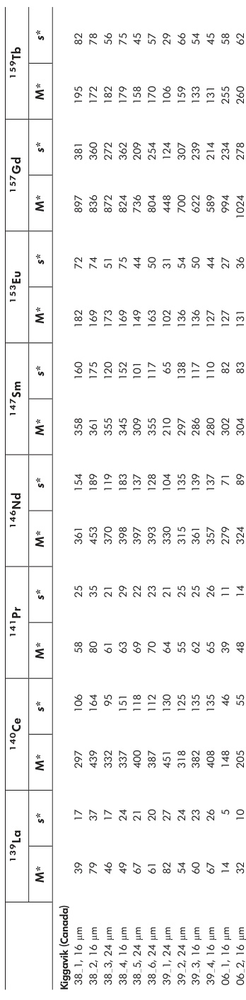

<table><tr><td></td><td>M 1-4C</td><td>M 1-4C</td><td>M 1-4C</td><td>M 1-4C</td><td>M 1-4C</td><td></td><td></td><td></td><td></td><td></td><td></td><td></td><td></td><td></td><td></td><td></td><td></td><td></td><td></td><td></td><td></td><td></td><td>M 1-4C</td><td></td><td></td><td></td><td></td><td></td><td></td><td></td><td></td><td></td><td></td><td></td><td></td><td>M 1-4C</td><td>M 1-4C</td><td></td><td></td><td></td><td></td><td></td><td></td><td></td><td></td><td>M 1-4C</td><td></td><td></td><td></td><td></td><td>M 1-4C</td><td></td><td></td><td></td><td></td><td></td><td></td><td></td><td></td><td>M 1-4C</td><td>M 1-4C</td><td>M 1-4C</td><td></td><td></td><td></td><td></td><td>M 1-4C</td><td></td><td></td><td></td><td></td><td>M 1-4C</td><td>M 1-4C</td><td></td><td></td><td></td><td></td><td>M 1-4C</td><td>M 1-4C</td><td>M 1-4C</td><td>M 1-4C</td></tr><tr><td></td><td></td><td></td><td></td><td></td><td></td><td></td><td></td><td></td><td></td><td></td><td></td><td></td><td></td><td></td><td></td><td></td><td rowspan="2"></td><td rowspan="2"></td><td rowspan="2"></td><td rowspan="2"></td><td rowspan="2"></td><td rowspan="2" colspan="2"></td><td rowspan="2"></td><td rowspan="2"></td><td rowspan="2"></td><td rowspan="2"></td><td row-span="2"></td><td rowspan="2"></td><td rowspan="2"></td><td rowspan="2"></td><td rowspan="2"></td><td rowSpan="2"></td><td rowspan="2"></td><td rowspan="2"></td><td rowspan="2"></td><td rowspan="2"></td><td row span="2"></td><td rowspan="2"></td><td rowspan="2"></td><td rowspan="2"></td><td rowspan="2"></td><td row Span="2"></td><td rowspan="2"></td><td rowspan="2"></td><td rowspan="2"></td><td rowspan="2"></td><td rowspans</td><td rowspan="2"></td><td rowspan="2"></td><td rowspan="2"></td><td rowspan="2"></td><td rowspan="2">&lt;fcel&gt;</td><td rowspan="2"></td><td rowspan="2"></td><td rowspan="2"></td><td rowspan="2"></td><td rowspan="2"><b>1</b></td><td rowspan="2"></td><td rowspan="2"></td><td rowspan="2"></td><td rowspan="2"></td><td rowspan="2"></b></td><td rowspan="2"></td><td rowspan="2"></td><td rowspan="2"></td><td rowspan="2"></td><td rowspan=''</b></td><td rowspan=''</b></td><td rowspan=''</b></td><td rowspan=''</b></td><td rowspan=''</td></td><td rowspan=''</b></td><td rowspan=''</b></td><td rowspan=''</b></td><td rowspan=''</td><td rowspan=''</b></td><td rowspan=''</b></td><td rowspan=''</b></td><td rowspan='' </td><td rowspan='' </td><td rowspan='' </td><td rowspan='' </td><td rowspan=''</td><td rowspan='' </td><td rowspan='' </td><td rowspan='' </td><td rowspan=''</b></td><td rowspan=''</b></td><td rowspan=''</b></td><td rowspan='' </td><td rowspan='' </td><td rowspan='' </td><td rowspan='' </td><td rowspan=''' </td><td rowspan=''' </td><td rowspan=''' </td><td rowspan=''' </td><td rowspan="2"></td><td rowspan="2"></td><td rowspan="2"></td><td rowspan="2"></td><td rowspan="3"></td><td rowspan="3"></td><td rowspan="3"></td><td rowspan="3"></td><td rowspan="3"></td><td rowspan="4"></td><td rowspan="4"></td><td rowspan="4"></td><td rowspan="4"></td><td rowspan="4"></td><td rowspan="5"></td><td rowspan="5"></td><td rowspan="5"></td><td rowspan="5"></td><td rowspan="5"></td><td rowspan="6"></td><td rowspan="6"></td><td rowspan="6"></td><td rowspan="6"></td><td rowspan="6"></td><td rowspan="7"></td><td rowspan="7"></td><td rowspan="7"></td><td rowspan="7"></td><td rowspan="7"></td><td rowspan="8"></td><td rowspan="8"></td><td rowspan="8"></td><td rowspan="8"></td><td rowspan="8"></td><td rowspan="9"></td><td rowspan="9"></td><td rowspan="9"></td><td rowspan="9"></td><td rowspan="9"></td><td rowspan="10"></td><td rowspan="10"></td><td rowspan="10"></td><td rowspan="10"></td><td rowspan="10"></td><td rowspan="11"></td><td rowspan="11"></td><td rowspan="11"></td><td rowspan="11"></td><td rowspan="11"></td><td rowspan="12"></td><td rowspan="12"></td><td rowspan="12"></td><td rowspan="12"></td><td rowspan="12"></td><td rowspan="13"></td><td rowspan="13"></td><td rowspan="13"></td><td rowspan="13"></td><td rowspan="14"></td><td rowspan="14"></td><td rowspan="14"></td><td rowspan="14"></td><td rowspan="15"></td><td rowspan="15"></td><td rowspan="15"></td><td rowspan="15"></td><td rowspan="15"></td><td rowspan="16"></td><td rowspan="16"></td><td rowspan="16"></td><td rowspan="16"></td><td rowspan="17"></td><td rowspan="17"></td><td rowspan="17"></td><td rowspan="17"></td><td rowspan="18"></td><td rowspan="18"></td><td rowspan="18"></td><td rowspan="19"></td><td rowspan="19"></td><td rowspan="19"></td><td rowspan="20"></td><td rowspan="20"></td><td rowspan="20"></td><td rowspan="20"></td><td rowspan="21"></td><td rowspan="21"></td><td rowspan="21"></td><td rowspan="21"></td><td rowspan="22"></td><td rowspan="22"></td><td rowspan="22"></td><td rowspan="22"></td><td rowspan="23"></td><td rowspan="23"></td><td rowspan="23"></td><td rowspan="23"></td><td rowspan="24"></td><td rowspan="24"></td><td rowspan="24"></td><td rowspan="25"></td><td rowspan="25"></td><td rowspan="25"></td><td rowspan="25"></td><td rowspan="26"></td><td rowspan="26"></td><td rowspan="26"></td><td rowspan="26"></td><td rowspan="27"></td><td rowspan="27"></td><td rowspan="27"></td><td rowspan="27"></td><td rowspan="28"></td><td rowspan="28"></td><td rowspan="28"></td><td rowspan="29"></td><td rowspan="29"></td><td rowspan="29"></td><td rowspan="29"></td><td rowspan="30"></td><td rowspan="30"></td><td rowspan="30"></td><td rowspan="30"></td><td rowspan="31"></td><td rowspan="31"></td><td rowspan="31"></td><td rowspan="31"></td><td rowspan="32"></td><td rowspan="32"></td><td rowspan="32"></td><td rowspan="32"></td><td rowspan="33"></td><td rowspan="33"></td><td rowspan="33"></td><td rowspan="33"></td><td rowspan="34"></td><td rowspan="34"></td><td rowspan="34"></td><td rowspan="34"></td><td rowspan="35"></td><td rowspan="35"></td><td rowspan="35"></td><td rowspan="35"></td><td rowspan="36"></td><td rowspan="36"></td><td rowspan="36"></td><td rowspan="36"></td><td rowspan="37"></td><td rowspan="37"></td><td rowspan="37"></td><td rowspan="37"></td><td rowspan="38"></td><td rowspan="38"></td><td rowspan="38"></td><td rowspan="38"></td><td rowspan="39"></td><td rowspan="39"></td><td rowspan="39"></td><td rowspan="39"></td><td rowspan="40"></td><td rowspan="40"></td><td rowspan="40"></td><td rowspan="40"></td><td rowspan="41"></td><td rowspan="41"></td><td rowspan="41"></td><td rowspan="41"></td><td rowspan="42"></td><td rowspan="42"></td><td rowspan="42"></td><td rowspan="42"></td><td rowspan="43"></td><td rowspan="43"></td><td rowspan="43"></td><td rowspan="43"></td><td rowspan="44"></td><td rowspan="44"></td><td rowspan="44"></td><td rowspan="44"></td><td rowspan="45"></td><td rowspan="45"></td><td rowspan="45"></td><td rowspan="45"></td><td rowspan="46"></td><td rowspan="46"></td><td rowspan="46"></td><td rowspan="46"></td><td rowspan="47"></td><td rowspan="47"></td><td rowspan="47"></td><td rowspan="47"></td><td rowspan="48"></td><td rowspan="48"></td><td rowspan="48"></td><td rowspan="48"></td><td rowspan="49"></td><td rowspan="49"></td><td rowspan="49"></td><td rowspan="49"></td><td rowspan="50"></td><td rowspan="50"></td><td rowspan="50"></td><td rowspan="50"></td><td rowspan="51"></td><td rowspan="51"></td><td rowspan="51"></td><td rowspan="51"></td><td rowspan="52"></td><td rowspan="52"></td><td rowspan="52"></td><td rowspan="52"></td><td rowspan="53"></td><td rowspan="53"></td><td rowspan="53"></td><td rowspan="53"></td><td rowspan="54"></td><td rowspan="54"></td><td rowspan="54"></td><td rowspan="54"></td><td rowspan="55"></td><td rowspan="55"></td><td rowspan="55"></td><td rowspan="55"></td><td rowspan="56"></td><td rowspan="56"></td><td rowspan="56"></td><td rowspan="56"></td><td rowspan="57"></td><td rowspan="57"></td><td rowspan="57"></td><td rowspan="57"></td><td rowspan="58"></td><td rowspan="58"></td><td rowspan="58"></td><td rowspan="58"></td><td rowspan="59"></td><td rowspan="59"></td><td rowspan="59"></td><td rowspan="59"></td><td rowspan="60"></td><td rowspan="60"></td><td rowspan="60"></td><td rowspan="60"></td><td rowspan="61"></td><td rowspan="61"></td><td rowspan="61"></td><td rowspan="61"></td><td rowspan="62"></td><td rowspan="62"></td><td rowspan="62"></td><td rowspan="62"></td><td rowspan="63"></td><td rowspan="63"></td><td rowspan="63"></td><td rowspan="63"></td><td rowspan="64"></td><td rowspan="64"></td><td rowspan="64"></td><td rowspan="64"></td><td rowspan="65"></td><td rowspan="65"></td><td rowspan="65"></td><td rowspan="65"></td><td rowspan="66"></td><td rowspan="66"></td><td rowspan="66"></td><td rowspan="66"></td><td rowspan="67"></td><td rowspan="67"></td><td rowspan="67"></td><td rowspan="67"></td><td rowspan="68"></td><td rowspan="68"></td><td rowspan="68"></td><td rowspan="68"></td><td rowspan="69"></td><td rowspan="69"></td><td rowspan="69"></td><td rowspan="69"></td><td rowspan="70"></td><td rowspan="70"></td><td rowspan="70"></td><td rowspan="70"></td><td rowspan="71"></td><td rowspan="71"></td><td rowspan="71"></td><td rowspan="71"></td><td rowspan="72"></td><td rowspan="72"></td><td rowspan="72"></td><td rowspan="72"></td><td rowspan="73"></td><td rowspan="73"></td><td rowspan="73"></td><td rowspan="73"></td><td rowspan="74"></td><td rowspan="74"></td><td rowspan="74"></td><td rowspan="74"></td><td rowspan="75"></td><td rowspan="75"></td><td rowspan="75"></td><td rowspan="75"></td><td rowspan="76"></td><td rowspan="76"></td><td rowspan="76"></td><td rowspan="76"></td><td rowspan="77"></td><td rowspan="77"></td><td rowspan="77"></td><td rowspan="77"></td><td rowspan="78"></td><td rowspan="78"></td><td rowspan="78"></td><td rowspan="78"></td><td rowspan="79"></td><td rowspan="79"></td><td rowspan="79"></td><td rowspan="79"></td><td rowspan="80"></td><td rowspan="80"></td><td rowspan="80"></td><td rowspan="80"></td><td rowspan="81"></td><td rowspan="81"></td><td rowspan="81"></td><td rowspan="81"></td><td rowspan="82"></td><td rowspan="82"></td><td rowspan="82"></td><td rowspan="82"></td><td rowspan="83"></td><td rowspan="83"></td><td rowspan="83"></td><td rowspan="83"></td><td rowspan="84"></td><td rowspan="84"></td><td rowspan="84"></td><td rowspan="84"></td><td rowspan="85"></td><td rowspan="85"></td><td rowspan="85"></td><td rowspan="85"></td><td rowspan="86"></td><td rowspan="86"></td><td rowspan="86"></td><td rowspan="86"></td><td rowspan="87"></td><td rowspan="87"></td><td rowspan="87"></td><td rowspan="88"></td><td rowspan="88"></td><td rowspan="88"></td><td rowspan="89"></td><td rowspan="89"></td><td rowspan="89"></td><td rowspan="89"></td><td rowspan="90"></td><td rowspan="90"></td><td rowspan="90"></td><td rowspan="90"></td><td rowspan="91"></td><td rowspan="91"></td><td rowspan="91"></td><td rowspan="91"></td><td rowspan="92"></td><td rowspan="92"></td><td rowspan="92"></td><td rowspan="92"></td><td rowspan="93"></td><td rowspan="93"></td><td rowspan="93"></td><td rowspan="93"></td><td rowspan="94"></td><td rowspan="94"></td><td rowspan="94"></td><td rowspan="94"></td><td rowspan="95"></td><td rowspan="95"></td><td rowspan="95"></td><td rowspan="95"></td><td rowspan="96"></td><td rowspan="96"></td><td rowspan="96"></td><td rowspan="96"></td><td rowspan="97"></td><td rowspan="97"></td><td rowspan="97"></td><td rowspan="98"></td><td rowspan="98"></td><td rowspan="98"></td><td rowspan="99"></td><td rowspan="99"></td><td rowspan="99"></td><td rowspan="99"></td><td rowspan="100"></td><td rowspan="100"></td><td rowspan="100"></td><td rowspan="100"></td><td rowspan="101"></td><td rowspan="101"></td><td rowspan="101"></td><td rowspan="101"></td><td rowspan="102"></td><td rowspan="102"></td><td rowspan="102"></td><td rowspan="102"></td><td rowspan="103"></td><td rowspan="103"></td><td rowspan="103"></td><td rowspan="103"></td><td rowspan="104"></td><td rowspan="104"></td><td rowspan="104"></td><td rowspan="104"></td><td rowspan="105"></td><td rowspan="105"></td><td rowspan="105"></td><td rowspan="105"></td><td rowspan="106"></td><td rowspan="106"></td><td rowspan="106"></td><td rowspan="106"></td><td rowspan="107"></td><td rowspan="107"></td><td rowspan="107"></td><td rowspan="107"></td><td rowspan="108"></td><td rowspan="108"></td><td rowspan="108"></td><td rowspan="108"></td><td rowspan="109"></td><td rowspan="109"></td><td rowspan="109"></td><td rowspan="109"></td><td rowspan="110"></td><td rowspan="110"></td><td rowspan="110"></td><td rowspan="110"></td><td rowspan="111"></td><td rowspan="111"></td><td rowspan="111"></td><td rowspan="111"></td><td rowspan="112"></td><td rowspan="112"></td><td rowspan="112"></td><td rowspan="112"></td><td rowspan="113"></td><td rowspan="113"></td><td rowspan="113"></td><td rowspan="113"></td><td rowspan="114"></td><td rowspan="114"></td><td rowspan="114"></td><td rowspan="114"></td><td rowspan="115"></td><td rowspan="115"></td><td rowspan="115"></td><td rowspan="116"></td><td rowspan="116"></td><td rowspan="116"></td><td rowspan="116"></td><td rowspan="117"></td><td rowspan="117"></td><td rowspan="117"></td><td rowspan="118"></td><td rowspan="118"></td><td rowspan="118"></td><td rowspan="119"></td><td rowspan="119"></td><td rowspan="119"></td><td rowspan="119"></td><td rowspan="120"></td><td rowspan="120"></td><td rowspan="120"></td><td rowspan="120"></td><td rowspan="121"></td><td rowspan="121"></td><td rowspan="121"></td><td rowspan="121"></td><td rowspan="122"></td><td rowspan="122"></td><td rowspan="122"></td><td rowspan="122"></td><td rowspan="123"></td><td rowspan="123"></td><td rowspan="123"></td><td rowspan="123"></td><td rowspan="124"></td><td rowspan="124"></td><td rowspan="124"></td><td rowspan="124"></td><td rowspan="125"></td><td rowspan="125"></td><td rowspan="125"></td><td rowspan="125"></td><td rowspan="126"></td><td rowspan="126"></td><td rowspan="126"></td><td rowspan="126"></td><td rowspan="127"></td><td rowspan="127"></td><td rowspan="127"></td><td rowspan="128"></td><td rowspan="128"></td><td rowspan="128"></td><td rowspan="129"></td><td rowspan="129"></td><td rowspan="129"></td><td rowspan="130"></td><td rowspan="130"></td><td rowspan="130"></td><td rowspan="131"></td><td rowspan="131"></td><td rowspan="131"></td><td rowspan="132"></td><td rowspan="132"></td><td rowspan="132"></td><td rowspan="133"></td><td rowspan="133"></td><td rowspan="133"></td><td rowspan="134"></td><td rowspan="134"></td><td rowspan="134"></td><td rowspan="135"></td><td rowspan="135"></td><td rowspan="135"></td><td rowspan="136"></td><td rowspan="136"></td><td rowspan="136"></td><td rowspan="137"></td><td rowspan="137"></td><td rowspan="137"></td><td rowspan="138"></td><td rowspan="138"></td><td rowspan="138"></td><td rowspan="139"></td><td rowspan="139"></td><td rowspan="139"></td><td rowspan="140"></td><td rowspan="140"></td><td rowspan="140"></td><td rowspan="141"></td><td rowspan="141"></td><td rowspan="141"></td><td rowspan="142"></td><td rowspan="142"></td><td rowspan="142"></td><td rowspan="143"></td><td rowspan="143"></td><td rowspan="143"></td><td rowspan="144"></td><td rowspan="144"></td><td rowspan="144"></td><td rowspan="145"></td><td rowspan="145"></td><td rowspan="145"></td><td rowspan="146"></td><td rowspan="146"></td><td rowspan="146"></td><td rowspan="147"></td><td rowspan="147"></td><td rowspan="147"></td><td rowspan="148"></td><td rowspan="148"></td><td rowspan="148"></td><td rowspan="149"></td><td rowspan="149"></td><td rowspan="149"></td><td rowspan="150"></td><td rowspan="150"></td><td rowspan="150"></td><td rowspan="151"></td><td rowspan="151"></td><td rowspan="151"></td><td rowspan="152"></td><td rowspan="152"></td><td rowspan="152"></td><td rowspan="153"></td><td rowspan="153"></td><td rowspan="153"></td><td rowspan="154"></td><td rowspan="154"></td><td rowspan="154"></td><td rowspan="155"></td><td rowspan="155"></td><td rowspan="155"></td><td rowspan="156"></td><td rowspan="156"></td><td rowspan="156"></td><td rowspan="157"></td><td rowspan="157"></td><td rowspan="157"></td><td rowspan="158"></td><td rowspan="158"></td><td rowspan="158"></td><td rowspan="159"></td><td rowspan="159"></td><td rowspan="159"></td><td rowspan="160"></td><td rowspan="160"></td><td rowspan="160"></td><td rowspan="161"></td><td rowspan="161"></td><td rowspan="161"></td><td rowspan="162"></td><td rowspan="162"></td><td rowspan="162"></td><td rowspan="163"></td><td rowspan="163"></td><td rowspan="163"></td><td rowspan="164"></td><td rowspan="164"></td><td rowspan="164"></td><td rowspan="165"></td><td rowspan="165"></td><td rowspan="165"></td><td rowspan="166"></td><td rowspan="166"></td><td rowspan="166"></td><td rowspan="167"></td><td rowspan="167"></td><td rowspan="167"></td><td rowspan="168"></td><td rowspan="168"></td><td rowspan="168"></td><td rowspan="169"></td><td rowspan="169"></td><td rowspan="169"></td><td rowspan="170"></td><td rowspan="170"></td><td rowspan="170"></td><td rowspan="171"></td><td rowspan="171"></td><td rowspan="171"></td><td rowspan="172"></td><td rowspan="172"></td><td rowspan="172"></td><td rowspan="173"></td><td rowspan="173"></td><td rowspan="173"></td><td rowspan="174"></td><td rowspan="174"></td><td rowspan="174"></td><td rowspan="175"></td><td rowspan="175"></td><td rowspan="175"></td><td rowspan="176"></td><td rowspan="176"></td><td rowspan="176"></td><td rowspan="177"></td><td rowspan="177"></td><td rowspan="177"></td><td rowspan="178"></td><td rowspan="178"></td><td rowspan="178"></td><td rowspan="179"></td><td rowspan="179"></td><td rowspan="179"></td><td rowspan="180"></td><td rowspan="180"></td><td rowspan="180"></td><td rowspan="181"></td><td rowspan="181"></td><td rowspan="181"></td><td rowspan="182"></td><td rowspan="182"></td><td rowspan="182"></td><td rowspan="183"></td><td rowspan="183"></td><td rowspan="183"></td><td rowspan="184"></td><td rowspan="184"></td><td rowspan="184"></td><td rowspan="185"></td><td rowspan="185"></td><td rowspan="185"></td><td rowspan="186"></td><td rowspan="186"></td><td rowspan="186"></td><td rowspan="187"></td><td rowspan="187"></td><td rowspan="187"></td><td rowspan="188"></td><td rowspan="188"></td><td rowspan="188"></td><td rowspan="189"></td><td rowspan="189"></td><td rowspan="189"></td><td rowspan="190"></td><td rowspan="190"></td><td rowspan="190"></td><td rowspan="191"></td><td rowspan="191"></td><td rowspan="191"></td><td rowspan="192"></td><td rowspan="192"></td><td rowspan="192"></td><td rowspan="193"></td><td rowspan="193"></td><td rowspan="193"></td><td rowspan="194"></td><td rowspan="194"></td><td rowspan="194"></td><td rowspan="195"></td><td rowspan="195"></td><td rowspan="195"></td><td rowspan="196"></td><td rowspan="196"></td><td rowspan="196"></td><td rowspan="197"></td><td rowspan="197"></td><td rowspan="197"></td><td rowspan="198"></td><td rowspan="198"></td><td rowspan="199"></td><td rowspan="199"></td><td rowspan="199"></td><td rowspan="200"></td><td rowspan="200"></td><td rowspan="200"></td><td rowspan="201"></td><td rowspan="201"></td><td rowspan="201"></td><td rowspan="202"></td><td rowspan="202"></td><td rowspan="202"></td><td rowspan="203"></td><td rowspan="203"></td><td rowspan="203"></td><td rowspan="204"></td><td rowspan="204"></td><td rowspan="204"></td><td rowspan="205"></td><td rowspan="205"></td><td rowspan="205"></td><td rowspan="206"></td><td rowspan="206"></td><td rowspan="206"></td><td rowspan="207"></td><td rowspan="207"></td><td rowspan="207"></td><td rowspan="208"></td><td rowspan="208"></td><td rowspan="208"></td><td rowspan="209"></td><td rowspan="209"></td><td rowspan="209"></td><td rowspan="210"></td><td rowspan="210"></td><td rowspan="210"></td><td rowspan="211"></td><td rowspan="211"></td><td rowspan="211"></td><td rowspan="212"></td><td rowspan="212"></td><td rowspan="212"></td><td rowspan="213"></td><td rowspan="213"></td><td rowspan="213"></td><td rowspan="214"></td><td rowspan="214"></td><td rowspan="214"></td><td rowspan="215"></td><td rowspan="215"></td><td rowspan="215"></td><td rowspan="216"></td><td rowspan="216"></td><td rowspan="216"></td><td rowspan="217"></td><td rowspan="217"></td><td rowspan="217"></td><td rowspan="218"></td><td rowspan="218"></td><td rowspan="218"></td><td rowspan="219"></td><td rowspan="219"></td><td rowspan="219"></td><td rowspan="220"></td><td rowspan="220"></td><td rowspan="220"></td><td rowspan="221"></td><td rowspan="221"></td><td rowspan="221"></td><td rowspan="222"></td><td rowspan="222"></td><td rowspan="222"></td><td rowspan="223"></td><td rowspan="223"></td><td rowspan="223"></td><td rowspan="224"></td><td rowspan="224"></td><td rowspan="224"></td><td rowspan="225"></td><td rowspan="225"></td><td rowspan="225"></td><td rowspan="226"></td><td rowspan="226"></td><td rowspan="226"></td><td rowspan="227"></td><td rowspan="227"></td><td rowspan="227"></td><td rowspan="228"></td><td rowspan="228"></td><td rowspan="228"></td><td rowspan="229"></td><td rowspan="229"></td><td rowspan="229"></td><td rowspan="230"></td><td rowspan="230"></td><td rowspan="230"></td><td rowspan="231"></td><td rowspan="231"></td><td rowspan="231"></td><td rowspan="232"></td><td rowspan="232"></td><td rowspan="232"></td><td rowspan="233"></td><td rowspan="233"></td><td rowspan="233"></td><td rowspan="234"></td><td rowspan="234"></td><td rowspan="234"></td><td rowspan="235"></td><td rowspan="235"></td><td rowspan="235"></td><td rowspan="236"></td><td rowspan="236"></td><td rowspan="236"></td><td rowspan="237"></td><td rowspan="237"></td><td rowspan="237"></td><td rowspan="238"></td><td rowspan="238"></td><td rowspan="238"></td><td rowspan="239"></td><td rowspan="239"></td><td rowspan="239"></td><td rowspan="240"></td><td rowspan="240"></td><td rowspan="240"></td><td rowspan="241"></td><td rowspan="241"></td><td rowspan="241"></td><td rowspan="242"></td><td rowspan="242"></td><td rowspan="242"></td><td rowspan="243"></td><td rowspan="243"></td><td rowspan="243"></td><td rowspan="244"></td><td rowspan="244"></td><td rowspan="244"></td><td rowspan="245"></td><td rowspan="245"></td><td rowspan="245"></td><td rowspan="246"></td><td rowspan="246"></td><td rowspan="246"></td><td rowspan="247"></td><td rowspan="247"></td><td rowspan="247"></td><td rowspan="248"></td><td rowspan="248"></td><td rowspan="248"></td><td rowspan="249"></td><td rowspan="249"></td><td rowspan="249"></td><td rowspan="250"></td><td rowspan="250"></td><td rowspan="250"></td><td rowspan="251"></td><td rowspan="251"></td><td rowspan="251"></td><td rowspan="252"></td><td rowspan="252"></td><td rowspan="252"></td><td rowspan="253"></td><td rowspan="253"></td><td rowspan="253"></td><td rowspan="254"></td><td rowspan="254"></td><td rowspan="254"></td><td rowspan="255"></td><td rowspan="255"></td><td rowspan="255"></td><td rowspan="256"></td><td rowspan="256"></td><td rowspan="256"></td><td rowspan="257"></td><td rowspan="257"></td><td rowspan="257"></td><td rowspan="258"></td><td rowspan="258"></td><td rowspan="258"></td><td rowspan="259"></td><td rowspan="259"></td><td rowspan="259"></td><td rowspan="260"></td><td rowspan="260"></td><td rowspan="260"></td><td rowspan="261"></td><td rowspan="261"></td><td rowspan="261"></td><td rowspan="262"></td><td rowspan="262"></td><td rowspan="262"></td><td rowspan="263"></td><td rowspan="263"></td><td rowspan="263"></td><td rowspan="264"></td><td rowspan="264"></td><td rowspan="264"></td><td rowspan="265"></td><td rowspan="265"></td><td rowspan="265"></td><td rowspan="266"></td><td rowspan="266"></td><td rowspan="266"></td><td rowspan="267"></td><td rowspan="267"></td><td rowspan="267"></td><td rowspan="268"></td><td rowspan="268"></td><td rowspan="268"></td><td rowspan="269"></td><td rowspan="269"></td><td rowspan="269"></td><td rowspan="270"></td><td rowspan="270"></td><td rowspan="270"></td><td rowspan="271"></td><td rowspan="271"></td><td rowspan="271"></td><td rowspan="272"></td><td rowspan="272"></td><td rowspan="272"></td><td rowspan="272"></td><td rowspan="273"></td><td rowspan="273"></td><td rowspan="273"></td><td rowspan="274"></td><td rowspan="274"></td><td rowspan="274"></td><td rowspan="275"></td><td rowspan="275"></td><td rowspan="275"></td><td rowspan="276"></td><td rowspan="276"></td><td rowspan="276"></td><td rowspan="277"></td><td rowspan="277"></td><td rowspan="277"></td><td rowspan="278"></td><td rowspan="278"></td><td rowspan="279"></td><td rowspan="279"></td><td rowspan="279"></td><td rowspan="280"></td><td rowspan="280"></td><td rowspan="280"></td><td rowspan="281"></td><td rowspan="281"></td><td rowspan="281"></td><td rowspan="282"></td><td rowspan="282"></td><td rowspan="282"></td><td rowspan="283"></td><td rowspan="283"></td><td rowspan="283"></td><td rowspan="284"></td><td rowspan="284"></td><td rowspan="284"></td><td rowspan="285"></td><td rowspan="285"></td><td rowspan="285"></td><td rowspan="286"></td><td rowspan="286"></td><td rowspan="286"></td><td rowspan="286"></td><td rowspan="287"></td><td rowspan="287"></td><td rowspan="287"></td><td rowspan="288"></td><td rowspan="288"></td><td rowspan="288"></td><td rowspan="289"></td><td rowspan="289"></td><td rowspan="289"></td><td rowspan="290"></td><td rowspan="290"></td><td rowspan="290"></td><td rowspan="290"></td><td rowspan="291"></td><td rowspan="291"></td><td rowspan="291"></td><td rowspan="291"></td><td rowspan="291"></td><td rowspan="292"></td><td rowspan="292"></td><td rowspan="292"></td><td rowspan="292"></td><td rowspan="292"></td><td rowspan="293"></td><td rowspan="293"></td><td rowspan="293"></td><td rowspan="293"></td><td rowspan="293"></td><td rowspan="294"></td><td rowspan="294"></td><td rowspan="294"></td><td rowspan="294"></td><td rowspan="294"></td><td rowspan="295"></td><td rowspan="295"></td><td rowspan="295"></td><td rowspan="295"></td><td

<!-- Page 290 -->

e e e e e e e e e e e e e e e e e e e e e e e e e e e e e e e e e e e e   

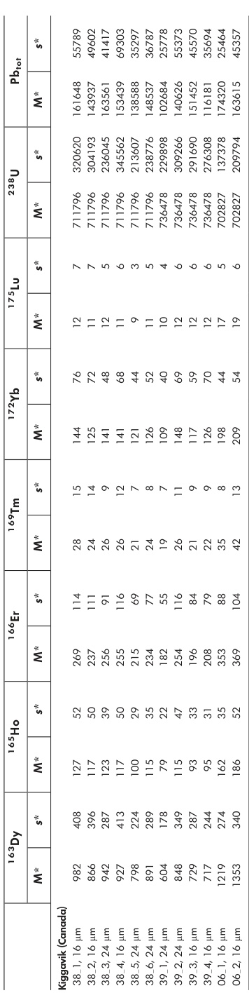

<table><tr><td></td><td>M*</td><td>M*</td><td>M*</td><td>M*</td><td>M*</td><td>M*</td><td>M*</td><td>M*</td><td>M*</td><td></td><td></td><td></td><td></td><td></td><td></td><td></td><td></td><td></td><td></td><td></td><td></td><td></td><td></td><td></td><td></td><td></td><td>M*</td><td></td><td></td><td></td><td></td><td></td><td></td><td></td><td></td><td></td><td></td><td></td><td></td><td></td><td></td><td>M*</td><td>M*</td><td></td><td></td><td></td><td></td><td></td><td></td><td></td><td></td><td></td><td></td><td></td><td></td><td>M*</td><td></td><td></td><td>M*</td><td></td><td></td><td></td><td></td><td></td><td></td><td></td><td></td><td></td><td></td><td></td><td></td><td>M*</td><td>M*</td><td>M*</td><td></td><td></td><td></td><td></td><td></td><td></td><td></td><td></td><td></td><td></td><td>M*</td><td></td><td></td><td></td><td></td><td>M*</td><td></td><td></td><td></td><td></td><td></td><td></td><td></td><td></td><td></td><td></td><td>M*</td><td></td><td></td><td>M*</td><td>M*</td><td></td><td></td><td></td><td></td><td></td><td></td><td></td><td></td><td></td><td></td><td>M*</td><td>M*</td><td></td><td></td><td>M*</td><td></td><td></td><td></td><td></td><td></td><td></td><td></td><td></td><td></td><td></td><td>M*</td><td>M*</td><td>M*</td><td>M*</td><td></td><td></td><td></td><td></td><td></td><td></td><td></td><td></td><td>M*</td><td></td><td></td><td></td><td></td><td></td><td></td><td>M*</td><td></td><td></td><td></td><td></td><td></td><td></td><td></td><td></td><td>M*</td><td></td><td></td><td></td><td></td><td>M*</td><td>M*</td><td></td><td></td><td></td><td></td><td></td><td></td><td></td><td></td><td>M*</td><td></td><td></td><td>M*</td><td></td><td></td><td>M*</td><td></td><td></td><td></td><td></td><td></td><td></td><td></td><td></td><td>M*</td><td></td><td></td><td>M*</td><td>M*</td><td>M*</td><td></td><td></td><td></td><td></td><td></td><td></td><td></td><td></td><td>M*</td><td>M*</td><td></td><td></td><td></td><td></td><td>M*</td><td></td><td></td><td></td><td></td><td></td><td></td><td></td><td></td><td>M*</td><td>M*</td><td></td><td></td><td>M*</td><td>M*</td><td></td><td></td><td></td><td></td><td></td><td></td><td></td><td></td><td>M*</td><td>M*</td><td>M*</td><td></td><td></td><td>M*</td><td></td><td></td><td></td><td></td><td></td><td></td><td></td><td></td><td>M*</td><td>M*</td><td>M*</td><td>M*</td><td>M*</td><td></td><td></td><td></td><td></td><td></td><td></td><td>M*</td><td></td><td></td><td></td><td></td><td></td><td></td><td>M*</td><td>M*</td><td></td><td></td><td></td><td></td><td></td><td></td><td>M*</td><td></td><td></td><td></td><td></td><td>M*</td><td></td><td></td><td>M*</td><td></td><td></td><td></td><td></td><td></td><td></td><td>M*</td><td></td><td></td><td></td><td></td><td>M*</td><td>M*</td><td>M*</td><td></td><td></td><td></td><td></td><td></td><td></td><td>M*</td><td></td><td></td><td>M*</td><td></td><td></td><td></td><td></td><td>M*</td><td></td><td></td><td></td><td></td><td></td><td></td><td>M*</td><td></td><td></td><td>M*</td><td></td><td></td><td>M*</td><td>M*</td><td></td><td></td><td></td><td></td><td></td><td></td><td>M*</td><td></td><td></td><td>M*</td><td>M*</td><td></td><td></td><td>M*</td><td></td><td></td><td></td><td></td><td></td><td></td><td>M*</td><td></td><td></td><td>M*</td><td>M*</td><td>M*</td><td>M*</td><td></td><td></td><td></td><td></td><td></td><td></td><td>M*</td><td>M*</td><td></td><td></td><td></td><td></td><td>M*</td><td>M*</td><td></td><td></td><td></td><td></td><td></td><td></td><td>M*</td><td>M*</td><td></td><td></td><td>M*</td><td></td><td></td><td>M*</td><td></td><td></td><td></td><td></td><td></td><td></td><td>M*</td><td>M*</td><td></td><td></td><td>M*</td><td>M*</td><td>M*</td><td></td><td></td><td></td><td></td><td></td><td></td><td>M*</td><td>M*</td><td>M*</td><td></td><td></td><td></td><td></td><td>M*</td><td></td><td></td><td></td><td></td><td></td><td></td><td>M*</td><td>M*</td><td>M*</td><td></td><td></td><td>M*</td><td>M*</td><td></td><td></td><td></td><td></td><td></td><td></td><td>M*</td><td>M*</td><td>M*</td><td>M*</td><td></td><td></td><td>M*</td><td></td><td></td><td></td><td></td><td></td><td></td><td>M*</td><td>M*</td><td>M*</td><td>M*</td><td>M*</td><td>M*</td><td></td><td></td><td></td><td></td><td>M*</td><td></td><td></td><td></td><td></td><td>M*</td><td></td><td></td><td></td><td></td><td>M*</td><td></td><td></td><td>M*</td><td>M*</td><td></td><td></td><td></td><td></td><td>M*</td><td></td><td></td><td></td><td></td><td>M*</td><td>M*</td><td></td><td></td><td>M*</td><td></td><td></td><td></td><td></td><td>M*</td><td></td><td></td><td></td><td></td><td>M*</td><td>M*</td><td>M*</td><td>M*</td><td></td><td></td><td></td><td></td><td>M*</td><td></td><td></td><td>M*</td><td></td><td></td><td></td><td></td><td>M*</td><td>M*</td><td></td><td></td><td></td><td></td><td>M*</td><td></td><td></td><td>M*</td><td></td><td></td><td>M*</td><td></td><td></td><td>M*</td><td></td><td></td><td></td><td></td><td>M*</td><td></td><td></td><td>M*</td><td></td><td></td><td>M*</td><td>M*</td><td>M*</td><td></td><td></td><td></td><td></td><td>M*</td><td></td><td></td><td>M*</td><td>M*</td><td></td><td></td><td>M*</td><td>M*</td><td></td><td></td><td></td><td></td><td>M*</td><td></td><td></td><td>M*</td><td>M*</td><td>M*</td><td></td><td></td><td>M*</td><td></td><td></td><td></td><td></td><td>M*</td><td></td><td></td><td>M*</td><td>M*</td><td>M*</td><td>M*</td><td>M*</td><td></td><td></td><td></td><td></td><td>M*</td><td>M*</td><td></td><td></td><td></td><td></td><td>M*</td><td>M*</td><td>M*</td><td></td><td></td><td></td><td></td><td>M*</td><td>M*</td><td></td><td></td><td>M*</td><td></td><td></td><td>M*</td><td>M*</td><td></td><td></td><td></td><td></td><td>M*</td><td>M*</td><td></td><td></td><td>M*</td><td>M*</td><td></td><td></td><td>M*</td><td></td><td></td><td></td><td></td><td>M*</td><td>M*</td><td></td><td></td><td>M*</td><td>M*</td><td>M*</td><td>M*</td><td></td><td></td><td></td><td></td><td>M*</td><td>M*</td><td>M*</td><td></td><td></td><td>M*</td><td></td><td></td><td>M*</td><td></td><td></td><td></td><td></td><td>M*</td><td>M*</td><td>M*</td><td></td><td></td><td>M*</td><td>M*</td><td>M*</td><td></td><td></td><td></td><td></td><td>M*</td><td>M*</td><td>M*</td><td>M*</td><td></td><td></td><td>M*</td><td>M*</td><td></td><td></td><td></td><td></td><td>M*</td><td>M*</td><td>M*</td><td>M*</td><td>M*</td><td></td><td></td><td>M*</td><td></td><td></td><td></td><td></td><td>M*</td><td>M*</td><td>M*</td><td>M*</td><td>M*</td><td>M*</td><td>M*</td><td></td><td></td><td>M*</td><td></td><td></td><td>M*</td><td></td><td></td><td>M*</td><td></td><td></td><td>M*</td><td>M*</td><td></td><td></td><td>M*</td><td></td><td></td><td>M*</td><td></td><td></td><td>M*</td><td>M*</td><td>M*</td><td>M*</td><td></td><td></td><td>M*</td><td></td><td></td><td>M*</td><td>M*</td><td></td><td></td><td>M*</td><td>M*</td><td>M*</td><td></td><td></td><td>M*</td><td></td><td></td><td>M*</td><td>M*</td><td>M*</td><td></td><td></td><td>M*</td><td>M*</td><td></td><td></td><td>M*</td><td></td><td></td><td>M*</td><td>M*</td><td>M*</td><td>M*</td><td>M*</td><td>M*</td><td></td><td></td><td>M*</td><td>M*</td><td></td><td></td><td>M*</td><td>M*</td><td>M*</td><td>M*</td><td>M*</td><td></td><td></td><td>M*</td><td>M*</td><td>M*</td><td>M*</td><td>M*</td><td>M*</td><td>M*</td><td>M*</td></tr><tr><td>M*</td><td>M*</td><td>M*</td><td>M*</td><td>M*</td><td>M*</td><td>M*</td><td>M*</td><td>M</td><td>M*</td><td>M*</td><td>M*</td><td>M*</td><td>M*</td><td>M*</td><td>M*</td><td>M*</td><td>S</td><td>S</td><td>S</td><td>S</td><td>S</td><td>S</td><td>S</td><td>S</td><td>S</td><td>S</td><td>S</td><td>S</td></tr><tr><td>M*</td><td>M*</td><td>M*</td><td>M*</td><td>M*</td><td>M*</td><td>M*</td><td>M*&lt;fci&gt;M*</td><td>M*</td><td>M*</td><td>M*</td><td>M*</td><td>M*</td><td>M*</td><td>M*</td><td>M*&lt;l&gt;M*</td><td>M*</td><td>M*</td><td>M*</td><td>M*</td><td>M*</td><td>M*</td><td>M*</td><td>S</td></tr><tr><td>M*</td><td>M*</td><td>M*</td><td>M*</td><td>M*</td><td>M*</td><td>M*</td><td rowspan="2">M*</td><td rowspan="2">M*</td><td rowspan="2">M*</td><td rowspan="2">M*</td><td rowspan="3">M*</td><td rowspan="3">M*</td><td rowspan="3">M*</td><td rowspan="3">M*</td><td rowspan=3">M*</td><td rowspan=3">M*</td><td rowspan=3">M*</td><td rowspan=3">M*</td><td rowspace=3>M*</td><td rowspan=3>M*</td><td rowspan=3>M*</td><td rowspan=3>M*</td><td rowspan=3>M*</td><td colspan="2" rowspan=3>M*</td><td rowspan=3>M*</td><td rowspan=3>M*</td><td rowspan=3>M*&lt;fci&gt;M*</td><td rowspan=3>M*</td><td rowspan=3>M*</td><td rowspan=3>M*</td><td rowspan=4>M*</td><td rowspan=4>M*</td><td rowspan=4>M*</td><td rowspan=4>M*</td><td rowspan="2">M*</td><td rowspan="2">M*</td><td rowspan="2">M*</td><td rowspan="4">M*</td><td rowspan=4>M*</td><td rowspan=4>M*</td><td rowspan=4>M*</td><td rowspan=5>M*</td><td rowspan=5>M*</td><td rowspan=5>M*</td><td rowspan=5>M*</td><td rowspan="2">M*</td><td rowspan=5>M*</td><td rowspan=5>M*</td><td rowspan=5>M*</td><td rowspan=6>M*</td><td rowspan=6>M*</td><td rowspan=6>M*</td><td rowspan=6>M*</td><td rowspan="2">M*</td><td rowspan=6>M*</td><td rowspan=6>M*</td><td rowspan=6>M*</td><td rowspan=7>M*</td><td rowspan=7>M*</td><td rowspan=7>M*</td><td rowspan=7>M*</td><td rowspan="2">M*</td><td rowspan=7>M*</td><td rowspan=7>M*</td><td rowspan=7>M*</td><td rowspan=8>M*</td><td rowspan=8>M*</td><td rowspan=8>M*</td><td rowspan=8>M*</td><td rowspan="2">M*</td><td rowspan=8>M*</td><td rowspan=8>M*</td><td rowspan=8>M*</td><td rowspan=9>M*</td><td rowspan=9>M*</td><td rowspan=9>M*</td><td rowspan=9>M*</td><td rowspan="2">M*</td><td rowspan=9>M*</td><td rowspan=9>M*</td><td rowspan=9>M*</td><td rowspan=10>M*</td><td rowspan=10>M*</td><td rowspan=10>M*</td><td rowspan=10>M*</td><td rowspan="2">M*</td><td rowspan=10>M*</td><td rowspan=10>M*</td><td rowspan=10>M*</td><td rowspan=11>M*</td><td rowspan=11>M*</td><td rowspan=11>M*</td><td rowspan=11>M*</td><td rowspan="2">M*</td><td rowspan=11>M*</td><td rowspan=11>M*</td><td rowspan=11>M*</td><td rowspan=12>M*</td><td rowspan=12>M*</td><td rowspan=12>M*</td><td rowspan=12>M*</td><td rowspan="2">M*</td><td rowspan=12>M*</td><td rowspan=12>M*</td><td rowspan=12>M*</td><td rowspan=13>M*</td><td rowspan=13>M*</td><td rowspan=13>M*</td><td rowspan=13>M*</td><td rowspan="2">M*</td><td rowspan=13>M*</td><td rowspan=13>M*</td><td rowspan=13>M*</td><td rowspan=14>M*</td><td rowspan=14>M*</td><td rowspan=14>M*</td><td rowspan=14>M*</td><td rowspan="2">M*</td><td rowspan=14>M*</td><td rowspan=14>M*</td><td rowspan=14>M*</td><td rowspan=15>M*</td><td rowspan=15>M*</td><td rowspan=15>M*</td><td rowspan=15>M*</td><td rowspan="2">M*</td><td rowspan=15>M*</td><td rowspan=15>M*</td><td rowspan=15>M*</td><td rowspan=16>M*</td><td rowspan=16>M*</td><td rowspan=16>M*</td><td rowspan=16>M*</td><td rowspan="2">M*</td><td rowspan=16>M*</td><td rowspan=16>M*</td><td rowspan=16>M*</td><td rowspan=17>M*</td><td rowspan=17>M*</td><td rowspan=17>M*</td><td rowspan=17>M*</td><td rowspan="2">M*</td><td rowspan=17>M*</td><td rowspan=17>M*</td><td rowspan=17>M*</td><td rowspan=18>M*</td><td rowspan=18>M*</td><td rowspan=18>M*</td><td rowspan=18>M*</td><td rowspan="2">M*</td><td rowspan=18>M*</td><td rowspan=18>M*</td><td rowspan=19>M*</td><td rowspan=19>M*</td><td rowspan=19>M*</td><td rowspan=19>M*</td><td rowspan="2">M*</td><td rowspan=19>M*</td><td rowspan=19>M*</td><td rowspan=20>M*</td><td rowspan=20>M*</td><td rowspan=20>M*</td><td rowspan=20>M*</td><td rowspan="2">M*</td><td rowspan=20>M*</td><td rowspan=20>M*</td><td rowspan=21>M*</td><td rowspan=21>M*</td><td rowspan=21>M*</td><td rowspan=21>M*</td><td rowspan="2">M*</td><td rowspan=21>M*</td><td rowspan=21>M*</td><td rowspan=22>M*</td><td rowspan=22>M*</td><td rowspan=22>M*</td><td rowspan=22>M*</td><td rowspan="2">M*</td><td rowspan=22>M*</td><td rowspan=22>M*</td><td rowspan=23>M*</td><td rowspan=23>M*</td><td rowspan=23>M*</td><td rowspan=23>M*</td><td rowspan="2">M*</td><td rowspan=23>M*</td><td rowspan=23>M*</td><td rowspan=24>M*</td><td rowspan=24>M*</td><td rowspan=24>M*</td><td rowspan=25>M*</td><td rowspan=25>M*</td><td rowspan=25>M*</td><td rowspan=25>M*</td><td rowspan="2">M*</td><td rowspan=25>M*</td><td rowspan=25>M*</td><td rowspan=26>M*</td><td rowspan=26>M*</td><td rowspan=26>M*</td><td rowspan=27>M*</td><td rowspan=27>M*</td><td rowspan=27>M*</td><td rowspan=28>M*</td><td rowspan=28>M*</td><td rowspan=28>M*</td><td rowspan=29>M*</td><td rowspan=29>M*</td><td rowspan=29>M*</td><td rowspan=30>M*</td><td rowspan=30>M*</td><td rowspan=30>M*</td><td rowspan=31>M*</td><td rowspan=31>M*</td><td rowspan=31>M*</td><td rowspan=32>M*</td><td rowspan=32>M*</td><td rowspan=32>M*</td><td rowspan=33>M*</td><td rowspan=33>M*</td><td rowspan=33>M*</td><td rowspan=34>M*</td><td rowspan=34>M*</td><td rowspan=34>M*</td><td rowspan=35>M*</td><td rowspan=35>M*</td><td rowspan=35>M*</td><td rowspan=36>M*</td><td rowspan=36>M*</td><td rowspan=36>M*</td><td rowspan=37>M*</td><td rowspan=37>M*</td><td rowspan=37>M*</td><td rowspan=38>M*</td><td rowspan=38>M*</td><td rowspan=38>M*</td><td rowspan=39>M*</td><td rowspan=39>M*</td><td rowspan=39>M*</td><td rowspan=40>M*</td><td rowspan=40>M*</td><td rowspan=40>M*</td><td rowspan=41>M*</td><td rowspan=41>M*</td><td rowspan=41>M*</td><td rowspan=42>M*</td><td rowspan=42>M*</td><td rowspan=42>M*</td><td rowspan=43>M*</td><td rowspan=43>M*</td><td rowspan=43>M*</td><td rowspan=44>M*</td><td rowspan=44>M*</td><td rowspan=44>M*</td><td rowspan=45>M*</td><td rowspan=45>M*</td><td rowspan=45>M*</td><td rowspan=46>M*</td><td rowspan=46>M*</td><td rowspan=46>M*</td><td rowspan=47>M*</td><td rowspan=47>M*</td><td rowspan=47>M*</td><td rowspan=48>M*</td><td rowspan=48>M*</td><td rowspan=48>M*</td><td rowspan=49>M*</td><td rowspan=49>M*</td><td rowspan=49>M*</td><td rowspan=50>M*</td><td rowspan=50>M*</td><td rowspan=50>M*</td><td rowspan=51>M*</td><td rowspan=51>M*</td><td rowspan=51>M*</td><td rowspan=52>M*</td><td rowspan=52>M*</td><td rowspan=52>M*</td><td rowspan=53>M*</td><td rowspan=53>M*</td><td rowspan=53>M*</td><td rowspan=54>M*</td><td rowspan=54>M*</td><td rowspan=54>M*</td><td rowspan=55>M*</td><td rowspan=55>M*</td><td rowspan=55>M*</td><td rowspan=56>M*</td><td rowspan=56>M*</td><td rowspan=56>M*</td><td rowspan=57>M*</td><td rowspan=57>M*</td><td rowspan=57>M*</td><td rowspan=58>M*</td><td rowspan=58>M*</td><td rowspan=58>M*</td><td rowspan=59>M*</td><td rowspan=59>M*</td><td rowspan=59>M*</td><td rowspan=60>M*</td><td rowspan=60>M*</td><td rowspan=60>M*</td><td rowspan=61>M*</td><td rowspan=61>M*</td><td rowspan=61>M*</td><td rowspan=62>M*</td><td rowspan=62>M*</td><td rowspan=62>M*</td><td rowspan=63>M*</td><td rowspan=63>M*</td><td rowspan=63>M*</td><td rowspan=64>M*</td><td rowspan=64>M*</td><td rowspan=64>M*</td><td rowspan=65>M*</td><td rowspan=65>M*</td><td rowspan=65>M*</td><td rowspan=66>M*</td><td rowspan=66>M*</td><td rowspan=66>M*</td><td rowspan=67>M*</td><td rowspan=67>M*</td><td rowspan=67>M*</td><td rowspan=68>M*</td><td rowspan=68>M*</td><td rowspan=68>M*</td><td rowspan=69>M*</td><td rowspan=69>M*</td><td rowspan=69>M*</td><td rowspan=70>M*</td><td rowspan=70>M*</td><td rowspan=70>M*</td><td rowspan=71>M*</td><td rowspan=71>M*</td><td rowspan=71>M*</td><td rowspan=72>M*</td><td rowspan=72>M*</td><td rowspan=72>M*</td><td rowspan=73>M*</td><td rowspan=73>M*</td><td rowspan=73>M*</td><td rowspan=74>M*</td><td rowspan=74>M*</td><td rowspan=74>M*</td><td rowspan=75>M*</td><td rowspan=75>M*</td><td rowspan=75>M*</td><td rowspan=76>M*</td><td rowspan=76>M*</td><td rowspan=76>M*</td><td rowspan=77>M*</td><td rowspan=77>M*</td><td rowspan=77>M*</td><td rowspan=78>M*</td><td rowspan=78>M*</td><td rowspan=78>M*</td><td rowspan=79>M*</td><td rowspan=79>M*</td><td rowspan=79>M*</td><td rowspan=80>M*</td><td rowspan=80>M*</td><td rowspan=80>M*</td><td rowspan=81>M*</td><td rowspan=81>M*</td><td rowspan=81>M*</td><td rowspan=82>M*</td><td rowspan=82>M*</td><td rowspan=82>M*</td><td rowspan=83>M*</td><td rowspan=83>M*</td><td rowspan=83>M*</td><td rowspan=84>M*</td><td rowspan=84>M*</td><td rowspan=84>M*</td><td rowspan=85>M*</td><td rowspan=85>M*</td><td rowspan=85>M*</td><td rowspan=86>M*</td><td rowspan=86>M*</td><td rowspan=86>M*</td><td rowspan=87>M*</td><td rowspan=87>M*</td><td rowspan=87>M*</td><td rowspan=88>M*</td><td rowspan=88>M*</td><td rowspan=88>M*</td><td rowspan=89>M*</td><td rowspan=89>M*</td><td rowspan=90>M*</td><td rowspan=90>M*</td><td rowspan=90>M*</td><td rowspan=91>M*</td><td rowspan=91>M*</td><td rowspan=91>M*</td><td rowspan=92>M*</td><td rowspan=92>M*</td><td rowspan=92>M*</td><td rowspan=93>M*</td><td rowspan=93>M*</td><td rowspan=93>M*</td><td rowspan=94>M*</td><td rowspan=94>M*</td><td rowspan=94>M*</td><td rowspan=95>M*</td><td rowspan=95>M*</td><td rowspan=95>M*</td><td rowspan=96>M*</td><td rowspan=96>M*</td><td rowspan=96>M*</td><td rowspan=97>M*</td><td rowspan=97>M*</td><td rowspan=97>M*</td><td rowspan=98>M*</td><td rowspan=98>M*</td><td rowspan=98>M*</td><td rowspan=99>M*</td><td rowspan=99>M*</td><td rowspan=99>M*</td><td rowspan=100>M*</td><td rowspan=100>M*</td><td rowspan=100>M*</td><td rowspan=101>M*</td><td rowspan=101>M*</td><td rowspan=101>M*</td><td rowspan=102>M*</td><td rowspan=102>M*</td><td rowspan=102>M*</td><td rowspan=103>M*</td><td rowspan=103>M*</td><td rowspan=103>M*</td><td rowspan=104>M*</td><td rowspan=104>M*</td><td rowspan=104>M*</td><td rowspan=105>M*</td><td rowspan=105>M*</td><td rowspan=105>M*</td><td rowspan=106>M*</td><td rowspan=106>M*</td><td rowspan=106>M*</td><td rowspan=107>M*</td><td rowspan=107>M*</td><td rowspan=107>M*</td><td rowspan=108>M*</td><td rowspan=108>M*</td><td rowspan=108>M*</td><td rowspan=109>M*</td><td rowspan=109>M*</td><td rowspan=109>M*</td><td rowspan=110>M*</td><td rowspan=110>M*</td><td rowspan=110>M*</td><td rowspan=111>M*</td><td rowspan=111>M*</td><td rowspan=111>M*</td><td rowspan=112>M*</td><td rowspan=112>M*</td><td rowspan=112>M*</td><td rowspan=113>M*</td><td rowspan=113>M*</td><td rowspan=113>M*</td><td rowspan=114>M*</td><td rowspan=114>M*</td><td rowspan=114>M*</td><td rowspan=115>M*</td><td rowspan=115>M*</td><td rowspan=115>M*</td><td rowspan=116>M*</td><td rowspan=116>M*</td><td rowspan=116>M*</td><td rowspan=117>M*</td><td rowspan=117>M*</td><td rowspan=117>M*</td><td rowspan=118>M*</td><td rowspan=118>M*</td><td rowspan=118>M*</td><td rowspan=119>M*</td><td rowspan=119>M*</td><td rowspan=119>M*</td><td rowspan=120>M*</td><td rowspan=120>M*</td><td rowspan=120>M*</td><td rowspan=121>M*</td><td rowspan=121>M*</td><td rowspan=121>M*</td><td rowspan=122>M*</td><td rowspan=122>M*</td><td rowspan=122>M*</td><td rowspan=123>M*</td><td rowspan=123>M*</td><td rowspan=123>M*</td><td rowspan=124>M*</td><td rowspan=124>M*</td><td rowspan=124>M*</td><td rowspan=125>M*</td><td rowspan=125>M*</td><td rowspan=125>M*</td><td rowspan=126>M*</td><td rowspan=126>M*</td><td rowspan=126>M*</td><td rowspan=127>M*</td><td rowspan=127>M*</td><td rowspan=127>M*</td><td rowspan=128>M*</td><td rowspan=128>M*</td><td rowspan=128>M*</td><td rowspan=129>M*</td><td rowspan=129>M*</td><td rowspan=129>M*</td><td rowspan=130>M*</td><td rowspan=130>M*</td><td rowspan=130>M*</td><td rowspan=131>M*</td><td rowspan=131>M*</td><td rowspan=131>M*</td><td rowspan=132>M*</td><td rowspan=132>M*</td><td rowspan=132>M*</td><td rowspan=133>M*</td><td rowspan=133>M*</td><td rowspan=133>M*</td><td rowspan=134>M*</td><td rowspan=134>M*</td><td rowspan=134>M*</td><td rowspan=135>M*</td><td rowspan=135>M*</td><td rowspan=135>M*</td><td rowspan=136>M*</td><td rowspan=136>M*</td><td rowspan=136>M*</td><td rowspan=137>M*</td><td rowspan=137>M*</td><td rowspan=137>M*</td><td rowspan=138>M*</td><td rowspan=138>M*</td><td rowspan=138>M*</td><td rowspan=139>M*</td><td rowspan=139>M*</td><td rowspan=139>M*</td><td rowspan=140>M*</td><td rowspan=140>M*</td><td rowspan=140>M*</td><td rowspan=141>M*</td><td rowspan=141>M*</td><td rowspan=141>M*</td><td rowspan=142>M*</td><td rowspan=142>M*</td><td rowspan=142>M*</td><td rowspan=143>M*</td><td rowspan=143>M*</td><td rowspan=143>M*</td><td rowspan=144>M*</td><td rowspan=144>M*</td><td rowspan=144>M*</td><td rowspan=145>M*</td><td rowspan=145>M*</td><td rowspan=145>M*</td><td rowspan=146>M*</td><td rowspan=146>M*</td><td rowspan=146>M*</td><td rowspan=147>M*</td><td rowspan=147>M*</td><td rowspan=147>M*</td><td rowspan=148>M*</td><td rowspan=148>M*</td><td rowspan=148>M*</td><td rowspan=149>M*</td><td rowspan=149>M*</td><td rowspan=149>M*</td><td rowspan=150>M*</td><td rowspan=150>M*</td><td rowspan=150>M*</td><td rowspan=151>M*</td><td rowspan=151>M*</td><td rowspan=151>M*</td><td rowspan=152>M*</td><td rowspan=152>M*</td><td rowspan=152>M*</td><td rowspan=153>M*</td><td rowspan=153>M*</td><td rowspan=153>M*</td><td rowspan=154>M*</td><td rowspan=154>M*</td><td rowspan=154>M*</td><td rowspan=155>M*</td><td rowspan=155>M*</td><td rowspan=155>M*</td><td rowspan=156>M*</td><td rowspan=156>M*</td><td rowspan=156>M*</td><td rowspan=157>M*</td><td rowspan=157>M*</td><td rowspan=157>M*</td><td rowspan=158>M*</td><td rowspan=158>M*</td><td rowspan=158>M*</td><td rowspan=159>M*</td><td rowspan=159>M*</td><td rowspan=159>M*</td><td rowspan=160>M*</td><td rowspan=160>M*</td><td rowspan=160>M*</td><td rowspan=161>M*</td><td rowspan=161>M*</td><td rowspan=161>M*</td><td rowspan=162>M*</td><td rowspan=162>M*</td><td rowspan=162>M*</td><td rowspan=163>M*</td><td rowspan=163>M*</td><td rowspan=163>M*</td><td rowspan=164>M*</td><td rowspan=164>M*</td><td rowspan=164>M*</td><td rowspan=165>M*</td><td rowspan=165>M*</td><td rowspan=165>M*</td><td rowspan=166>M*</td><td rowspan=166>M*</td><td rowspan=166>M*</td><td rowspan=167>M*</td><td rowspan=167>M*</td><td rowspan=167>M*</td><td rowspan=168>M*</td><td rowspan=168>M*</td><td rowspan=168>M*</td><td rowspan=169>M*</td><td rowspan=169>M*</td><td rowspan=169>M*</td><td rowspan=170>M*</td><td rowspan=170>M*</td><td rowspan=170>M*</td><td rowspan=170>M*</td><td rowspan=int(1)</td><td rowspan=170>M*</td><td rowspan=170>M*</td><td rowspan=171>M*</td><td rowspan=171>M*</td><td rowspan=171>M*</td><td rowspan=171>M*</td><td rowspan=int(1)</td><td rowspan=171>M*</td><td rowspan=171>M*</td><td rowspan=172>M*</td><td rowspan=172>M*</td><td rowspan=172>M*</td><td rowspan=172>M*</td><td rowspan=int(1)</td><td rowspan=172>M*</td><td rowspan=172>M*</td><td rowspan=172>M*</td><td rowspan=172>G*</td><td rowspan=172>M*</td><td rowspan=172>M*</td>

<!-- Page 291 -->

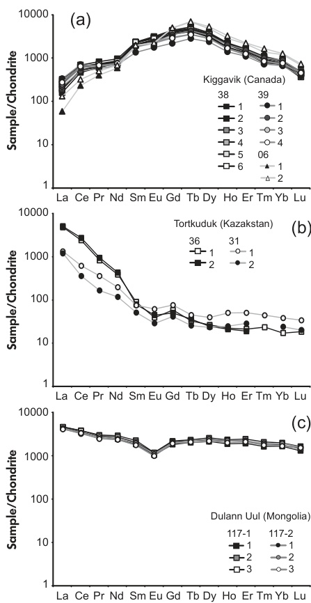

Figure 7. Chondrite-normalised REE patterns of uranium oxides from different samples of the (a) Kiggavik (Canada), (b) Torktuduk (Kazakhstan) and (c) Dulann Ul (Mongolia) uranium deposits. REE chondritic values are from Evensen et al. (1978). \(^{238}\mathrm{U}\) was used as internal standard and NIST SRM 610 as external calibrator. 
  

<|ref|>text<|/ref|><|det|>[[117, 745, 481, 913], [515, 114, 880, 376]]<|/det|>
Indeed, the REE and U present equivalent fractionation indices (Kroslakova and Gunther 2007), which indicate that they have the same behaviour, both being refractory elements, and are consequently incorporated into the same particles. Lead, as a volatile element, is transported as a volatile species (Hom et al. 2000) and is not incorporated in the U- REE particles, as shown by its higher fractionation index. These laser- induced fractionation effects between U and Pb could be in part directly related to the use of a nanosecond laser, which favours thermal effects at the ablation site (Poitrasson et al. 2003). Other possible fractionation effects for \(\mathrm{UO_2}\) may also occur during aerosol transport and digestion in the plasma torch (Gunther and Hattendorf 2005), but these need to be evaluated for uranium oxides. The constant diameter of \(60\mu \mathrm{m}\) chosen in this study for the ablation of the external calibrator may be another process interfering with U, Pb and REE quantification. As demonstrated by Kroslakova and Gunther (2007), the difference of the chosen ablation diameter between the external calibrator and the studied sample can lead to mass load effects and modification of the intensity ratios for the studied sample up to several per cent. A thorough understanding of the fractionation effects would require a specific study of these particles, which is beyond the scope of the article. It should, however, be pointed out that this elemental fractionation does not influence significantly the quality of the ICP- MS measurements when U is used as internal standard, as observed in Figure 6b.   

One of the main results of this study is the demonstration that no major matrix effect affects the determination of the REE in \(\mathrm{UO_2}\) by LA- ICP- MS (Figure 6). The observable difference \((< 20\%)\) for all REE between the use of NIST SRM 610 and the Mistamisk uranium oxide as external calibrators is due to matrix effects (a constant underestimation is visible for Mistamisk compared with NIST SRM 610) but it can be considered as not significant as it is within error for both matrices. Moreover, the chondrite- normalised REE patterns did not present clear differences when the contrasting external calibrators were used. This conclusion was previously proposed for other matrices (Jackson et al. 1992, Gunther and Hattendorf 2005). Our result indicates that space- charge effects between U and REE for the studied uranium matrix do not have significant influence for the quantification of REE except possibly for the lowest atomic number REEs (La and Ce), which have the highest variability. Further study is needed to clearly understand the processes taking place at the ablation site for uranium oxide, as has been carried out for other minerals.  

### Technical advantages of LA-ICP-MS compared with SIMS for in situ determination of REE contents of uranium oxide

We highlight several advances brought by the use of LA- ICP- MS rather than SIMS for in situ determination of REE in uranium oxides. Firstly, LA- ICP- MS does not require a long sample preparation time such as gold coating for electrical conductivity for SIMS analysis. Minerals in this section can be directly analysed, avoiding the preparation of polished sections. The analysis (ablation plus signal processing) can be achieved in a short period of time \((< 15 \mathrm{min})\) . Indeed, using SIMS, several major interferences for REE masses imply

<!-- Page 292 -->

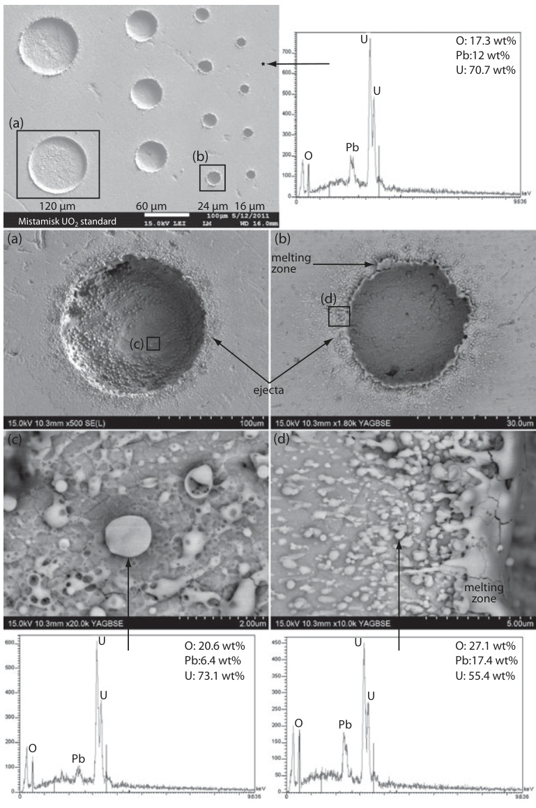

Figure 8. Backscattered electron (BSE) images of ablation craters obtained after LA-ICP-MS analyses on the Mistamisk uraninite using different crater diameters. (a, b) Close-up of ablation craters, respectively, at \(120\mu \mathrm{m}\) and \(24\mu \mathrm{m}\) diameter. (c, d) Close-up of ablation ejecta and particles created during the ablation process at, respectively, \(120\) and \(24\mu \mathrm{m}\) diameter. The first EDS spectrum (upper right) corresponds to the uraninite matrix, the second (lower left) corresponds to a particle within the crater ( \(120\mu \mathrm{m}\) ), and the third spectrum (lower right) corresponds to a particle of the ejecta blanket ( \(24\mu \mathrm{m}\) ). 

<!-- Page 293 -->

a long time (close to one hour for the protocol proposed in Bonhoure et al. (2007)) and careful signal and data processing, in addition to the duration of measurement (around two hours). The main interferences, as explained in Bonhoure et al. (2007), are related to the formation of low atomic number REE oxides (such as LaO, CeO and NdO) that have similar masses to intermediate and high atomic number REE. Even with a dedicated procedure, the concentrations of Gd and Yb cannot be determined, leading to incomplete REE compositions. The precision for both techniques (LA- ICP- MS and SIMS) is equivalent, close to or below 10%. The results of the present study show that a non- matrix- matched sample, such as a certified glass reference material, can be used as an external calibrator to obtain accurate chondrite- normalised REE patterns, which is not the case for SIMS. This is of primary importance as no reference material is currently available for uranium oxides. Indeed, significant differences for the REE measurements of the Mistamisk uranium RME were obtained using LA- ICP- MS and SIMS (Figure 5c). The same discrepancy between analytical data is pointed out with solution nebulisation ICP- MS (SARM; Figure 5c). The composition of the Mistamisk uranium reference sample used to calibrate the SIMS measurements in Bonhoure et al. (2007) is the solution nebulisation ICP- MS data provided by the SARM. However, due to the high contents of U and Pb within the Mistamisk sample, a dilution procedure using ultrapure quartz (the analysed material was composed of more than 90% m/m SiO2) was applied before the analysis of the liquid solution by ICP- MS at the SARM (Bonhoure, personal comm.). Consequently, a bias for the REE concentration could be related to this procedure, as observed by comparing the SARM and IGEM- RAS solution nebulisation ICP- MS results (Figure 5). For ICP- MS results from IGEM- RAS, where no dilution was applied, the measurements are within the error of the LA- ICP- MS data, except for La and Ce. Concerning these two elements, slightly higher concentration values (< 40%) obtained with LA- ICP- MS compared with other techniques are not currently understood. To improve future SIMS analysis and to decipher possible matrix effects, the element content and homogeneity at the \(\mu \mathrm{m}\) scale of the Mistamisk uranium oxide need to be precisely re- evaluated. However, despite the lack of precise characterisation of the REEs from the Mistamisk uranium oxide, the shape of the chondrite- normalised REE patterns for the UO2 acquired by SIMS was not significantly affected, as observed for the Millennium deposit (Figure 6).  

### Preliminary results obtained for REE contents in natural uranium oxides by LA-ICP-MS

<|ref|>text<|/ref|><|det|>[[116, 885, 481, 915], [515, 114, 881, 316]]<|/det|>
In the present study, the measurement of REE contents by LA- ICP- MS was applied to uranium oxides from three uranium deposits for which the genetic conditions are not well constrained: Kiggavik (Canada), Torkuduk (Kazakhstan) and Dulann Uul (Mongolia). These deposits are widely distributed and are proposed to belong to different types (unconformity- related and roll- front) of uranium deposit. The use of this classification from the IAEA is questionable for under- explored or newly discovered occurrences. Using LA- ICP- MS to measure REE in uranium oxides, the results provide clear, new indications on the origin of the deposits. The thorough use and application of LA- ICP- MS for geological interpretations are not the subject of the present article but some primary information can be provided concerning the three locations tested.   

The three uranium- bearing samples from Kiggavik, whatever their location, were characterised by close bell- shaped chondrite- normalised REE patterns (Figure 7a), similar to that obtained for the Millennium deposit (Figure 6) and for the other unconformity- related deposits (Fayek and Kyser 1997, Bonhoure et al. 2007, Mercadier et al. 2011b). Consequently, together with existing field observations, this provides evidence to classify the Kiggavik uranium deposit as unconformity- related. Concerning the uranium oxides from Mongolia and Kazakhstan, the REE contents for the two studied deposits were closely matched at the scale of the deposit. However, comparing the available samples of the two deposits, the REE patterns were clearly distinguishable (Table 6 and Figure 7). As previously explained, if the genetic conditions for both deposits are identical, their uranium oxides should present the same REE composition. Consequently, it can be argued that, despite their proposed rather similar geological contexts, the two deposits may have formed under different genetic conditions. This preliminary conclusion needs to be reinforced by more detailed geological studies on the deposit scale and by analysis of new mineralised samples, but nevertheless provides insights into the classification of uranium deposits. Consequently, the use of in situ REE determination in uranium oxides by LA- ICP- MS can be considered as a first- order technique to decipher the origin of uranium deposits by comparing REE patterns of uranium oxides from poorly studied deposits with those from already well- characterised occurrences.  

## Conclusions

This study demonstrates that LA- ICP- MS is currently an efficient analytical technique to make fast, precise and accurate quantitative measurements of rare earth element concentrations in uranium oxides at the micrometre scale. The REE concentration measurements showed good agreement with those obtained by standard solution nebulisation

<!-- Page 294 -->

ICP- MS or in situ SIMS techniques for a reference material uranium oxide. The best quantification was performed using U as an internal standard and a non- matrix- matched certified reference material (NIST SRM 610) to quantify the REE contents in uranium oxide with efficiency and to define chondrite- normalised REE patterns. This avoids the use of non- certified uranium oxide minerals as an external calibrator, as is the case for SIMS analysis. In the LA- ICP- MS configuration used, the limits of detection were close to or less than the \(\mu \mathrm{g} \mathrm{g}^{- 1}\) level, depending upon crater diameter, and the data were accurate for an ablation diameter down to \(16 \mu \mathrm{m}\) . Moreover, the short measurement time and the absence of interferences for all REE bring significant improvements compared with SIMS analysis, which was considered, until now, the best technique for measuring REE contents in uranium oxides. The results obtained for unknown uranium oxides from deposits with poorly known or debatable origins clearly demonstrate the utility of LA- ICP- MS (i) to identify uranium deposit types from the REE signature of the uranium oxides and (ii) to provide new constraints on the conditions of their formation. LA- ICP- MS will provide new insights for the classification of uranium deposits under exploration and the understanding of their conditions of formation.  

## Acknowledgements

The authors wish to thank the CNRS and AREVA for their financial support, AREVA for scientific discussions and AREVA and Cameca for sampling their prospects and deposits. Many thanks to Marc Brouand (AREVA) for sampling and data sharing associated with fruitful discussions, to Detlef Gunther for discussions about the data and LA- ICP- MS fundamentals and to Antonin Richard for text improvements. The authors thank William F. McDonough and Edward A. Williams for their editorial handling and two anonymous reviewers for their constructive comments.  

### References

Alexandre P. and Kyser T.K. (2005) Effects of cationic substitutions and alteration in uranium, and implications for the dating of uranium deposits. Canadian Mineralogist, 43, 1005- 1017.  

Aubakirov K. (1998) On the deep origin of ore- forming solutions in the uranium deposits in platform sequence of depressions (with Chu- Sarysu Province as an example). Geology of Kazakhstan, 2, 40- 47.  

Bonhoure J., Kister P., Cuney M. and Deloule E. (2007) Methodology for rare earth element determinations of uranium oxides by ion microprobe. Geostandards and Geoenalytical Research, 31, 209- 225.  

Cloutier J., Kyser K., Olivo G.R., Alexandre P. and Halaburda J. (2009) The Millennium uranium deposit, Athabasca Basin, Saskatchewan, Canada: An atypical basement- hosted unconformity- related uranium deposit. Economic Geology, 104, 815- 840.  

Cuney M. (2009) The extreme diversity of uranium deposits. Mineralum Deposita, 44, 3- 9.  

Cuney M. (2010) Evolution of uranium fractionation processes through time: Driving the secular variation of uranium deposit types. Economic Geology, 105, 553- 569.  

Cuney M. and Kyser K. (2008) Recent and not- so- recent developments in uranium deposits and implications for exploration. Mineralogical Association of Canada Short Course Series, 39, 272pp.  

Dahlkamp F.J. (2009) Uranium deposits of the world: Asia. Springer (Berlin, Heidelberg), 494pp.  

Davidson I.D. and Gandhi S.S. (1989) Unconformity- related U- Au mineralization in the middle Proterozoic Thelon sandstone Boomerang Lake prospect, Northwest Territories, Canada. Economic Geology, 84, 143- 157.  

Evensen N.M., Hamilton P.J. and O'Nions R.K. (1978) Rare- earth abundances in chondritic meteorites. Geochimica et Cosmochimica Acta, 42, 1199- 1212.  

Fayek M. and Kyser K. (1997) Characterization of multiple fluid- flow events and rare earth element mobility associated with the formation of unconformity- type uranium deposits in the Athabasca Basin, Saskatchewan. Canadian Mineralogist, 35, 627- 658.  

Fayek M., Anovitz L.M., Cole D.R. and Bostick D.A.  

O and H diffusion in uranium: Implication for fluid- uranium interactions, nuclear waste disposal, and nuclear forensics.  

Geochimica et Cosmochimica Acta, 75, 3677- 3686.  

Fryer B.J. and Taylor R.P. (1987) Rare- earth element distributions in uraninates: Implications for ore genesis. Chemical Geology, 63, 101- 108.  

Fuchs H.D. and Hilger W. (1989) Kiggavik (Lone Gull): An unconformity- related uranium deposit in the Thelon basin, Northwest Territories, Canada. IAEA TECHDOC- 500 (Vienna), 429- 454pp.  

Glaas R., Kaegi R., Krumeich F. and Gunther D. (2010) Phenomenological studies on structure and elemental composition of nanosecond and femtosecond laser- generated aerosols with implications on laser ablation inductively coupled plasma- mass spectrometry. Spectrochimica Acta Part B, 65, 812- 822.  

Gunther D. and Hattendorf B. (2005) Solid sample analysis using laser ablation inductively coupled plasma mass spectrometry. Trends in Analytical Chemistry, 24, 255- 265.

<!-- Page 295 -->

### references

Hidaka H., Holliger P., Shimizu H. and Masuda A. (1992) Lanthanide tetrad effect observed in the Oklo and ordinary uraninates and its implication for their forming processes. Geochemical Journal, 26, 337- 346.  

Horn I., Rudnick R.L. and McDonough W.F. (2000) Precise elemental and isotope ratio determination by simultaneous solution nebulization and laser ablation- ICP- MS: Application to U- Pb geochronology. Chemical Geology, 164, 281- 301.  

### IAEA (2009)

World distribution of uranium deposits (UDEPO) with uranium deposits classification. IAEA TECHDOC- 1629, International Atomic Energy Agency (Vienna), 117 pp.  

Jackson S.E., Longerich H.P., Dunning G.R. and Fryer B.J. (1992) The application of laser- ablation microprobe- inductively coupled plasma- mass spectrometry (LAM- ICP- MS) to in situ trace- element determinations in minerals. Canadian Mineralogist, 30, 1049- 1064.  

Kish L. and Cuney M. (1981) Uraninite- albite veins from the Mistamisk Valley of the Labrador trough, Quebec. Mineralogical Magazine, 44, 471- 483.  

Koch J., Von Bohlen A., Hergenroder R. and Niemax K. (2004) Particle size distributions and compositions of aerosols produced by near- IR femto- and nanosecond laser ablation of brass. Journal of Analytical Atomic Spectrometry, 19, 267- 272.  

Kosler J., Tubrett M.N. and Sylvester P. (2001) Application of laser ablation ICP- MS to U- Th- Pb dating of monazite. Geostandards Newsletter: The Journal of Geostandards and Geoanalsis, 25, 375- 386.  

Kosler J., Wiedenbeck M., Wirth R., Hovorka J., Sylvester P. and Mikova J. (2005) Chemical and phase composition of particles produced by laser ablation of silicate glass and zircon - Implication for elemental fractionation during ICP- MS analysis. Journal of Analytical Atomic Spectrometry, 20, 402- 409.  

Kozlov B., Saint A. and Skorec A. (2003) Elemental fractionation in the formation of particulates, as observed by simultaneous isotopes measurement using laser ablation ICP- OA- TOFMS. Journal of Analytical Atomic Spectrometry, 18, 1069- 1075.  

Kroskakova I. and Gunther D. (2007) Elemental fractionation in laser ablation inductively coupled plasma- mass spectrometry: Evidence for mass load matrix effects in the ICP during ablation of silicate glass. Journal of Analytical Atomic Spectrometry, 22, 51- 62.  

Kuhn H.R. and Gunther D. (2003) Elemental fractionation studies in laser ablation inductively coupled plasma- mass spectrometry on laser- induced brass aerosols. Analytical Chemistry, 75, 747- 753.  

Kuhn H.R. and Gunther D. (2004) Laser ablation- ICP- MS: Particle size dependent elemental composition studies on filter- collected and online measured aerosols from glass. Journal of Analytical Atomic Spectrometry, 19, 1158- 1164.  

Kuhn B.K., Birbaum K., Luo Y. and Gunther D. (2010) Fundamental studies on the behaviour of Pb/U in NIST SRM 610 and zircon 91500 using laser ablation inductively coupled plasma- mass spectrometry with respect to geochronology. Journal of Analytical Atomic Spectrometry, 25, 21- 27.  

Lee D.E. and Bastron H. (1967) Fractionation of rare- earth elements in allanite and monazite as related to geology of the Mt. Wheeler mine, Nevada. Geochimica et Cosmochimica Acta, 31, 339- 356.  

Lewis A.J., Komninou A., Yardley B.W.D. and Palmer M.R. (1998) Rare earth element speciation in geothermal fluids from Yellowstone National Park, Wyoming, USA. Geochimica et Cosmochimica Acta, 62, 657- 663.  

Longerich H.P., Jackson S.E. and Gunther D. (1996) Laser ablation inductively coupled plasma mass spectrometric transient signal data acquisition and analyte concentration calculation. Journal of Analytical Atomic Spectrometry, 11, 899- 904.  

Lottermoser B.G. (1992) Rare earth elements and hydrothermal ore formation processes. Ore Geology Reviews, 7, 25- 41.  

Luo Y., Gao S., Longerich H.P., Gunther D., Wunderli S., Yuan H.- L. and Liu X.- M. (2007) The uncertainty budget of the multi- element analysis of glasses using LA- ICP- MS. Journal of Analytical Atomic Spectrometry, 22, 122- 130.  

Maas R. and McCulloch M.T. (1990) A search for fossil nuclear reactors in the Alligator River Uranium Field, Australia: Constraints from Sm, Gd, and Nd isotopic studies. Chemical Geology, 88, 301- 315.  

Mercadier J. (2008) Conditions de genèse des gisements d'uranium associés aux discordances protézozoques et localisés dans les socles. Exemple du socle du bassin d'Athabasca (Saskatchewan, Canada). PhD thesis, INPL Nancy, 325 pp.  

Mercadier J., Cuney M., Cathelineau M. and Lacorde M.  

Mercadier J., Cuney M., Cathelineau M. and Lacorde M. (2011a) U redox fronts and kaolinitisation in basement- hosted ores of the Athabasca Basin (Canada): Late U remobilisation by meteoric fluids. Mineralium Deposita, 46, 105- 135.  

Mercadier J., Cuney M., Lach P., Boiron M.- C., Bonhoure J., Richard A., Leisen M. and Kister P. (2011b) Origin of uranium deposits revealed by their rare earth element signature. Terra Nova, 23, 264- 269.

<!-- Page 296 -->

### references

Merten D, Geletnky J, Bergmann H, Haferburg G, Kothe E. and Buchel G. (2005) Rare earth element patterns: A tool understanding processes in remediation of acid mine drainage. Geochemistry, 65, 97- 114.  

Mikova J, Kosler J, Longerich H.P., Wiedenbeck M. and Hanchar J.M. (2009) Fractionation of alkali elements during laser ablation ICP- MS analysis of silicate geological samples. Journal of Analytical Atomic Spectrometry, 24, 1244- 1252.  

Pagel M, Pinte G. and Rotach- Toulhoat N. (1987) The rare earth elements in natural uranium oxides. Monograph Series on Mineral Deposits, 27, Gebruder Bortraeger (Berlin- Stuttgart), 81- 85pp.  

Pearce N.J.G., Perkins W.K., Westgate J.A., Gorton M.P., Jackson S.E., Neal C.R. and Chenery S.P. (1997) A compilation of new and published major and trace element data for NIST SRM 610 and NIST SRM 612 glass reference materials. Geostandards Newsletter: The Journal of Geostandards and Geoanalysis, 21, 101- 114.  

Piani L, Sangely L, Mercadier J. and Cuney M. (2008) A new method for rare earth elements analysis by secondary ion mass spectrometry. SIMS Europe 2008 Conference (Münster, Germany).  

Poitrasson F, Mao X, Mao S.S., Freydier R. and Russo R.E. (2003) Comparison of ultraviolet femtosecond and nanosecond laser ablation inductively coupled plasma- mass spectrometry analysis in glass, monazite, and zircon. Analytical Chemistry, 75, 6184- 6190.  

Roudil D., Bonhoure J., Pik R., Cuney M., Jégou C. and Gauthier- Lafaye F. (2008) Diffusion of radiogenic helium in natural uranium oxides. Journal of Nuclear Materials, 378, 70- 78.  

Shannon R.D. (1976) Revised effective ionic radii and systematic studies of interatomic distances in halides and chalcogenides. Acta Crystallographica, 32, 751- 767.  

Uysal I.T. and Golding S.D. (2003) Rare earth element fractionation in authigenic illite- smectite from Late Permian clastic rocks, Bowen Basin, Australia: Implications for phys- chemical environments of fluids during illitization. Chemical Geology, 193, 167- 179.  

Van Middlesworth P.E. and Wood S.A. (1998) The aqueous geochemistry of the rare earth elements and yttrium. Part 7. REE, Th and U contents in thermal springs associated with the Idaho batholiths. Applied Geochemistry, 13, 861- 884.

