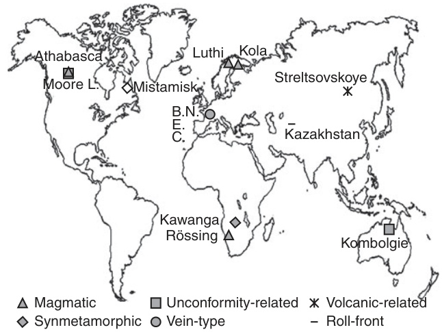
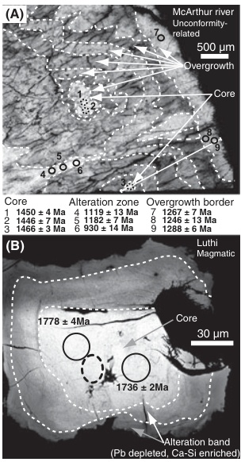
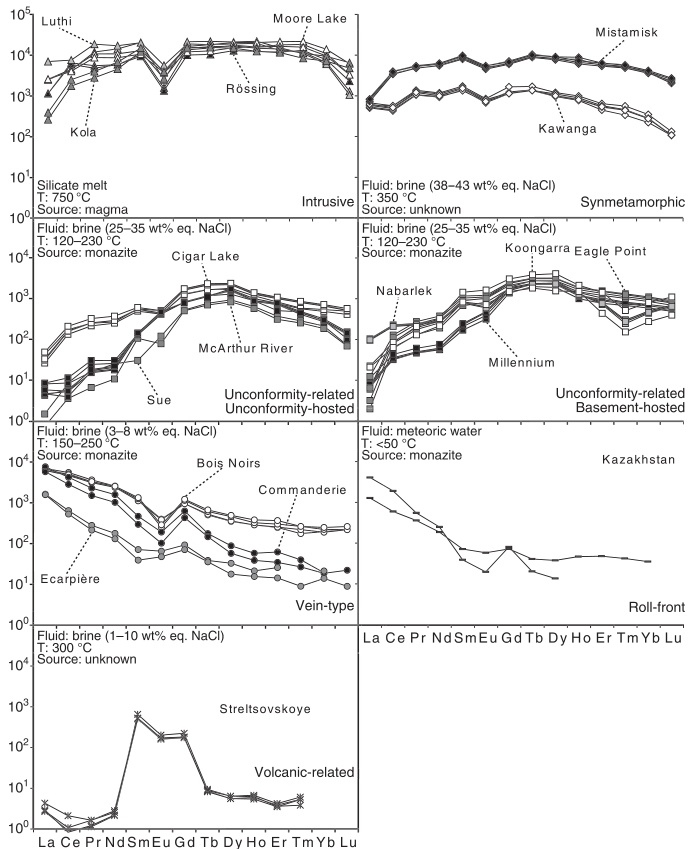
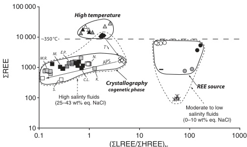
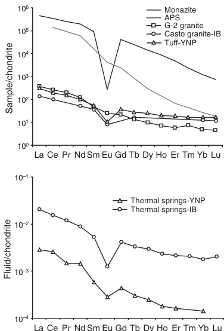

# Origin of uranium deposits revealed by their rare earth element signature

Julien Mercadier, Michel Cuney, Philippe Lach, Marie- Christine Boiron, Jessica Bonhoure, Antonio Richard, Mathieu Leisen and Philippe Kister  

G2R, Nancy- Université, CNRS, CREGU, Boulevard des Aiguillettes, B.P. 239, F- 54506 Vandœuvre lès Nancy, France; Present address: Institut Polytechnique LaSalle Beauvais, 19 rue Pierre Waguet, B.P. 30313, F- 60026 Beauvais, France  

## ABSTRACT

Uranium deposits form in a wide range of geological settings, including deep magmatic to surficial conditions, and range in age from Archaean to recent. These temporal and spatial variations have given rise to an extreme diversity of ore deposits. However, understanding their conditions of formation has remained challenging. This article reports rare earth element (REE) abundances, measured by microbeam methods in uranium oxides, for a series of worldwide uranium occurrences. The REE patterns are very specific to each deposit type and directly reflect the conditions of their  

genesis. We propose an evaluation of the first- order parameters controlling the REE behaviour in each mineralised system. This study demonstrates that the REE pattern is the most efficient tool for constraining the geological models of uranium deposits and for genetically discriminating new uranium discoveries. This approach may form the starting point for a new procedure in the fight against nuclear trafficking.  

Terra Nova, 23, 264- 269, 2011  

## Introduction

Uranium ores are the indispensable raw material for nuclear fuel preparation and are currently heavily prospected. Unlike the majority of metals, the metallogeny of uranium is specifically characterised by an extreme diversity of deposits that are directly related to the various conditions under which U deposits formed in geological environments (Cuney, 2009). More than 800 uranium deposits are identified globally and at least 16 deposit types are referenced by the International Atomic Energy Agency (IAEA, 2009). The current classifications, however, do not provide meaningful indications to understand the formation of uranium deposits and, thus, to genetically discriminate them. Furthermore, to date, no link between uranium oxide geochemistry and the genetic conditions for uranium oxide formation has been clearly established.  

Uranium oxides, ideally \(\mathrm{UO_2}\) termed uraninite or pitchblende for the high temperature and collomorph low temperature varieties, respectively, are the most common and abundant  

components of uranium ores. They incorporate variable quantities of trace elements during their crystallisation, possibly demonstrating the diversity of the physical- chemical characteristics (e.g. temperature or fluid composition) of the mineralising fluids (Janeczek and Ewing, 1992). However, the composition of the uranium oxides (primary plus radiogenic elements) is frequently modified by post- depositional re- equilibration with later fluids under variable physical- chemical conditions (Alexandre and Kyser, 2005), thus limiting the accuracy of U, O or Pb isotope ratios and U- Th- Pb ages (Fayek et al., 2002; Brennecka et al., 2010) as a tool to discriminate uranium deposit types. An underexplored, but potentially powerful tool to understand the formation of uranium deposits is the rare earth element (REE) composition of U- oxides. Indeed, the fractionation of REEs is particularly interesting in uranium oxides, because they are less sensitive to redox changes and their ionic radii (1.16- 0.977 Å) are close to that of \(\mathrm{U}^{4 + }\) (1 Å) in eightfold coordination (Shannon, 1976), which allows them to easily substitute for U with only minor modification by post- crystallisation events.  

## Previous developments and considerations

<|ref|>text<|/ref|><|det|>[[360, 889, 606, 915], [630, 415, 877, 609]]<|/det|>
Pioneer determinations of REE contents within uranium oxides (Fryer and Taylor, 1987; Pagel et al., 1987; Maas and McCulloch, 1990; Hidaka et al., 1992; Hidaka and Gauthier- Lafaye, 2001), although highly promising, were limited by: (i) the small number of uranium deposit types considered; (ii) the small number of analyses available for each deposit type; (iii) the sensitivity and accuracy of REE analyses due to technical limitations; (iv) the lack of discrimination between altered and unaltered zones in the studied samples; and (v) the lack of genetic constraints on the studied deposits.   

Decisive advances in REE analysis in uranium oxides have resulted from the recent development of microbeam analysis by secondary ion mass spectrometry (SIMS; Bonhoure et al., 2007). In the present article, further improvements by laser ablation inductively coupled plasma mass spectrometry (LA- ICPMS) analysis are presented. The full analytical details for this technique are given elsewhere (see Supplementary Material). Compared to previously used techniques, LA- ICPMS allows fast analysis of areas down to a diameter of \(5 \mu \mathrm{m}\) , at a much faster rate, and without interferences between REEs (Figure S1). The application of these microbeam methods (SIMS and LA- ICPMS) now allows the creation of a large and robust database of REE distribution in uranium oxides from major deposit types whose genetic conditions are

<!-- Page 265 -->

reasonably well constrained. This database can help to evaluate the first- order parameters controlling the REE abundances in each mineralised system, and will allow the use of REEs as a tool for metallogenic discrimination of uranium provinces.  

## Results

<|ref|>text<|/ref|><|det|>[[117, 229, 366, 533], [388, 96, 636, 164]]<|/det|>
Sixty- six REE analyses of uranium oxides (Table S1) have been performed by SIMS and LA- ICPMS (Table S2). The samples are from 18 uranium occurrences worldwide (Fig. 1), including world class uranium deposits and covering the six major deposit types that represent \(55\%\) of the world uranium resource (IAEA, 2009): intrusive, symmetamorphic, unconformity- related, vein- type, roll- front and volcanic- related. For each individual sample, the analysed areas were stringently selected after petrographic study, analysis by scanning electron microscopy (SEM), electron microprobe (EMP) and U/Pb dating by SIMS. This intensive preliminary work permits the precise identification of zonings, overgrowths and/or post- depositional alterations at the micrometre scale (Fig. 2). Only the most homogeneous and the best preserved earliest generation of uranium oxides characterising each occurrence was used in the determination of the primary REE signature of the mineralising system.   

Each uranium deposit type is remarkably characterised by a specific chondrite- normalised REE pattern (Fig. 3), regardless of the age and the geodynamic context of each deposit type. The distinctive REE signature in uranium oxides is directly related to the variability of the mineralising processes and geological settings between uranium deposit types (Table S1). Although the REE behaviour in each mineralising system is not yet fully constrained, the following preliminary interpretations on the origin of distinctive REE patterns can be proposed (Fig. 4).  

### Controls on REE incorporation in uranium oxides

At temperatures \(>350^{\circ}\mathrm{C}\) , the dilatational nature of the uranium structure allows the incorporation of large amounts of REEs without fractionation (ZLREE/ZHREE \(\approx 1\) , intrusive and symmetamorphic deposits), resulting in a flat' REE pattern, and a strong negative Eu anomaly reflecting  

Fig. 1 Geographical location of the different studied uranium deposits. The deposits are classified function of their type (IAEA, 2009). Athabasca and Kombolgie on the map refer respectively to Athabasca and Kombolgie basin deposits, respectively (see Table 1 in Supplementary Material). Moore Lake is a magmatic uranium occurrence within the basement rocks below the Athabasca Basin. 
  

Fig. 2 Back-scattered electron mode images of McArthur River, Canada (A) and Luthi, Finland (B) uranium oxides (brightness correlates with content in radiogenic lead). REE concentrations were measured by SIMS in core zones (dashed circles), following a drastic selection including electron microprobe profiles (white line) and U/Pb dating (full circles) to avoid alteration zones (in A and B) and late overgrowths (in A). In A, U/Pb dating and REE analysis were achieved at the same location (1, 2 and 3). The ages correspond to \(^{207}\mathrm{Pb} / ^{206}\mathrm{Pb}\) ages. 
  

early fractionation of plagioclase in the silicate melt for intrusive deposits (Cuney, 2010). Below \(350^{\circ}\mathrm{C}\) , the total REE content decreases and a fractionation occurs between REEs due to the crystallographic control of the mineral structure, with preferential incorporation of REEs having a ionic radii close to that of \(\mathrm{U}^{4 + }\) (Tb- Er), leading to a 'bell shape' REE pattern centred on Tb to Er. A possible Eu anomaly is visible for some deposit types (symmetamorphic and vein- type for example) and was caused by the reducing conditions during the precipitation of the uranium oxides. However, processes other than pure crystallographic control also influence REE incorpora

<!-- Page 266 -->

Fig. 3 Chondrite-normalised rare earth element patterns for uranium oxides from six different types of uranium occurrences. For each type, three key genetic parameters are highlighted: nature of the mineralising fluid (Fluid), temperature of ore formation (T) and source of the REE (Source). The given REE source is the proposed-to-be dominant source. The genetic parameters are from references summarised in Table 1 (Electronic Supplementary Material). See Table 2 (Electronic Supplementary Material) for analytical data. For SIMS analysis, Gd and Yb values are calculated from: \(\mathrm{Gd^{*} = 1 / 3^{*}Sm + 2 / 3^{*}Tb}\) \(\mathrm{Yb^{*} = 0.5^{*}Tm + 0.5^{*}Lu}\) (see Fig. 1 in Electronic Supplementary Material for explanation). Chondrite values are from Anders and Grevesse (1989). 
  

<|ref|>text<|/ref|><|det|>[[90, 718, 336, 915], [358, 718, 604, 915], [625, 718, 878, 915]]<|/det|>
tion in hydrothermal deposits. For unconformity- related deposits, LREE integration into the U- oxide structure is attenuated by the crystallisation of cocenetic LREE- rich Al- Phosphat- Sulphate (APS) minerals (Gaboreau et al., 2007), which preferentially partition the LREE (Fig. 5), leading to LREE- depleted asymmetric bell shape patterns. For vein- type and roll- front deposits, REE abundances in the uranium oxides are highly fractionated and their REE patterns, irrespective of the temperature, mimic those of the host rocks (Fig. 5). This indicates the dominance of a control by the REE source despite the different geological conditions for both deposit types. In addition, no major fractionation occurs during source leaching, REE transport and uranium oxide crystallisation. This REE behaviour is also exhibited by Variscan fluorite deposits that are contemporaneous with the vein- type deposits described herein (Schwinn and Markl, 2005) and in current geothermal systems (Van Middlesworth and Wood, 1998; Lewis et al., 1998; Fig. 5). The conditions that define a transition between crystallographic- controlled (unconformity- related and symmetamorphic types) and source- controlled (vein and roll- front types) REE patterns in hydrothermal uranium deposits are unclear. Indeed, unconformity- related, vein type and roll- front deposits share relatively low to moderate formation temperature and a common REE source (i.e. monazite). These common characteristics should prefigure similar REE patterns for the three types, which is not the case. However, unconformity- related and symmetamorphic deposits are both formed

<!-- Page 267 -->

Fig. 4 Rare earth element abundance (ZREE) vs. REE fractionation ((ZLTREE/ZHREE) for analyses presented in Fig. 2 (same symbols used in both figures). ZREE and (ZLTREE/ZHREE) values are shown in Table 2 (Electronic Supplementary Material). The main parameters controlling REE content in the uranium oxides for each deposit type are highlighted (bold italic name and black line). REE abundance in hydrothermal deposit reflects the salinity of the ore fluid (small dashed lines). No REE fractionation (ZLTREE/ZHREE \(\sim 1\) ) is seen in deposits which formed at \(T > 350^{\circ}\mathrm{C}\) (big dashed line). Below this temperature, the crystallography of uranium oxides is a key parameter. For synmetamorphic and unconformity-related deposits, the REE contents are also dependent of the crystallisation of cogenetic phase (APS). For vein-type and roll-front deposits, the REE source controls the REE pattern (see text for explanation). S.: Sue, M.R.: McArthur River, M.: Millennium, E.P.: Eagle Point, N.: Nabarlek, K.: Koongarra, C.L.: Cigar Lake. 
  

from highly saline brines \((25 - 43\mathrm{wt}\%\) eq. NaCl) while vein- type and rollfront deposits form from relatively low salinity fluids \((0 - 8\mathrm{wt}\%\) eq. NaCl). Therefore, the fluid salinity appears to have a strong but still poorly constrained impact on REE fractionation from source leaching, and during REE transport and U- oxide deposition. One of the main questions is the role played by the ligands, especially chlorine in highly saline fluids. None of the above- mentioned parameters can be reasonably proposed to explain the REE patterns of volcanic- related deposits which are characterised by a relative anomalous enrichment of the second REE tetrad (Masuda et al., 1987; McLennan, 1994).  

<|ref|>text<|/ref|><|det|>[[118, 717, 365, 913], [388, 463, 637, 913], [659, 97, 907, 444]]<|/det|>
Although a thorough understanding of REE fractionation in U- oxides would require the analysis of REEs in the ore fluid coupled with extensive experimental and thermodynamic data, as for other metals (Lottermoser, 1992), the REEs through their highly specific modes of incorporation provide a key for the metallogenic discrimination of uranium deposits. Indeed, unlike zircons (Hoskin and Ireland, 2000), the variability of the genetic conditions related to the formation of each deposit type yields characteristic signatures for uranium oxides. Two deposits having the same REE pattern are thus characterised by having similar genetic conditions. This result provides a crucial contribution to the controversial genetic model of the giant Canadian and Australian unconformity- related uranium deposits, the world's largest high grade uranium deposits (Kyser and Cuney, 2008). Similar REE patterns have been obtained in the present study for basement- and sandstone- hosted deposits from the two districts, clearly indicating similar genetic conditions and, therefore, a unique genetic model. This conclusion contrasts with the currently accepted genetic model which proposes a difference in the uranium oxide formation conditions for both sub- types. Until now, two fluid flow models have been proposed for the genesis of U deposits in the Athabasca Basin (described in Fayek and Kyser, 1997 and Kyser and Cuney, 2008). This genetic contrast is mainly based on bulk REE contents in uranium oxides chips (Fayek and Kyser, 1997). In the first model proposed for basement- hosted deposits, oxidising basin- derived brines interact with basement lithologies, resulting in alteration haloes and the reduction of U(VI). In the second model, invoked for unconformity- hosted deposits, the basinal brines behave similarly to the first model, but the reduction of U(VI) is due to mixing between the brines and a reducing basement- derived fluid. The REE content difference between both subtypes resulted in fact from the analysis, by these authors, of recent products of remobilisation of the primary mineralisation by cold oxidising meteoric water (Mercadier et al., 2011) in sandstone- hosted deposits. The approach described in the present study is also particularly suited to resolve ambiguities for other controversial metallogenic provinces, such as the world- class Au- U deposits of the Witwatersrand Supergroup (South Africa), for which a detrital or hydrothermal origin of metals is vigorously debated (Meier et al., 2009). If the runnitines within these sedimentary basins are mostly detrital and originated from the erosion of the surrounding Archean magmatic rocks, the uranium oxides should have a 'flat' REE pattern as described herein for magmatic uranium oxides.   

The examples above demonstrate that the proposed microbeam methodologies, which permit very fast and simple analysis on micro- sized zones, are especially suitable for application during exploratory phases, being of primary help in determining the deposit types and thus optimising exploration strategies to newly discovered uranium occurrence.  

### Development perspectives for forensic purpose

To limit the proliferation of uranium trafficking, the identification of the origin of nuclear material is a major concern for the forensic community (Pajo et al., 2001; Brennecka et al., 2010; Fahey et al., 2010). One of the keys in the fight against illegal nuclear trafficking is to provide markers that unambiguously identify the source of the uranium samples. As demonstrated in our study, the REE composition is one of the most powerful tools to distinguish the uranium deposit type from which a uranium oxide comes from. This approach, combined with isotope studies previously used or proposed (Pajo et al., 2001; Brennecka et al., 2010; Fahey et al., 2010), may become the starting point for a new procedure in nuclear forensics analysis. Future work in this field would be to test the REE signa

<!-- Page 268 -->

Fig. 5 Examples of chondrite-normalised rare earth element patterns of monazite mineral (Monazite), hydrothermal Al-phosphat-sulfate minerals (APS), felsic igneous rocks (upper part) and fluids from geothermal systems (Thermal springs, lower part). REE patterns of fresh igneous rocks (Tuff, G-2 and Casto granites) are controlled by monazite. Note the similar REE pattern of the two geothermal fluids and their igneous host rocks, indicating the lack of REE fractionation between REE during hydrothermal processes, as proposed in the present study for vein-type and roll-front uranium deposits. The crystallisation of APS, light REE-rich cogenetic mineral of uranium oxides in unconformity-related deposits, could explain the light REE-depleted spectra of the uranium oxides from these deposits. IB: Idaho batholith (Van Middleworth and Wood, 1998), YNP: Yellowstone National Park (Lewis et al., 1998). References for the REE spectra are given in Electronic Supplementary Material. G-2: USGS granite reference material. Chondrite values are from Anders and Grevesse (1989). 
  

ture of the uranium concentrates after uranium mining and milling operations, and to compare it with the original deposit signature.  

## Conclusions

This study clearly demonstrates that the uranium oxides have REE abundances directly dependant of the geological conditions linked to uranium oxide formation. The uranium oxide REE patterns are a key for a definition of meaningful genetic models. The application of this method to all known uranium deposit types, coupled with conventional isotopic techniques, will therefore greatly improve the understanding of the geology of this complex metal and will help in the discovery of new uranium deposits.  

solar. Geochim. Cosmochim. Acta, 53, 197- 214. Bonhoure, J., Kister, P., Cuney, M. and Deloule, E., 2007. Methodology for rare earth element determinations of uranium oxides by ion microprobe. Geostan. Geoanl. Res., 31, 209- 225. Brennecka, G.A., Borg, L.E., Hutcheon, I.D., Sharp, M.A. and Anbar, A.D., 2010. Natural variations in uranium isotope ratios of uranium ore concentrates: understanding the \(^{238}\mathrm{U}/^{235}\mathrm{U}\) fractionation mechanism. Earth Planet. Sci. Lett., 291, 228- 233. Cuney, M., 2009. The extreme diversity of uranium deposits. Miner. Deposita, 44, 3- 9. Cuney, M., 2010. Evolution of uranium fractionation processes through time: driving the secular variation of uranium deposit types. Econ. Geol., 105, 553- 569. Fahey, A.J., Ritchie, N.W.M., Newbury, D.E. and Small, J.A., 2010. The use of lead isotopic abundances in trace uranium samples for nuclear forensics analysis. J. Radioanal. Chem., 284, 575- 581. Fahey, M. and Kyser, T.K., 1997. Characterization of multiple fluid- flow events and rare- earth- element mobility associated with formation of unconformity- type uranium deposits in the Athabasca Basin, Saskatchewan. Can. Mineral., 35, 627- 658. Fahey, M., Harrison, T.M., Ewing, R.C., Grove, M. and Coath, C.D., 2002. O and Pb isotopic analyses of uranium minerals by ion microprobe and U- Pb ages from the Cigar Lake deposit. Chem. Geol., 185, 205- 225. Fryer, B.J. and Taylor, R.P., 1987. Rare earth elements distributions in uraniumites: implications for ore genesis. Chem. Geol., 63, 101- 108. Gaboreau, S., Cuney, M., Quirt, D., Beaufort, D., Patrier, P. and Mathieu, R., 2007. Significance of aluminium phosphate- sulfate minerals associated with U unconformity- type deposits: the Athabasca basin, Canada. Am. Mineral., 92, 267- 280. Hidaka, H. and Gauthier- Lafaye, F., 2001. Neutron capture effects on Sm and Gd isotopes in uraniumites. Geochim. Cosmochim. Acta, 65, 941- 949. Hidaka, H., Holliger, P., Shimizu, H. and Masuda, A., 1992. Lanthanide tetrad effect observed in the Oklo and ordinary uraniumites and implication for their forming processes. Geochem. J., 26, 337- 346. Hoskin, P.W.O. and Ireland, T.R., 2000. Rare earth element chemistry of zircon and its use as a provenance indicator. Geology, 28, 627- 630. IAEA (International Atomic Energy Agency), 2009. World Distribution of

<!-- Page 269 -->

Uranium Deposits (UDEPO) with Uranium Deposits Classification. IAEA- TECHDOC- 1629, 117 pp. IAEA, Vienna. Janeczek, J. and Ewing, R.C., 1992. Structural formula of uranium. J. Nucl. Mater., 190, 128- 132. Kyser, T.K. and Cuney, M., 2008. Unconformity- related uranium deposits. In: Recent and Not- So- Recent Developments in Uranium Deposits and Implications for Exploration (M. Cuney and T.K. Kyser, eds), Mineral. Assoc. Can. Short Course Ser., 39, 161- 219. Lewis, A.J., Komninou, A., Yardley, B.W.D. and Palmer, M.R., 1998. Rare earth element speciation in geothermal fluids from Yellowstone National Park, Wyoming, USA. Geochim. Cosmochim. Acta, 62, 657- 663. Lottermoser, B.G., 1992. Rare earth elements and hydrothermal ore formation processes. Ore Geol. Rev., 7, 25- 41. Maas, R. and McCulloch, M.T., 1990. A search for fossil nuclear reactors in the Alligator River Uranium Field, Australia: constraints from Sm, Gd and Nd isotopic studies. Chem. Geol., 88, 301- 315. Masuda, A., Kawakami, O., Dohmoto, Y. and Takaneta, T., 1987. Lanthanide tetrad effects in nature: two mutually opposite types, W and M. Geochem. J., 13, 19- 22. McLennan, S.M., 1994. Rare earth element geochemistry and the "tetrad" effect. Geochim. Cosmochim. Acta, 58, 2025- 2033.  

Meier, D.L., Heinrich, C.A. and Watts, M.A., 2009. Matic dikes displacing Waitwatersand gold reefs: evidence against metamorphic- hydrothermal ore formation. Geology, 37, 607- 610. Mercadier, J., Cuney, M., Cathelineau, M. and Lacorde, M., 2011. U redox fronts and kaolinsites in basement- hosted unconformity- related U ores of the Athabasca Basin (Canada): late U remobilisation by meteoric fluids. Miner. Deposita, 46, 105- 135. Pagel, M., Pinte, G. and Rotach- Toulhoat, N., 1987. The rare earth elements in natural uranium oxides. Monogr. Ser. Miner. Dep., 27, 81- 85. Pajo, L., Mayer, K. and Koch, L., 2001. Investigation of the oxygen isotopic composition in oxidic uranium compounds as a new property in nuclear forensic science. Fresen. J. Anal. Chem., 371, 348- 352. Schwinn, G. and Markl, G., 2005. REE systematics in hydrothermal fluorite. Chem. Geol., 216, 225- 248. Shannon, R.D., 1976. Revised effective ionic radii and systematic studies of interatomic distances in halides and chalcogenides. Acta Crystallogr. A, 32, 751- 767. Van Middlesworth, P.E. and Wood, S.A., 1998. The aqueous geochemistry of the rare earth elements and yttrium. Part 7. REE, Th and U contents in thermal springs associated with the Idaho batholith. Appl. Geochem., 13, 861- 884.  

## Supporting Information

Additional Supporting Information may be found in the online version of this article:  

Table S1. Description of the uranium occurrences studied for REE chemistry determination.  

Table S2. SIMS and LA- ICPMS results for the REE chemistry determination of the studied uranium oxides (results in p.p.m.).  

Figure S1. Comparison of the chondrite- normalised rare earth element patterns for uranium oxides from unconformity- related deposits obtained by the previous methods (Fryer and Taylor, 1987; Pagel et al., 1987; Maas and McCulloch, 1990) and the punctual secondary ion mass spectrometry (SIMS) and laser ablation inductively coupled plasma mass spectrometry (LA- ICPMS) methods developed for this study.  

Please note: Wiley- Blackwell are not responsible for the content or functionality of any supporting materials supplied by the authors. Any queries (other than missing material) should be directed to the corresponding author of the article.

