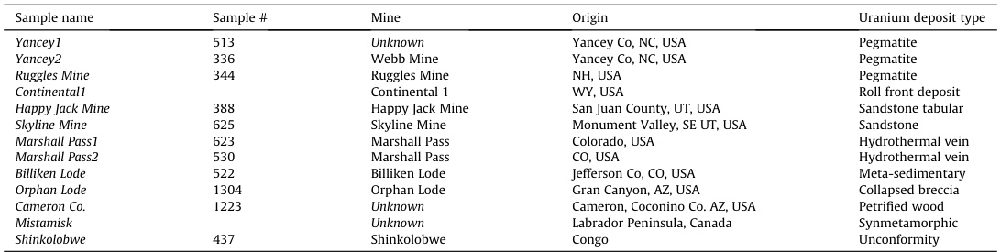
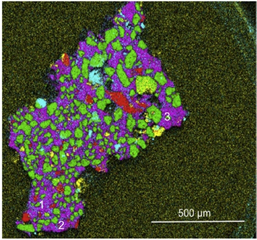
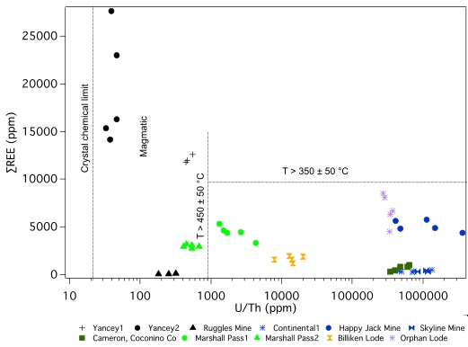
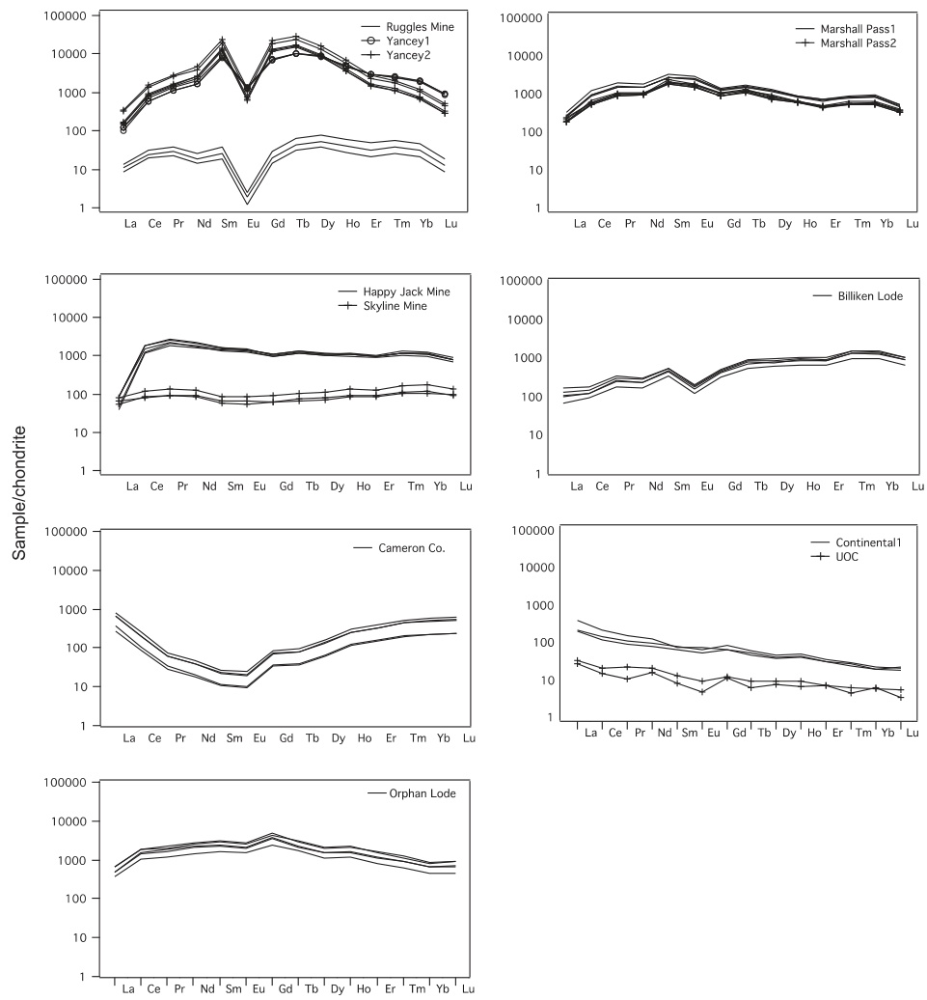
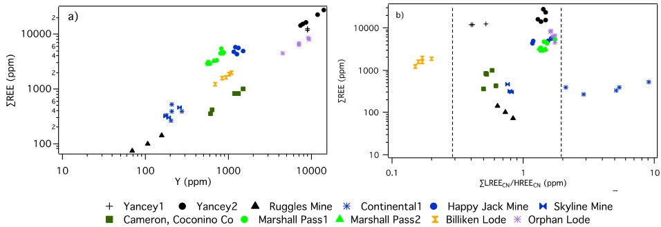
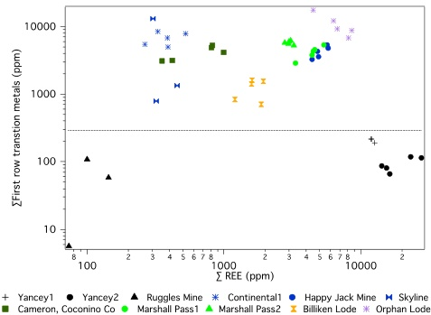
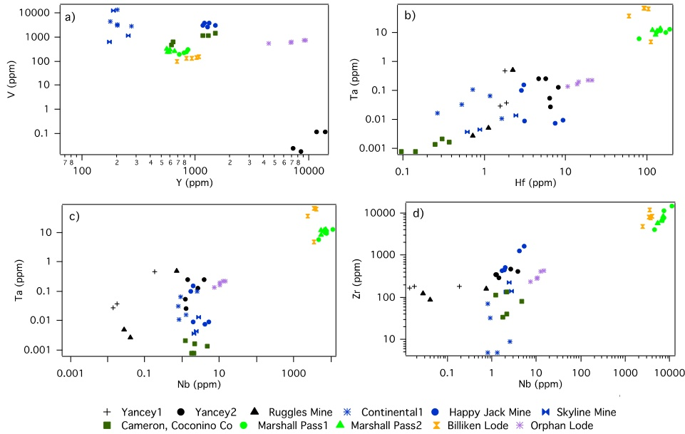
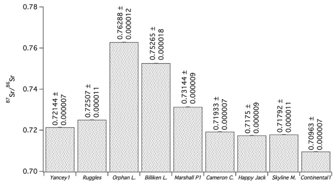
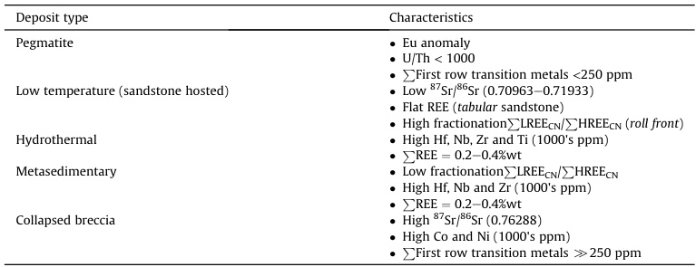

# Chemical and Sr isotopic characterization of North America uranium ores: Nuclear forensic applications

Enrica Balboni a,b,\\*, Nina Jones a, Tyler Spano a, Antonio Simonetti a, Peter C. Burns a,c  

a Department of Civil and Environmental Engineering and Earth Science, University of Notre Dame, Notre Dame, IN 46556, United States b Glenn T. Seaborg Institute, Physical and Life Science Directorate, Lawrence Livermore National Laboratory, 7000 East Avenue, Livermore, CA 94550, United States c Department of Chemistry and Biochemistry, University of Notre Dame, Notre Dame, IN 46556, United States  

## ARTICLEINFO  

## ABSTRACT

Article history: Received 27 June 2016 Received in revised form 23 August 2016 Accepted 29 August 2016 Available online 31 August 2016  

Keywords: Uranium deposits in the United States Uranium ore concentrate Strontium isotopes ICP- MS  

This study reports major, minor, and trace element data and Sr isotope ratios for 11 uranium ore (uraninite, \(\mathrm{UO}_{2 + x}\) ) samples and ore processed uranium ore concentrate (UOC) from various U.S. deposits. The uraniumite investigated represents ore formed via different modes of mineralization (e.g., high- and low- temperature) and within various geological contexts, which include magmatic pegmatites, metamorphic rocks, sandstone- hosted, and roll front deposits. In situ trace element data obtained by laser ablationICP- MS and bulk sample Sr isotopic ratios for uraniumite samples investigated here indicate distinct signatures that are highly dependent on the mode of mineralization and host rock geology. Relative to their high- temperature counterparts, low- temperature uranium ores record high U/Th ratios (>1000), low total rare earth element (REE) abundances (<1 wt%), high contents (>300 ppm) of first row transition metals (Sc, Ti, V, Cr, Mn, Co, Ni), and radiogenic \(^{87}\mathrm{Sr}^{86}\mathrm{Sr}\) ratios (>0.7200). Comparison of chondrite normalized REE patterns between uraniumite and corresponding processed UOC from the same locality indicates identical patterns at different absolute concentrations. This result ultimately confirms the importance of establishing geochemical signatures of raw, uranium ore materials for attribution purposes in the forensic analysis of intercepted nuclear materials.  

© 2016 Elsevier Ltd. All rights reserved.  

## 1. Introduction

<|ref|>text<|/ref|><|det|>[[54, 661, 480, 846], [504, 635, 927, 688]]<|/det|>
One of the most important public concerns regarding the safe use of nuclear energy is the possible diversion of nuclear and radiological material for illicit purposes. Nuclear material may be intercepted and traded illegally or originate from illegal mining operations, and thus an interest exists in employing methods that help in tracking its origin. Since the early 1990s, the IAEA has recorded more than 800 cases of illicit trafficking of nuclear and radioactive material. Tracing the origin of these materials is of utmost importance so as to deter future trafficking routes and help intercept illicit materials (Mayer et al., 2007; Keatley et al., 2015). The IAEA illicit trafficking database reports that many incidents of nuclear trafficking have involved low- grade material, such as natural uranium (IAEA, 2015). Thus, natural uranium within early fuel cycle stage material, such as ores and ore concentrate, is commonly intercepted material. Consequently, there is an international need to better understand and document the forensic signatures of different ore types such that an origin can be determined for seized material (IAEA, 2015).   

More than 800 uranium deposits are identified globally, with at least fifteen deposits type (IAEA, 2012). Uraninite, the main ore source, has an ideal crystal formula of \(\mathrm{UO_2}\) but typically \(\mathrm{U^{4 + }}_{1 - x - y - }\) \(\mathrm{U^{6 + }}_{x}\mathrm{REE}^{3 + }\) \(\mathrm{M}_2^{2 + }\) \(\mathrm{O}_{2 + x - (0.5) - z}\) (Janeczek and Ewing, 1992); it belongs to the cubic crystal system and forms well crystallized grains at higher temperature, or a collomorph, known as pitchblende, at low temperature. The fluorite- type uraniumic crystal structure can host many elements with ionic radii similar to that of \(\mathrm{U^{4 + }}\) in eightfold coordination. This applies particularly to \(\mathrm{Th^{4 + }}\) , the rare earth elements \((\mathrm{REE}^{3 + })\) , and \(\mathrm{Y}^{3 + }\) . The incorporation of these elements into the structure is mainly a function of temperature and element availability (Frimmel et al., 2014; Burns and Finch, 1999).  

In recent years, several studies have successfully attributed uranium ores and uranium ore concentrates (UOCs) to specific mining areas via elemental and isotopic fingerprinting (Mayer et al., 2007; Mayer et al., 2005; Wallenius et al., 2006; Keegan et al., 2012;

<!-- Page 25 -->

Han et al., 2013). Characteristic chemical fingerprints used in these studies include the concentration of elemental impurities as well as relative abundance and type of radioisotopes (e.g., Sr, U, Pb) present. For intercepted uranium ores, details about the geologic environment of formation can be obtained by analyses of REEs, whereas details in relation to the origin and age can be gained by investigating the isotope systematics of uranium, strontium, and lead (Mayer et al., 2005; Varga et al., 2009, 2011; Svedkauskaite- LeGore et al., 2007; Svedkauskaite- LeGore et al., 2008).  

For example, Varga et al. (2009) and Svedkauskaite- LeGore et al. (2007, 2008), both found a large variation in lead and strontium isotopic compositions in UOC of different origin. The variation of the \(^{87}\mathrm{Sr} / ^{86}\mathrm{Sr}\) is due to the decay of long- lived \(^{87}\mathrm{Rb}\) (half- life, \(4.8 \times 10^{10}\) years) to \(^{87}\mathrm{Sr}\) and the highly variable Rb/Sr ratio in nature. Sr isotope ratio measurements have been widely used in geology for age determinations, and recently as possible indicators of provenance for origin assessment of ivory, human tooth enamel and bones, and food products (Buzon et al., 2007; Buzon and Simonetti, 2013; Grupe et al., 1997; Van Der Merwe et al., 1990), as bioavailable Sr is characteristic of the geological background.  

Keegan et al. (2008, 2012) and Varga et al. (2010a) have both identified key attributes within UOC and uranium ore that are specific to geographic locations. However, only a few studies have examined unprocessed uranium ore (Frimmel et al., 2014; Richter et al., 1999; Mercadier et al., 2011), which represents the most elementally heterogeneous stage in the nuclear fuel cycle. Whilst certain forensic fingerprints are thought to be removed along the ore- processing route, REE normalized patterns and heavy isotope fractionation are believed to remain intact and representative of the original deposit type (Varga et al., 2010b, 2011).  

Building upon the data base of Mercadier et al. (2011) and Frimmel et al. (2014), which provide REE data for 32 localities and fourteen deposit types, this study reports chemical data and Sr isotope ratios for uranium ore samples and one UOC sample from the North American continent. Specifically, the aim of this work is to: 1- chemically characterize uranium samples from the United States including major, minor, and trace elements; 2- report \(^{87}\mathrm{Sr} / ^{86}\mathrm{Sr}\) ratios for the same samples; and 3- provide in depth characterization of sandstone deposits. Sandstone deposits constitute about \(18\%\) of uranium resources worldwide and \(41\%\) of known deposits. They are of major economic importance in several different countries (Kazakhstan, Uzbekistan and Niger) including the USA. The USA has large resources in sandstone type deposits and most of its uranium production has been from these deposits (Burns and Finch, 1999). Lastly, this study provides a direct comparison of trace element (REE) signatures between uranium ore and UOC originating from a sandstone- hosted roll front deposit from Wyoming.  

## 2. Materials and methods

### 2.1. Samples

Of the uranium ore samples analyzed in this work, eleven were retrieved from the "Ewing collection" of minerals and rocks housed at the University of Notre Dame. The Continental1 mine (WY) sample was purchased from the Mineralogical Research Corporation (www.minresco.com) and the Mistamisk uranium was obtained from the Universite' de Lorraine, GeoResources, France (Table 1). In addition to uranium specimens, a sample of UOC from Powder River Basin (WY) was obtained and its chemical composition analyzed.  

### 2.1.1. Brief description of the uranium samples

Yancey1 and Yancey2 (Yancey Co, NC) - pegmatite- hosted  

uraninite are from the Spruce Pine pegmatite, North Carolina. The pegmatites are of early Paleozoic age and cut mica and amphibole gneiss and schist rocks of Precambrian age (Brost, 1962). Ruggles Mine (NH) - In this area, the host rock consists of quartz- mica schist, quartzite, amphibolite, and high- grade metamorphic rocks. These rocks were folded, faulted, metamorphosed, and intruded in Devonian time. A U- Pb age of 304 Ma has been reported for the pegmatite (Olson, 1941; Korzeb et al., 1997). Billiken Lode (Jefferson Co., CO) - uranium ore veins are hosted in folded and faulted Precambrian meta- sedimentary rocks; the U- Pb age for the uranium ore is \(69 \pm 1.1\) million years (Zhao and Ewing Rodney, 2000; Dahlkamp, 1991). Marshall Pass1 and Marshall Pass2 (Marshall Pass district, CO) - uranium mineralization in this area occurs in fault- controlled veins and breccia zones in limestone of the Pennsylvania Belden Formation (320- 300 million years). The uranium ore is located at the intersection of major faults with Tertiary (between 65 and 2 million years) erosion surfaces. These surfaces were buried by Early Tertiary siliceous tuffs, a likely source of uranium (Zhao and Ewing Rodney, 2000; Deditius et al., 2007). Skyline Mine (Monument Valley, UT), Cameron Co. (Coconino Co. AZ) and Happy Jack Mine (San Juan Co, UT) - uranium ore samples are from tabular uranium sandstone deposits hosted by Upper Paleozoic and Mesozoic fluvial sediments typical of the Colorado plateau Province; i.e., mudstone and sandstone clastic layers consisting of coarse- grained pebbles and sandstone with abundant fossil wood. Ores originating from these deposits were formed in three main mineralization events - Late Triassic- Early Jurassic, Late Jurassic, and Early Cretaceous (Burns and Sigmon, 2013; Granger, 1962). Orphan Lode (AZ) - deposits of this type occur in circular vertical pipes filled with collapse breccia in which uranium is concentrated in the matrix and fracture around the pipe. The only known examples of this deposit type occur in the Arizona Strip, (USA). The pipes developed in Pennsylvania and Permian limestone and calcareous rock formations, and were mineralized in the late Triassic (26- 254Ma) (Burns and Finch, 1999; Burns and Sigmon, 2013). Continental1 and UOC (Wyoming) - uranium mineralization in the province started during the Laramide uplift and peaked in Oligocene (Burns and Sigmon, 2013). Mineralization is hosted in roll front deposit type in porous and permeable sedimentary rocks.  

### 3. Analytical methods

Sample preparation and major element analyses. For each sample, grains or chunks were separated or cut from the bulk material and fixed in 1- inch round epoxy filled moulds. The surface of each sample was polished and carbon coated.  

Chemical maps of the epoxy- mounted samples were constructed utilizing an EDAX Orbis Micro EDXRF (X- ray fluorescence) system. Maps were collected on a matrix of \(512 \times 400\) pixels with an X- ray aperture size of \(30 \mu \mathrm{m}\) , \(10 \mathrm{kV}\) voltage, \(200 \mu \mathrm{s}\) dwell time, \(12.8 \mu \mathrm{s}\) time with a total acquisition time \(\sim 8 \mathrm{h}\) .  

Major element analyses were conducted using a Cameca SX- 50 electron microprobe. An accelerating voltage of \(15 \mathrm{KV}\) was used, along with a beam size of \(15 \mu \mathrm{m}\) , and a beam current of \(100 \mathrm{nA}\) . Standardization was performed using well- characterized in- house standards of uranium oxide (UO2), thorium oxide (ThO2), galena (PbO), anorthite glass (Al2O3, CaO), titanium oxide (TiO2), manganese metal (MnO), zircon (ZrO2, SiO2), vanadium oxide (V2O3), yttrium aluminum garnet (Y2O3), and apatite (P2O5). Uncertainties (2σ mean) are based on counting statistics and are \(\leq 2\%\) for TiO2, UO2, MnO and V2O3; \(\leq 3\%\) for PbO; \(\leq 5\%\) for SiO2, Al2O3, P2O5, CaO, ZrO2 and ThO2 and \(\leq 6\%\) for Y2O3. For all samples, spots analyzed were homogeneous in relation to their major element composition (75 \(\mu \mathrm{m}\) diameter) based on their backscatter electron images also collected on the electron microprobe.

<!-- Page 26 -->

Table 1 Investigated uraninite samples, geographic location of origin, and uranium deposit type. Sample # refers to the catalog number of the samples obtained from the Rod Ewing sample collection.   

<table><tr><td>Sample name</td><td>Sample #</td><td>Mine</td><td>Origin</td><td>Uranium deposit type</td></tr><tr><td>Yancey1</td><td>513</td><td>Unknown</td><td>Yancey Co, NC, USA</td><td>Pegmatite</td></tr><tr><td>Yancey2</td><td>336</td><td>Webb Mine</td><td>Yancey Co, NC, USA</td><td>Pegmatite</td></tr><tr><td>Ruggles Mine</td><td>344</td><td>Ruggles Mine</td><td>NH, USA</td><td>Pegmatite</td></tr><tr><td>Continental1</td><td></td><td>Continental 1</td><td>WY, USA</td><td>Roll front deposit</td></tr><tr><td>Happy Jack Mine</td><td>388</td><td>Happy Jack Mine</td><td>San Juan County, UT, USA</td><td>Sandstone tabular</td></tr><tr><td>Skyline Mine</td><td>625</td><td>Skyline Mine</td><td>Monument Valley, SE UT, USA</td><td>Sandstone</td></tr><tr><td>Marshall Pass1</td><td>623</td><td>Marshall Pass</td><td>Colorado, USA</td><td>Hydrothermal vein</td></tr><tr><td>Marshall Pass2</td><td>530</td><td>Marshall Pass</td><td>CO, USA</td><td>Hydrothermal vein</td></tr><tr><td>Billiken Lode</td><td>522</td><td>Billiken Lode</td><td>Jefferson Co, CO, USA</td><td>Meta-sedimentary</td></tr><tr><td>Orphan Lode</td><td>1304</td><td>Orphan Lode</td><td>Gran Canyon, AZ, USA</td><td>Collapsed breccia</td></tr><tr><td>Cameron Co.</td><td>1223</td><td>Unknown</td><td>Cameron, Coconino Co. AZ, USA</td><td>Petrified wood</td></tr><tr><td>Mistamisk</td><td></td><td>Unknown</td><td>Labrador Peninsula, Canada</td><td>Symmetamorphic</td></tr><tr><td>Shinkolobwe</td><td>437</td><td>Shinkolobwe</td><td>Congo</td><td>Unconformity</td></tr></table>  

Trace element analysis. All in situ trace element analyses were performed within the MITERAC Facility at the University of Notre Dame. Measurements were carried out using a New Wave Research UP213 Nd:YAG laser ablation (LA) system coupled to a Thermo Finningan Element 2 sector field high resolution inductively coupled plasma mass spectrometer (HR- ICP- MS). Background ion signals were determined for \(60~\mathrm{s}\) with the laser on and shuttered. Sample ion signal was collected for \(60~\mathrm{s}\) subsequent to the start of the ablation. Concentrations were determined using the NIST SRM 610 glass wafer as the external standard using a "standard- sample" bracketing technique; CaO and \(\mathrm{ThO_2}\) wt. \(\%\) (obtained by electron microprobe) as the internal standards. Analytical settings and conditions used were similar to those reported by Chen and Simonetti, (2013). Data reduction was performed offline using Glitter software (Van Achterbergh et al., 2001), which yields concentrations, internal uncertainties, and limits of detection. The average relative uncertainty ( \(2\sigma\) mean) for each elemental concentration determination is a function of the recorded ion signals (which depends on the absolute abundance of each trace element in the sample), and for most elements investigated in this work is \(\sim 5 - 10\%\) . During each laser ablation analysis, no significant ion signal changes were observed in the time resolved spectra, further indicating the homogeneity and lack of inclusions present within uraninite (at the scale of \(10\mathrm{s}\) of \(\mu \mathrm{m}\) ).  

For the sample powder of UOC, \(0.05\mathrm{g}\) was digested using concentrated, double distilled (DD) \(\mathrm{HNO_3}\) in \(15\mathrm{mL}\) capped Savillex® Teflon vials on a hotplate ( \(\sim 120^{\circ}\mathrm{C}\) ) for \(48\mathrm{h}\) in a clean room (class 1000) laboratory. Samples were evaporated to dryness followed by the addition of \(2\mathrm{mL}\) concentrated DD \(\mathrm{HNO_3}\) , and the solutions were then placed on the hotplate for an additional \(24\mathrm{h}\) . This procedure was repeated twice. Subsequent to the last evaporation cycle, \(5\mathrm{mL}\) of concentrated DD \(\mathrm{HNO_3}\) was added and then diluted gravimetrically to a final volume of \(\sim 100\mathrm{mL}\) with \(18\mathrm{M}\Omega\) water. The abundance of the trace elements investigated here was determined by a standard/spike addition method (Jenner et al., 1990), which includes correction for matrix effects and instrumental drift. At the start of each analytical session, optimization of the ICP- MS was achieved using a multi- element 1 ppb tuning solution. All solution mode analyses were conducted using the same Thermo Finnigan Element 2 ICP- MS instrument as employed for the laser ablation analyses.  

<|ref|>text<|/ref|><|det|>[[54, 845, 476, 925], [504, 305, 928, 740]]<|/det|>
Strontium isotopes analyses. Among the uraninite specimens investigated here, only nine samples presented the right size and quality for separation of homogeneous chunks of uranium oxide. Cut pieces were pulverized using an agate mortar and pestle and \(0.01 - 0.05\mathrm{g}\) were digested using concentrated DD \(\mathrm{HNO_3}\) in \(15\mathrm{mL}\) capped Savillex® Teflon vials on a hotplate for \(48\mathrm{h}\) in a clean room (class 1000) laboratory. After \(48\mathrm{h}\) , the solution was centrifuged and unreacted solid residue was separated from solution, dried, and weighed. Partial dissolution of the samples was considered desirable as to avoid digestion of the host rock minerals, especially the silicate matrix, which could overprint the strontium isotopic signature of the sample. The solution was then re- transferred in capped Savillex® Teflon and evaporated to dryness. \(2\mathrm{mL}\) of a 1:1 concentrated (DD) \(\mathrm{HNO_3}\) : (DD) HCl acid mixture was added to each sample. After \(24\mathrm{h}\) , the samples were uncapped and evaporated to almost complete dryness. At this point, \(2\mathrm{mL}\) of concentrated DD \(\mathrm{HNO_3}\) was added to each sample and immediately brought to almost complete dryness. Finally \(2\mathrm{mL}\) of concentrated DD \(\mathrm{HNO_3}\) was added and then diluted gravimetrically to a final volume of \(\sim 100\mathrm{mL}\mathrm{with}18\mathrm{M}\Omega\) water. Aliquots of samples were completely dried and prepared for chemical separation and a brief description of the method is provided here. Columns consist of \(1.42\mathrm{mL}\) of \(200 - 400\mathrm{mesh}\) AG50W- X8 resin. The resin bed volume was cleaned with \(5\mathrm{mL}\) of ultrapure ( \(18\mathrm{M}\Omega\) ) \(\mathrm{H}_2\mathrm{O}\) and then conditioned with \(5\mathrm{mL}\) of \(2.5\mathrm{N}\) DD HCl. The sample aliquot is loaded onto the resin in \(0.25\mathrm{mL}\) of \(2.5\mathrm{N}\) HCl, washed with \(9.75\mathrm{mL}\) of \(2.5\mathrm{N}\) HCl, and last eluted with \(4\mathrm{mL}\) of \(2.5\mathrm{N}\) HCl. Subsequent to ion exchange chromatography, the Sr- bearing aliquots were brought to dryness and later diluted in \(2\%\) \(\mathrm{HNO_3}\) solution ( \(\sim 2\mathrm{mL}\) ), and aspirated into the ICP torch using a desolvating nebulizing system (DSN- 100 from Nu Instruments Inc.). Strontium isotope measurements were conducted using a NuPlasma MC- ICP- MS instrument following a protocol outlined in Buzon et al. (2007). Strontium isotope data were acquired in static, multi- collection mode using 5 F collectors for a total of \(400\mathrm{s}\) , consisting of 40 scans of 10 s integrations. Accuracy and reproducibility of the analytical protocol were verified by the analysis of the NIST SRM 987 strontium isotope standard during the course of this study; this yielded an average value of \(0.71025\pm 0.00004\) .   

## 4. Results and discussion

### 4.1. Major elements and REE

The rare earth elements, \(\mathrm{Ca^{2 + }}\) , \(\mathrm{Y^{3 + }}\) , \(\mathrm{Pb^{2 + }}\) , and \(\mathrm{Th^{4 + }}\) can to a certain extent substitute for uranium in the crystal lattice of uraninite (Janeczek and Ewing, 1992; Burns and Finch, 1999; Deditius et al., 2007). Other elemental impurities in uraninite include Si, P, Al, Fe, Mg, Na, K, and other transition metals. The exact origins of these elements in uraninite remain uncertain, but most are not compatible within the uraninite structure (Deditius et al., 2007). Although it cannot be ascertained in all cases if a certain trace element is actually hosted in the uraninite structure or present

<!-- Page 27 -->

within submicroscopic inclusions, the chemical information can nonetheless be useful for fingerprinting purposes, when such inclusions are a characteristic feature of a given deposit. Overall, the abundance of trace elements in uraniumite is a function of ore genesis, fluid/magma chemistry, local element availability in the source region, and chemistry of the host rock (Frimmel et al., 2014; Mercadier et al., 2011).  

In this work all in situ analyses including electron microprobe (EMP) and laser ablation (LA)- ICP- MS were conducted on \(\mathrm{UO_2}\) with no visible alterations. Due to the high degree of heterogeneity within most samples, great care was taken to select spots that corresponded to uraniumite, and not to alterations or secondary phases within the specimens. For example, Fig. 1 represents an elemental map for Continental1. Spots labeled 1, 2, and 3 in Fig. 1 recorded the lowest amount of alteration and were considered for further analyses (EMP and LA- ICP- MS). Micro- XRF elemental maps for other samples are reported in the Supplementary Information.  

Many of the analysis totals for the elemental oxide concentrations are lower than \(100\mathrm{wt\%}\) (Supplementary Information), and typically range from 87 to \(100\mathrm{wt\%}\) . The lower calculated elemental oxide totals in uraniumite may be attributed to either deviations from the ideal \(\mathrm{UO_2}\) formula, concentrations of elements not analyzed for by EMP, and/or partial hydration or alteration (coffinitization). For example, cofinitization and alteration of primary uraniumite may lead to elevated \(\mathrm{Si^{4 + }(>2.5\%wt.~SiO_2)}\) \(\mathrm{Ca^{2 + }}\) (above \(1.5\%\) wt. \(\mathrm{CaO}\) and \(\mathrm{Al^{3 + }}\) (Frimmel et al., 2014). Hence, the spots analyzed by EMP that yielded elevated amounts of \(\mathrm{CaO}\) and \(\mathrm{SiO_2}\) were not considered for LA- ICP- MS analysis. Continental1 and Cameron Co. contain the highest \(\mathrm{Al_2O_3}\) contents, \(\sim 0.3\) and \(0.5\%\) weight respectively; in the remaining samples, aluminum is either below detection limit or \(< 0.1\%\) . Most of the samples contain \(< 0.1\%\) of \(\mathrm{P_2O_5}\) , only Cameron Co. has an elevated phosphorous content up to \(\sim 0.8\%\) , which may be indicative of alteration of uraniumite to \(\mathrm{U(VI)}\) minerals. The amount of \(\mathrm{UO_2}\) measured in the samples ranges between 75 and 92 wt%.  

Fig. 1. Example of X-ray fluorescence elemental map of sample Continental1 (Continental Mine WY), from a sandstone hosted roll front deposit. Color: uranium (magenta); silicon (green); lead (yellow); iron (red); calcium (light blue). Uraninite is present as a cement surrounding quartz grains; areas labeled 1, 2 and 3 presented the least amount of cracking and alteration and were selected for electron microprobe analyses. XRF maps were collected for all samples (Supplementary Information). (For interpretation of the references to colour in this figure legend, the reader is referred to the web version of this article.) 
  

indicative of alteration of uraniumite to \(\mathrm{U(VI)}\) minerals. The amount of \(\mathrm{UO_2}\) measured in the samples ranges between 75 and 93 wt%.  

All of the analyzed uranium ore grains contain lead at variable levels. Most of this lead is radiogenic in origin as indicated by the poor but negative correlation between \(\mathrm{UO_2}\) and PbO contents (Fig. 2 SI). Thus, it is not surprising that low temperature deposits (e.g., Continental1) contain the least amount of lead, which is consistent with their relatively young ages. The sample from Happy Jack Mine is the exception since it does not exhibit a negative correlation between \(\mathrm{UO_2}\) and PbO contents. However, common gangue minerals in this deposit are Pb- bearing sulfide minerals (chalcopyrite, galena and pyrite) (Zhao and Ewing Rodney, 2000), which may affect measurement of the total PbO content.  

The uraniumite grains from all the deposits studied here define both variable REE contents and \(\mathrm{U / Th}\) ratios, which are seemingly dependent on their respective crystallization temperatures Frimmel et al. (2014) and Mercadier et al. (2011) (Fig. 2). In general, it is expected that uraniumite formed during igneous processes can accommodate large amounts of Th and REEs in their crystal structure without fractionation. Its REE chondrite normalized pattern is thus usually flat with a negative Eu anomaly, as is displayed in Fig. 3. At lower temperatures, the total REE content decreases and more fractionation is expected between the REEs (Mercadier et al., 2011).  

As displayed in Fig. 2, uraniumite formed at higher temperatures (Yancey1, Yancey2 and Ruggles Mine) have elevated \(\mathrm{ThO_2}\) contents \((- 0.5 - 4\mathrm{wt}\%)\) . Yancey2 and Yancey1 also have elevated REE contents \((\Sigma = 1.1 - 2.9\%)\) , however the Ruggles Mine sample is characterized by an extremely low abundance in REEs \((\Sigma \sim 0.01\%)\) , which is consistent with previous reports on the chemical composition of uranium oxide samples from this mine (Korzeb et al., 1997; Shaub, 1938). Based on accepted conventionality, this low REE content is consistent with uranium oxide formation at low temperature; however, \(\mathrm{U / Th}\) ratios are \(< 1000\) , and REE chondrite normalized patterns and the \(\mathrm{Y_2O_3}\) contents confirm the pegmatitic origin of the sample (Figs. 2- 4 (Frimmel et al., 2014)).  

Low temperature and hydrothermal uraniumite samples are devoid or have low thorium content \((0.1 - 8\mathrm{ppm})\) , as indicated by the high \(\mathrm{U / Th > 1000}\) (Fig. 2). Among the low temperature samples, differences can be observed in their respective REE contents. Three of the low temperature uranium oxide samples from tabular sandstone- type deposits and from mineralized wood (Continental1, Skyline Mine and Cameron Co.) have both low REE \((0.03 - 0.5\%)\) and  

Fig. 2. Log-log plot showing the total REE versus \(\mathrm{U / Th}\) for all primary uraniumite grains. Boundaries set as Frimmel et al. (2014). 

<!-- Page 28 -->

Fig. 3. Chondrite-normalized rare earth element plots for uranium samples, which originate from eight different deposit types. Laser ablation-ICP-MS-derived values represent the average of five ablation sites. Uraninites originating from two different sedimentary deposit types were analyzed (tabular and roll front). Uranium ore concentrate obtained from the roll front deposit located in Powder River Basin, WY was also analyzed for its REE content by solution mode ICP-MS. 
  

The contents. The Happy Jack Mine sample however, displays a REE chondrite normalized pattern that is predominantly flat and slightly enriched in light REEs, and has low Th \((0.5 - 2 \mathrm{ppm})\) , which is typical of sandstone- hosted low temperature deposits. However, its high REE contents \((- 0.5\%)\) are not consistent with low temperature uranium. Chondrite normalized REE patterns for uranium deposits formed at low temperature are highly dependent on the geochemical characteristics of the host rock (Mercadier et al., 2011), mineral fluid composition, and metal availability. Thus, the local geology and geochemical conditions of the area hosting the Happy Jack uranium deposit may account for its high REE content.  

Marshall Pass1 and 2 (hydrothermal origin) and Billiken Lode  

(metasedimentary) have REE contents in the \(0.2 - 0.4\%\) range and U/ Th ratios intermediate between low and high temperature uraniumite (Fig. 2).  

The \(\mathrm{Y}_2\mathrm{O}_3\) content in the samples ranges between 0 and \(3.8\%\) with those of magmatic origin (Yancey2, Yancey1 and Ruggles Mine) recording the highest contents \((0.7 - 3.8 \mathrm{wt}\%)\) . Due to its similar geochemical behavior, Y contents for most samples expectedly show a positive correlation with REE abundances (Fig. 4a), with the exception of 3 samples. One of the latter is Yancey1 (pegmatitic) in which the lack of correlation is probably due to the presence of garnet, which strongly fractionates Y (Fig. 4a). Continental1 and Happy Jack Mine are of sedimentary origin and also display a poor

<!-- Page 29 -->

Fig. 4. Log-log plots depicting the concentrations of a) Total REE versus Y content and b) \(\Xi \mathrm{REE}\) versus chondrite-normalized light over heavy rare earth elements fractionation \((\Sigma \mathrm{LREE})_{\mathrm{N}} / (\Sigma \mathrm{HREE})_{\mathrm{N}}\) from various types of deposit [ \(\Sigma \mathrm{LREE}_{\mathrm{CN}} = \mathrm{La}\) , Ce, Pr, Nd; \(\Sigma \mathrm{HREE}_{\mathrm{CN}} = \mathrm{Er}\) , Tm, Yb, Lu]. 
  

correlation between \(\Sigma \mathrm{REE}\) and Y contents.  

The mechanisms that lead to REE fractionations in uranium oxides are not fully understood (Mercadier et al., 2011). Factors that appear to affect REE fractionation include 1) crystallization temperature; 2) crystallization of geocentric REE- rich phases, 3) REE signature of the host rock, 4) salinity of mineralizing fluids, and 5) elemental availability (Mercadier et al., 2011).  

Incorporation of REE in the uranium structure is favored at a temperature \(\sim 350^{\circ}\mathrm{C}\) , without fractionation \((\Sigma \mathrm{LREE} / \Sigma \mathrm{HREE} = 1)\) and in large amounts \((>10000\mathrm{ppm})\) (Mercadier et al., 2011). As the crystallization temperature decreases, the total REE content decreases as well, and fractionation occurs, such as REE having ionic radii similar to that of \(\mathrm{U}^{4 + }\) become preferentially incorporated. In the \(\Sigma \mathrm{REE}\) versus \((\Sigma \mathrm{LREE})_{\mathrm{CN}} / (\Sigma \mathrm{HREE})_{\mathrm{CN}}\) diagram (Fig. 4b), Yancey1 and Yancey2 show little fractionation \((- 1.2)\) and \(\Sigma \mathrm{LREE} > 10,000\) consistent with a pegmatitic origin. The Ruggles mine sample, also of pegmatitic origin, shows little fractionation yet extremely low REE value, possibly indicative of low elemental availability at the time of crystallization.  

Continental1 displays the highest values and variability with \((\Sigma \mathrm{LREE})_{\mathrm{CN}} / (\Sigma \mathrm{HREE})_{\mathrm{CN}}\) ratios ranging between 2.2 and 9.1, which is consistent with data reported for roll front deposits from other localities (Mercadier et al., 2011). Mercadier et al. attributed the REE fractionation in uraniumite originating from roll front deposits the low fluid salinity of the mineralizing solution (Mercadier et al., 2011).  

Overall, the majority of samples show little fractionation between heavy and light REEs with chondrite normalized ratios between 0.5 and 2, and with the sample from Billiken Lode displaying the lowest \((\Sigma \mathrm{LREE})_{\mathrm{CN}} / (\Sigma \mathrm{HREE})_{\mathrm{CN}}\) ratios of \(\sim 0.15\) , this REEs fractionation is reflected in the uraniumite REE patterns for Continental1 and Billiken Lode samples (Fig. 3).  

### 4.1.1. Comparison of REE uranium ore and UOC from Wyoming

The chondrite normalized REE patterns for a sample of UOC produced from a roll front deposit in Wyoming, and a uranium ore sample from the same geologic environment (i.e., Continental1) are illustrated in Fig. 3. As expected, the concentrations of the REEs are lower in the processed uranium (UOC), however their patterns are indistinguishable given their associated uncertainties. The information provided here is one of the few examples that compare the geochemical signatures between uranium ore and its processed concentrate from the same geographic locality.  

### 4.1.2. Method validation

The Mismask and Shinkolobwe samples were analyzed by laser ablation (LA)- ICP- MS to validate our methodology (Figure SI 3). The Shinkolobwe uraniumite shows enrichment of the middle REE (Sm- Ho) centered at Tb and a weak negative Eu anomaly; in contrast, the Mismask uraniumite has a fairly flat chondrite normalized pattern with low La and a small Eu anomaly. These results are consistent with those from (Frimmel et al. 2014), Bonhoure et al. (2007), and Mercadier et al. (2011), and thus confirm the validity of the in situ results reported here and the adopted analytical protocol.  

### 4.2. First row transition metals

Uranium ore samples contain a significant number of first series transition metal impurities at varying concentrations, in particular distinct differences exist between localities and deposit types. For example, uraniumite samples Continental1, Happy Jack Mine, and Cameron Co. record the highest vanadium content (2000- 4000 ppm). The sample from Orphan Lode (collapsed breccia pipe) has vanadium contents between 500 and 700 ppm, whereas hydrothermal uraniumite (Marshall Pass1 and 2) and that of meta- sedimentary origin (Billiken Lode) show vanadium contents of \(\sim 200\) ppm and \(\sim 100\) ppm, respectively. In a plot of V vs Y contents  

Fig. 5. Log-log plot illustrating total concentrations of first row transition metal versus \(\Sigma \mathrm{REE}\) . 

<!-- Page 30 -->

(Fig. 5), all deposits fall within distinct fields with the exception of sample Continental1, which shows the highest variability in V contents. Titanium content is high in samples of hydrothermal origin (Marshall Pass1 and 2) ranging between 2500 and 5300 ppm. Other samples that contain elevated Ti contents are Orphan Lode (500–900 ppm) and Continental1 (50–250 ppm). Orphan Lode yields the highest Cr content (170–240 ppm). Mn contents range in the 1000s of ppm for samples Cameron Co. (1600–1900 ppm), and in the 100s of ppm in samples Happy Jack Mine, Marshall Pass1, and Orphan Lode. Cobalt content is below detection limit or \(< 10\) ppm in most samples with the exception of Orphan Lode and Cameron Co., which have Co concentrations up to 2400 ppm and 1900 ppm, respectively. Ni was detected only in Orphan Lode (4000–7800 ppm) sample and was either at below detection limit or \(< 10\) ppm for the remaining samples. Among all the samples, the collapsed breccia pipe from Orphan Lode has the highest Cr and Ni contents, which may be specific characteristics of this deposit type (Burns and Finch, 1999; Dahlkamp, 1991) (Supplementary Information).  

For all uranium of pegmatitic association, the abundances of all first row transition metals are either below detection limit (V, Cr, Co, Ni) or \(< 10\) ppm (Sc, Ti); Mn content ranges between 50 and 200 ppm. All pegmatite-type uranium deposits analyzed in this work contain \(< 200\) ppm total of first row transition metals (Fig. 5). As displayed in Fig. 5, samples of pegmatitic origin can be discriminated from low temperature uranium oxide samples based on their much lower total contents of first row transition metals.  

### 4.3. Other metals

Ta contents correlate well with Hf, Nb, and Zr abundances (Fig. 6), although for a significant number of analyses, the former  

were close to the detection limit. Samples Marshall Pass1, and 2, and Billiken Lode contain the highest concentrations of these high field strength elements (up to thousands of ppm).  

In all of the samples, Ba contents range between 2 and 50 ppm; only the sample from Billiken Lode records extremely high Ba abundances (1000–2000 ppm). The high Ba content in the Billiken Lode sample is not surprising as the mineralization in Billiken Lode, Jefferson County (CO) is reportedly associated with Ba- rich carbonates (100–1000 ppm) (Dahlkamp, 1991).  

### 4.4. Strontium isotopes

All samples contain strontium abundances in the range of 5–400 ppm. The \(^{87}\mathrm{Sr} / ^{86}\mathrm{Sr}\) isotope ratios reported in this study define a wide range of values between \(0.70963 \pm 0.000007\) and \(0.76288 \pm 0.000012\) (Fig. 7), and corroborate and overlap those reported for UOCs from worldwide sources ( \(0.70750 \pm 0.00008\) and \(0.76063 \pm 0.00002\) ; Varga et al. (2009)). Uraninite from sandstone-type (Happy Jack Mine and Skyline Mine) and roll- front (Continental1) deposits are characterized by the least radiogenic Sr isotope values (<0.7200), whereas the highest ratios are recorded in samples Orphan Lode (collapsed breccia), Billiken Lode (metasedimentary), and Marshall Pass1 (hydrothermal; Fig. 7).  

The age and Rb/Sr ratio of the uranium will play significant roles in determining the measured, present- day Sr isotope ratios of the samples. In general, similar \(^{87}\mathrm{Sr} / ^{86}\mathrm{Sr}\) ratios can be expected for uranium hosted by comparable host rocks that are of young age (due to the long half- life of \(^{87}\mathrm{Rb}\) ). For example, the youngest sample Continental1 from Wyoming (Oligocene mineralization) has the lowest \(^{87}\mathrm{Sr} / ^{86}\mathrm{Sr}\) ratio of \(0.70963 \pm 0.000007\) .  

In this work, four samples from the Colorado Plateau were investigated, three from sandstone- hosted tabular uranium  

Fig. 6. Log-log diagrams illustrating concentrations of various trace elements. a) V versus Y content; b) Ta versus Hf; c) Ta versus Nb, and d) Zr versus Nb from various types of deposit. 

<!-- Page 31 -->

Fig. 7. Measured \(^{87}\mathrm{Sr}^{86}\mathrm{Sr}\) isotope ratios of the investigated uranium samples. All associated uncertainties are reported at the \(2\sigma\) confidence level. 
  

<|ref|>text<|/ref|><|det|>[[68, 343, 493, 700], [522, 343, 944, 590]]<|/det|>
deposits (Skyline Mine, Happy Jack Mine and Cameron Co.) and one uranium oxide from a collapsed breccia pipe (Orphan). The collapsed breccia pipes located in the Arizona strip are a unique example for this deposit type. The proposed source of the uranium in the pipe is suggested to have been the overlying volcanoclastic sediments, as is the case for the other deposits in the Colorado Uranium province (Burns and Finch, 1999; Dahlkamp, 1991). Thus, Happy Jack Mine, Cameron Co., Skyline Mine, and Orphan Lode samples are located geographically proximal to one another and share similar geologic and geochemical features, including the suggested uranium source for mineralization and host rock formations. However, these samples display geochemical traits that are distinct and varied such as different REE patterns, total REE contents, total abundances of first row transition metals, and \(^{87}\mathrm{Sr}^{86}\mathrm{Sr}\) ratios. Skyline Mine, Cameron Co., and Happy Jack Mine samples have similar \(^{87}\mathrm{Sr}^{86}\mathrm{Sr}\) ratios of \(0.71792 \pm 0.000011\) , \(0.71750 \pm 0.000009\) , and \(0.71933 \pm 0.000007\) , respectively (Fig. 7), consistent with their young formational ages. In contrast, the Orphan Lode sample contains the highest Sr isotope ratio reported here ( \(^{87}\mathrm{Sr}^{86}\mathrm{Sr}\) of \(0.76288 \pm 0.000012\) ). Despite the similarities in geologic setting for these four specimens (Happy Jack Mine, Skyline Mine, Cameron Co., and Orphan Lode), some differences in their respective modes of mineralization may help explain the disparities in \(^{87}\mathrm{Sr}^{86}\mathrm{Sr}\) ratios. One of the differences among these four samples is the nature of the mineralizing fluid. Happy Jack Mine, Cameron Co., and Skyline Mine are uranium ore samples from channel/basal uranium deposits in Phanerozoic sandstones in which mineralizing processes were initiated soon after sedimentation; this involved surface groundwater containing small amounts of U, V, and Cu migrating through the hydrologic gradient (Dahlkamp, 1991). In contrast, the Orphan Lode sample represents uranium mineralization in a breccia pipe deposit (Dahlkamp, 1991). Fluid inclusion studies suggest that the ore forming solution had temperatures ranging between \(80^{\circ}\mathrm{C}\) and \(170^{\circ}\mathrm{C}\) , and salinity between 9 and \(19\%\) eq. NaCl (Burns and Finch, 1999; Dahlkamp, 1991). Strontium and rubidium in natural groundwater are considered minor and trace constituents, respectively, with a concentration range of \(0.01 - 1\) ppm for strontium, and \(0.0001 - 0.1\) ppm for rubidium. However, salt brines can have higher strontium (30 - 60 ppm) and rubidium (1 - 10 ppm) contents than groundwater (Fontes and Matray, 1993). Fontes and Matray (1993) investigated the chemical and isotopic signatures of salt brines in France, and noted that some brines had higher \(^{87}\mathrm{Sr}^{86}\mathrm{Sr}\) values than expected. The latter were attributed to the salt brines flowing through rocks characterized by radiogenic \(^{87}\mathrm{Sr}^{86}\mathrm{Sr}\) values (Fontes and Matray, 1993).   

Samples of uranium formed at higher temperatures (e.g., Yancey1 and Ruggles Mine) or that have undergone hydrothermal processes (Marshall Pass1) or metamorphism (Billiken Lode) have higher Sr isotope ratios (0.72144- 0.75265) compared to those formed at low temperatures. However, it is difficult to determine the exact relative importance of both temperature and nature of hydrothermal fluids in determining the \(^{87}\mathrm{Sr}^{86}\mathrm{Sr}\) ratios of these uranium oxides. Overall, the \(^{87}\mathrm{Sr}^{86}\mathrm{Sr}\) ratios clearly correlate to the  

Table 2 Summary of the chemical and isotopic signatures representative of the deposit types.   

<table><tr><td>Deposit type</td><td>Characteristics</td></tr><tr><td>Pegmatite</td><td>• Eu anomaly • U/Th &amp;lt; 1000 • ∑First row transition metals &amp;lt;250 ppm • Low 87Sr/86Sr (0.70963–0.71933) • Flat REE (tabular sandstone) • High fractionation∑LREEcN/∑HREEcN (roll front) • High Hf, Nb, Zr and Ti (1000&#x27;s ppm) • ∑REE = 0.2–0.4wt • Low fractionation∑LREEcN/∑HREEcN • High Hf, Nb and Zr (1000&#x27;s ppm) • ∑REE = 0.2–0.4wt • High 87Sr/86Sr (0.76288) • High Co and Ni (1000&#x27;s ppm) • ∑First row transition metals ≥250 ppm</td></tr><tr><td>Low temperature (sandstone hosted)</td><td></td></tr><tr><td>Hydrothermal</td><td></td></tr><tr><td>Metasedimentary</td><td></td></tr><tr><td>Collapsed breccia</td><td></td></tr></table>

<!-- Page 32 -->

deposit type and can be used to distinguish uraninite of different origin. However, this radiogenic isotope information has to be supplemented with other geochemical characteristics and signatures for a more accurate assessment of a sample's origin in relation to forensic analysis.  

## 5. Conclusions

Accurate source attribution of intercepted nuclear material is presently a major concern within the international community. This study provides a detailed chemical characterization of eleven uranium ore samples and one UOC from the United States. Thorium and yttrium contents, U/Th ratios, rare earth chondrite normalized patterns, and total REE concentrations represent critical chemical indices that can be used for differentiating deposit types. The results reported here show the importance of combining multiple chemical signatures in order to determine the origin of uranium ore. For example, combining the abundances of first row transition metals and high field strength elements with their corresponding strontium isotopic data provide significant information in relation to determining a sample's geographic origin. A summary of the chemical and isotopic signatures representative of the deposit types characterized in this work is reported in Table 2.  

Additionally, the corroborating chemical signatures of unprocessed uranium ore and early stage processing uranium from Continental 1 Mine (Wyoming) reported here suggest that detailed elemental analyses of early stage nuclear material is an effective tool that can be applied for provenance studies of intercepted nuclear materials. The work presented here provides a step forward in the global effort of creating a fingerprinting database of uranium ore raw materials used in the nuclear fuel cycle and weapons manufacturing.  

## Acknowledgments

This work is funded by DHS Grant 2014- DN- 077- ARI082. The authors thank Dr. Ian Steele for his expertise with electron microprobe analysis. The Center of Environmental Science and Technology (CEST) at the University of Notre Dame is thanked for the training and use of the \(\mu\) - XRF. This work was performed under the auspices of the U.S. Department of Energy by Lawrence Livermore National Laboratory under contract DE- AC52- 07NA27344.  

## Appendix A. Supplementary data

Supplementary data related to this article can be found at http://dx.doi.org/10.1016/j.apegeochem.2016.08.016.  

## References

Bonhoure, J., et al., 2007. Methodology for rare earth element determinations of uranium oxides by ion microprobe. Geostand. Geoenalytical Res. 31 (3), 209- 225. Brost, A.D., 1962. The Spruce pine DistrictAvery, mitchel and Yancey counties North Carolina. In: Geological Survey Bulletin. Washington DC. Burns, P.C., Finch, R., 1999. Uranium : Mineralogy, Geochemistry and the Environment. In: Mineralogy, Geochemistry and the Environment. Mineralogical Society of America, Washington, DC. Burns, P.C., Sigmon, G.E., 2013. In: Uranium : Cradle to Grave. C. Mineralogical Association. Buzon, M.R., Simonetti, A., 2013. Strontium isotope (Sr- 87/Sr- 86) variability in the nile valley: identifying residential mobility during ancient egyptian and nubian sociopolitical changes in the New kingdom and napatan periods. Am. J. Phys. Anthropol. 151 (1), 1- 9. Buzon, M.R., Simonetti, A., Creaser, R.A., 2007. Migration in the Nile Valley during  

the New Kingdom period: a preliminary strontium isotope study. J. Archaeol. Sci. 34 (9), 1391- 1401. Chen, W., Simonetti, A., 2013. In- situ determination of major and trace elements in calcite and apatite, and U- Pb ages of apatite from the Oka carbonatite complex: insights into a complex crystallization history. Chem. Geol. 353, 151- 172. Dahlkamp, F.J., 1991. Uranium Ore Deposits. Deditius, A.P., Utsunomiya, S., Ewing, R.C., 2007. Fate of trace elements during alteration of uranium in a hydrothermal vein- type U- deposit from Marshall Pass, Colorado, USA. Geochim. Cosmochim. Acta 71 (20), 4954- 4973. Fontes, J.C., Matray, J.M., 1993. Geochemistry and origin of formation brines from the Paris Basin, France. I. Brines associated with Triassic salts. Chem. Geol. 109 (1- 4), 149- 175. Frimmel, H.E., Schedel, S., Braetz, H., 2014. Uraninite chemistry as forensic tool for provenance analysis. Appl. Geochem. 48, 104- 121. Granger, H.C., 1962. Reconnaissance Study of Uranium Deposits in Arizona. Washington DC. Grupe, G., et al., 1997. Mobility of Bell Beaker people revealed by strontium isotope ratios of tooth and bone: a study of southern Bavarian skeletal remains. Appl. Geochem. 12 (4), 517- 525. Han, S.- H., et al., 2013. Measurement of the sulphur isotope ratio (S- 34/S- 32) in uranium ore concentrates (yellow cakes) for origin assessment. J. Anal. Atomic Spectrom. 28 (12), 1919- 1925. IAEA. International Status and Prospects for Nuclear Power 2012. IAEA. http://www- ns.iaea.org/security/itdb.asp. [cited 2015. Janeczek, J., Ewing, R.C., 1992. Structural formula of uranium. J. Nucl. Mater. 190 (0), 128- 132. Jenner, G.A., et al., 1990. ICP- MS - a powerful tool for high- precision trace- element analysis in earth sciences - evidence from analysis of selected USGS reference samples. Chem. Geol. 83 (1- 2), 133- 148. Keatley, A.C., et al., 2015. An investigation into heterogeneity in a single vein- type uranium ore deposit: implications for nuclear forensics. J. Environ. Radioact. 150, 75- 85. Keegan, E., et al., 2008. The provenance of Australian uranium ore concentrates by elemental and isotopic analysis. Appl. Geochem. 23 (4), 765- 777. Keegan, E., et al., 2012. Attribution of uranium ore concentrates using elemental and anionic data. Appl. Geochem. 27 (8), 1600- 1609. Korzeb, S.L., Foord, E.E., Lichte, F.E., 1997. The chemical evolution and paragenesis of uranium minerals from the Ruggles and Palermo granitic pegmatites, New Hampshire. Can. Mineral. 35, 135- 144. Mayer, K., Wallenius, M., Ray, I., 2005. Nuclear forensics - a methodology providing clues on the origin of illicitly trafficked nuclear materials. Analyst 130 (4), 433- 441. Mayer, K., Wallenius, M., Fanghaeenel, T., 2007. Nuclear forensic science - from cradle to maturity. J. Alloys Compd. 444, 50- 56. Mercadier, J., et al., 2011. Origin of uranium deposits revealed by their rare earth element signature. Terra Nova 23 (4), 264- 269. Olson, J.C., 1941. Mica- bearing Pegmatites on New Hampshire. Richter, S., et al., 1999. Isotopic "fingerprints" for natural uranium ore samples. Int. J. Mass Spectrom. 193 (1), 9- 14. Shaub, B.M., 1938. The occurrence, crystal habit and composition of the uranium from the Ruggles Mine, near Grafton Center, New Hampshire. Am. Mineralog. 23 (5), 334- 341. Svedkauskaite- LeGore, J., et al., 2007. Investigation of the isotopic composition of lead and of trace elements concentrations in natural uranium materials as a signature in nuclear forensics. Radiochim. Acta 95 (10), 601- 605. Svedkauskaite- LeGore, J., et al., 2008. Investigation of the sample characteristics needed for the determination of the origin of uranium- bearing materials. J. Radioanal. Nucl. Chem. 278 (1), 201- 209. Van Achterberg, E., et al., 2001. Data reduction software for LA- ICP- MS. In: Laser Ablation ICPMS in the Earth Science - Principles and Applications, pp. 239- 243. Mineralogical Association of Canada (short course series). Van Der Merwe, N.J., et al., 1990. Source- area determination of elephant ivory by isotopic analysis. Nat. Lond. 346 (6286), 744- 746. Varga, Z., et al., 2009. Application of lead and strontium isotope ratio measurements for the origin assessment of uranium ore concentrates. Anal. Chem. 81 (20), 8327- 8334. Varga, Z., et al., 2010a. Determination of rare- earth elements in uranium- bearing materials by inductively coupled plasma mass spectrometry. Talanta 80 (5), 1744- 1749. Varga, Z., Wallenius, M., Mayer, K., 2010b. Origin assessment of uranium ore concentrates based on their rare- earth elemental impurity pattern. In: Radiochimica Acta International Journal for Chemical Aspects of Nuclear Science and Technology, p. 771. Varga, B.Z., et al., 2011. Analysis of uranium ore concentrates for origin assessment. Radiochim. acta 4, 1- 4. Wallenius, M., Mayer, K., Ray, I., 2006. Nuclear forensic investigations: two case studies. Forensic Sci. Int. 156 (1), 55- 62. Zhao, D., Ewing Rodney, C., 2000. Alteration products of uranium from the Colorado Plateau. In: Radiochimica Acta International Journal for Chemical Aspects of Nuclear Science and Technology, p. 739.

